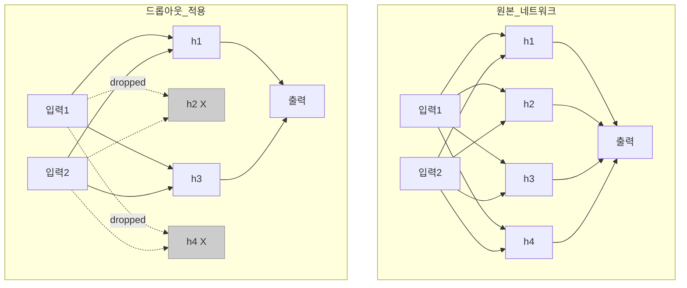

## 개요

드롭아웃(Dropout)은 학습 중 뉴런을 무작위로 비활성화하여 신경망의 과적합(overfitting)을 방지하는 정규화 기법이다. Hinton 등(2012)이 "Improving neural networks by preventing co-adaptation of feature detectors"에서 제안하고, Srivastava 등(2014)이 체계적으로 분석했다. 단순하면서도 효과적이어서 [[perceptron-mlp]], CNN, RNN 등 거의 모든 신경망 아키텍처에서 활용되며, 암묵적 앙상블 학습의 효과를 갖는다.

## 핵심 원리

### 왜 과적합이 일어나는가

대규모 신경망이 작은 데이터셋으로 학습하면 뉴런들이 **상호 적응(co-adaptation)**을 형성한다. 특정 뉴런 조합이 훈련 데이터의 노이즈까지 암기하여, 새로운 데이터에 대한 일반화 성능이 떨어진다. [[overfitting-regularization]]의 전형적인 사례다.

### 드롭아웃의 동작

학습의 각 순전파(forward pass)에서 은닉 뉴런을 확률 p로 무작위 비활성화(출력을 0으로 설정)한다.

- 매 학습 반복마다 다른 뉴런 조합이 비활성화되므로, 네트워크는 매번 다른 "희소(thinned) 네트워크"로 학습
- 각 뉴런은 특정 뉴런에 의존하지 않고 독립적으로 유용한 특징을 학습해야 함
- 결과적으로 더 견고하고 일반화된 표현(representation)을 형성

### 학습 vs 추론

| 단계 | 동작 |
|------|------|
| **학습** | 뉴런을 확률 p로 무작위 비활성화. 매 반복마다 다른 서브네트워크 |
| **추론** | 모든 뉴런 활성화. 가중치에 (1-p)를 곱하여 스케일 보정 |

### 역 드롭아웃 (Inverted Dropout)

실무에서는 추론 시 스케일링 대신, 학습 시 활성 뉴런의 출력을 1/(1-p)로 나누는 역 드롭아웃을 사용한다. 이렇게 하면 추론 코드를 수정할 필요 없이 학습된 가중치를 그대로 사용할 수 있다. 대부분의 딥러닝 프레임워크(PyTorch, TensorFlow)가 이 방식을 기본 구현으로 채택한다.

## 앙상블 관점

드롭아웃은 n개 뉴런이 있을 때 2^n개의 가능한 서브네트워크를 암묵적으로 학습하는 것과 같다. 추론 시 모든 뉴런을 활성화하는 것은 이 지수적 앙상블의 근사적 평균 예측에 해당한다. 명시적 앙상블 학습(여러 모델을 독립적으로 훈련)에 비해 추가 계산 비용 없이 유사한 정규화 효과를 얻는 효율적 방법이다.

## 드롭아웃 비율 선택

- **은닉층**: 일반적으로 p=0.5 (Hinton의 원래 권장값)
- **입력층**: 더 낮은 비율 (p=0.1~0.2). 입력 정보 손실을 최소화
- **대규모 모델**: 더 높은 비율 가능 (p=0.5~0.8)
- **소규모 모델**: 낮은 비율이나 드롭아웃 미사용이 유리할 수 있음

드롭아웃 비율은 [[cross-validation-model-evaluation]]을 통해 최적화한다.

## 변형 기법

### Spatial Dropout

CNN에서 개별 뉴런 대신 **전체 특성 맵(feature map)**을 단위로 드롭한다. 인접 픽셀의 강한 상관관계 때문에 일반 드롭아웃이 비효과적인 합성곱 층에서 더 나은 정규화를 제공한다.

### DropConnect

Wan 등(2013)이 제안한 변형으로, 뉴런 대신 **개별 가중치(연결)**를 무작위로 0으로 설정한다. 드롭아웃의 일반화 버전이며, 이론적으로 더 유연하나 계산 비용이 높다.

### DropBlock

ResNet 등 현대 CNN을 위한 구조적 드롭아웃으로, 특성 맵에서 연속된 영역(block)을 함께 제거한다.

## BatchNorm과의 관계

[[batch-norm-layer-norm]]은 자체적으로 정규화 효과를 가지므로, BatchNorm을 사용하는 네트워크에서는 드롭아웃이 불필요하거나 오히려 성능을 저해할 수 있다. 두 기법의 상호작용은 아키텍처에 따라 다르며, 실험적 검증이 필요하다. 현대 [[transformer-architecture]] 기반 LLM에서는 드롭아웃을 사용하지 않는 경우가 많으며, 데이터 규모가 충분히 크면 과적합 위험이 낮기 때문이다.

## 관련 문서

- [[perceptron-mlp]] - 드롭아웃이 적용되는 기본 신경망
- [[overfitting-regularization]] - L1/L2 정규화, 조기 종료 등 다른 기법
- [[batch-norm-layer-norm]] - 정규화 효과를 가진 또 다른 기법
- [[activation-functions]] - 드롭아웃과 함께 동작하는 비선형 변환
- [[cross-validation-model-evaluation]] - 드롭아웃 비율 최적화 방법
- [[weight-initialization]] - 초기화와 정규화의 조합
