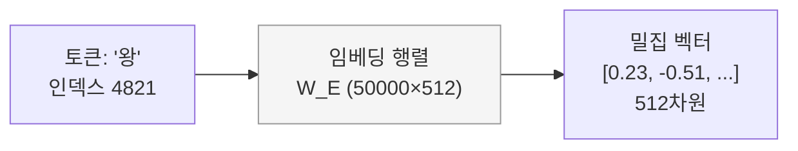

# 임베딩 레이어와 표현 학습 (Embedding Layers)

## 원-핫 인코딩의 한계

원-핫 인코딩(one-hot encoding)은 각 토큰을 어휘 크기(vocabulary size) $|V|$ 의 희소 벡터로 표현한다. 두 가지 치명적 한계가 있다.

1. **차원의 저주**: 어휘가 50,000개라면 벡터도 50,000차원. 메모리·연산 비용이 폭발적으로 증가한다.
2. **의미 관계 부재**: "왕"과 "여왕"의 코사인 유사도가 "왕"과 "사과"의 유사도와 동일(모두 0)하다. 단어 간 의미적 거리를 전혀 인코딩하지 못한다.

## 룩업 테이블로서의 임베딩 레이어

임베딩 레이어는 가중치 행렬 $W_E \in \mathbb{R}^{|V| \times d}$ 를 학습하는 룩업 테이블이다. 토큰 인덱스를 입력하면 해당 행을 꺼내 $d$ 차원 밀집 벡터(dense vector)를 반환한다.

위 다이어그램은 정수 인덱스가 밀집 벡터로 변환되는 과정을 보여준다. 역전파(backpropagation)를 통해 의미적으로 유사한 단어들이 가까운 벡터 공간에 배치되도록 학습된다.

## 위치 임베딩 비교 (Positional Embedding)

Transformer는 시퀀스 순서 정보가 없으므로 위치 임베딩을 별도로 추가한다.

| 방식 | 특징 | 대표 모델 | 외삽(extrapolation) |
|------|------|-----------|---------------------|
| **Sinusoidal** | 수식으로 고정 생성, 파라미터 없음 | 원본 Transformer | 가능하나 성능 저하 |
| **Learned** | 학습 가능한 위치 임베딩 행렬 | GPT-2, BERT | 훈련 길이 초과 불가 |
| **RoPE** (Rotary Position Embedding) | 쿼리-키 내적에 회전 행렬 적용, 상대적 위치 인코딩 | LLaMA, GPT-NeoX | 우수 (YaRN 확장 시 더욱 향상) |
| **ALiBi** | 어텐션 점수에 거리 기반 바이어스 직접 추가 | BLOOM, MPT | 우수 |

RoPE는 위치 $m$, $n$의 내적이 $(m-n)$의 함수가 되도록 설계하여 상대적 위치 관계를 자연스럽게 인코딩한다.

$$q_m^T k_n = \text{Re}[q_m e^{im\theta} \cdot \overline{k_n e^{in\theta}}] = f(q, k, m-n)$$

## 멀티모달 임베딩 (CLIP의 공유 공간)

CLIP(Contrastive Language-Image Pretraining)은 이미지 인코더와 텍스트 인코더를 별도로 두되, 두 모달리티의 출력을 동일한 공유 임베딩 공간(shared embedding space)으로 투영(project)한다. 대조 학습(contrastive learning)으로 매칭되는 이미지-텍스트 쌍의 코사인 유사도를 최대화하고, 불일치 쌍은 최소화한다.

## 공유 임베딩 (Tied Embeddings)

입력 임베딩 행렬 $W_E$와 출력 소프트맥스 직전의 투영 행렬 $W_U \in \mathbb{R}^{d \times |V|}$를 동일한 가중치로 공유하는 기법이다($W_U = W_E^T$). 파라미터 수를 $|V| \times d$ 만큼 절약하며, 특히 어휘 크기가 클 때 효과적이다. GPT-2, LLaMA 등 대부분의 현대 LLM이 채택한다.

## 관련 문서
- [[tokenization-bpe]] -- 토크나이제이션과 BPE
- [[word2vec-fasttext]] -- Word2Vec과 FastText (Word Embeddings)
- [[mteb]] -- MTEB (Massive Text Embedding Benchmark)
- [[embedding-quantization]] -- 임베딩 양자화 (Embedding Quantization)
- [[dense-passage-retrieval]] -- 고밀도 패시지 검색 (DPR)
- [[code-rag]] -- 코드 RAG (Code RAG)

- [[RoPE와 위치 인코딩]]
- [[CLIP과 멀티모달 임베딩]]
- [[attention-mechanism-overview]]
- [[Transformer 아키텍처]]
- [[contrastive-learning]]
