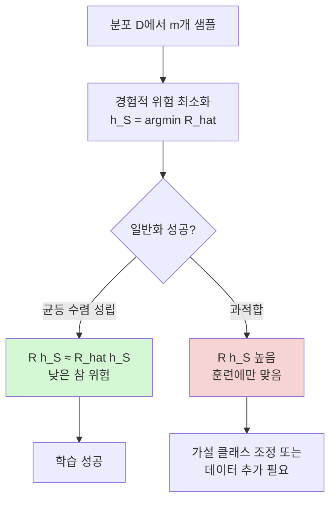

# 경험적 위험 최소화 (ERM) 이론

## 개요

경험적 위험 최소화(Empirical Risk Minimization, ERM)는 통계 학습 이론(statistical learning theory)의 근본적인 학습 원리다. 실제 분포에 대한 참 위험(true risk)을 최소화하는 것이 목표지만, 분포에 직접 접근할 수 없으므로 훈련 데이터로 구성한 경험적 위험(empirical risk)을 최소화하는 가설을 찾는다.

Vapnik과 Chervonenkis가 1970년대에 수립한 이론적 기반으로, 현대 딥러닝의 손실 최소화 패러다임이 모두 ERM의 변형이다.

## 기본 설정

### 학습 문제 정식화

- 입력 공간: $\mathcal{X}$, 출력 공간: $\mathcal{Y}$
- 미지의 분포: $\mathcal{D}$ over $\mathcal{X} \times \mathcal{Y}$
- 훈련 샘플: $S = \{(x_1, y_1), \ldots, (x_m, y_m)\}$, i.i.d. from $\mathcal{D}$
- 가설 클래스: $\mathcal{H} = \{h: \mathcal{X} \to \mathcal{Y}\}$
- 손실 함수: $\ell: \mathcal{Y} \times \mathcal{Y} \to \mathbb{R}_{\geq 0}$

### 참 위험 (True Risk)

$$R(h) = \mathbb{E}_{(x,y) \sim \mathcal{D}} [\ell(h(x), y)]$$

분포 $\mathcal{D}$를 모르므로 직접 계산 불가.

### 경험적 위험 (Empirical Risk)

$$\hat{R}_S(h) = \frac{1}{m} \sum_{i=1}^m \ell(h(x_i), y_i)$$

훈련 데이터로 측정한 평균 손실. 학습 알고리즘이 최소화하는 대상.

### ERM 학습 규칙

$$h_S = \arg\min_{h \in \mathcal{H}} \hat{R}_S(h)$$

## 일반화 문제

ERM의 핵심 질문: "$\hat{R}_S(h_S) \approx 0$이면 $R(h_S) \approx 0$인가?"

이 답이 항상 "예"가 아닌 이유가 과적합(overfitting)이다. ERM이 잘 작동하려면 두 조건이 필요하다:

1. **표현력**: $\mathcal{H}$가 진짜 좋은 가설을 포함하는가
2. **일반화**: $\hat{R}$이 $R$을 잘 근사하는가 (균등 수렴)

위 흐름은 ERM이 성공하기 위한 조건 분기를 보여준다.

## 균등 수렴 (Uniform Convergence)

### 정의

균등 수렴이란 모든 $h \in \mathcal{H}$에 대해 경험적 위험이 참 위험에 균등하게 수렴하는 성질이다:

$$\sup_{h \in \mathcal{H}} |R(h) - \hat{R}_S(h)| \to 0 \quad \text{as } m \to \infty$$

균등 수렴이 성립하면 ERM은 일관성(consistency)을 가진다.

### 호에프딩 경계 (Hoeffding Bound)

단일 가설 $h$에 대해, $\ell \in [0, 1]$이면 다음이 성립한다:

$$P(|R(h) - \hat{R}_S(h)| > \epsilon) \leq 2\exp(-2m\epsilon^2)$$

### 유니온 바운드로 유한 클래스 경계

$|\mathcal{H}| = N < \infty$이면:

$$P\left(\sup_{h \in \mathcal{H}} |R(h) - \hat{R}_S(h)| > \epsilon\right) \leq 2N \exp(-2m\epsilon^2)$$

확률 $\geq 1 - \delta$로:

$$R(h_S) \leq \hat{R}_S(h_S) + \sqrt{\frac{\ln(2N/\delta)}{2m}}$$

### 무한 클래스 - VC 차원 경계

$|\mathcal{H}| = \infty$인 경우 VC 차원 $d$를 이용:

$$R(h_S) \leq \hat{R}_S(h_S) + O\left(\sqrt{\frac{d \log(m/d)}{m}}\right)$$

## 일관성 (Consistency)

ERM 알고리즘이 일관성을 가진다는 것은 샘플 수 $m \to \infty$일 때:

$$R(h_S) \to \inf_{h \in \mathcal{H}} R(h)$$

이 성립한다는 의미다. **적절한 가설 클래스에서 ERM은 일관된 학습 알고리즘**이다.

## 과소적합과 과적합의 이중 분해

일반화 오차는 다음 두 항의 합으로 분해된다:

$$R(h_S) - R(h^*) = \underbrace{[R(h_S) - \inf_{h \in \mathcal{H}} R(h)]}_{\text{추정 오차}} + \underbrace{[\inf_{h \in \mathcal{H}} R(h) - R(h^*)]}_{\text{근사 오차}}$$

- **추정 오차(estimation error)**: ERM이 최적 가설을 유한 데이터로 찾는 데서 발생 (과적합 방향)
- **근사 오차(approximation error)**: 클래스 $\mathcal{H}$가 진짜 최적 $h^*$를 포함 못 할 때 발생 (과소적합 방향)

| 클래스 크기 | 근사 오차 | 추정 오차 | 전체 오차 |
|-------------|----------|----------|----------|
| 너무 작음 | 높음 | 낮음 | 높음 (과소적합) |
| 최적 | 중간 | 중간 | 최소 |
| 너무 큼 | 낮음 | 높음 | 높음 (과적합) |

## 정규화 ERM (Regularized ERM)

과적합을 제어하기 위해 정규화 항을 추가한다:

$$h_S^\lambda = \arg\min_{h \in \mathcal{H}} \left[ \hat{R}_S(h) + \lambda \Omega(h) \right]$$

- $\Omega(h)$: 복잡도 페널티 (예: L2 노름 $\|w\|_2^2$, L1 노름 $\|w\|_1$)
- $\lambda > 0$: 정규화 강도 하이퍼파라미터

이는 **구조적 위험 최소화(Structural Risk Minimization, SRM)**의 한 형태다.

## 딥러닝과 ERM

딥러닝의 특이한 현상들을 ERM 관점에서 이해할 수 있다:

### 이중 강하 (Double Descent)

파라미터 수가 훈련 샘플 수를 넘는 과도한 파라미터화(overparameterization) 구간에서 테스트 오차가 오히려 감소하는 현상. 고전적 ERM 이론의 편향-분산 트레이드오프와 충돌하는 것처럼 보이지만, 암묵적 정규화(implicit regularization)로 설명된다.

### 암묵적 정규화 (Implicit Regularization)

SGD(확률적 경사 하강)로 ERM을 최적화하면, 수렴하는 해가 여러 전역 최솟값 중 특정 구조(보통 최소 노름 해)를 갖는 것이 관찰된다. 알고리즘 자체가 정규화 효과를 낸다.

### 기억화 (Memorization)

Zhang et al. (2017)은 무작위 레이블로 대체한 CIFAR-10도 심층 신경망이 완벽하게 암기할 수 있음을 보였다. 즉, 신경망은 원칙적으로 라데마허 복잡도가 훈련 데이터를 전부 암기할 수 있을 만큼 크다. 일반화는 모델 구조가 아닌 데이터와 최적화 과정의 상호작용에서 나온다.

## 실무 적용 지침

### 손실 함수 선택

ERM 프레임워크에서 손실 함수 선택이 핵심이다:
- 분류: 크로스엔트로피(cross-entropy) = 음로그우도(negative log-likelihood)
- 회귀: 평균 제곱 오차(MSE) = 가우시안 우도 최대화
- 순위 학습: 힌지 손실(hinge loss), 트리플릿 손실(triplet loss)

### 샘플 복잡도 (Sample Complexity)

원하는 정밀도 $\epsilon$과 신뢰도 $\delta$로 학습하기 위한 최소 샘플 수:

$$m \geq \frac{1}{2\epsilon^2} \left( \ln|\mathcal{H}| + \ln\frac{1}{\delta} \right)$$

복잡한 모델을 사용하려면 더 많은 데이터가 필요하다는 것을 수학적으로 정당화한다.

## 관련 문서

- [[vc-dimension]] - VC 차원: ERM 일반화 경계의 핵심 도구
- [[pac-learning]] - PAC 학습 프레임워크: ERM이 PAC 학습 알고리즘임을 증명
- [[rademacher-complexity]] - 라데마허 복잡도: ERM 일반화의 데이터 의존 경계
- [[pac-bayes-bounds]] - PAC-Bayes 경계: 정규화 ERM의 베이지안 해석
- [[bias-variance-tradeoff]] - 편향-분산 트레이드오프: 추정·근사 오차의 실용 해석
- [[optimization-theory]] - 최적화 이론: ERM을 실제로 최소화하는 방법
