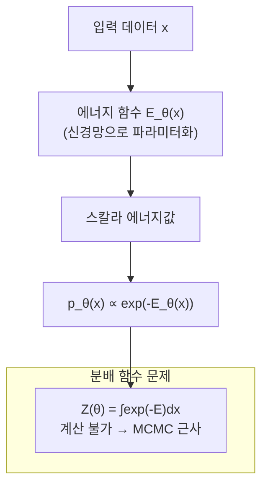
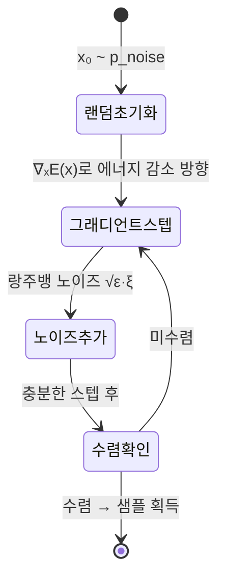

# 에너지 기반 모델 (Energy-Based Models, EBM)

에너지 기반 모델(EBM)은 데이터 포인트 $x$에 스칼라 에너지 $E_\theta(x)$를 할당하고, 이 에너지가 낮을수록 해당 데이터가 분포 내에서 높은 확률을 가진다는 가정 아래 확률 분포를 정의하는 생성 모델 패러다임이다.

## 에너지 함수와 확률

에너지 함수로부터 확률 밀도를 다음과 같이 정의한다:

$$p_\theta(x) = \frac{\exp(-E_\theta(x))}{Z(\theta)}, \quad Z(\theta) = \int \exp(-E_\theta(x)) dx$$

$Z(\theta)$는 분배 함수(partition function)로, 모든 가능한 상태에 대한 적분이다. 이 값을 **닫힌 형태(closed form)**로 계산할 수 없다는 것이 EBM의 핵심 난점이다.

## 학습: Contrastive Divergence

분배 함수를 직접 계산할 수 없으므로, 로그-우도의 그래디언트를 다음과 같이 분해한다:

$$\nabla_\theta \log p_\theta(x) = -\nabla_\theta E_\theta(x) + \mathbb{E}_{x' \sim p_\theta}[\nabla_\theta E_\theta(x')]$$

첫 번째 항은 데이터 포인트("양성 상(positive phase)")의 에너지를 낮추고, 두 번째 항은 모델 샘플("음성 상(negative phase)")의 에너지를 높인다. 음성 상 기댓값을 계산하려면 **모델에서 샘플을 생성**해야 한다.

### Contrastive Divergence (CD)

Hinton이 제안한 방법으로, 데이터 포인트에서 짧은 MCMC 체인(보통 CD-k, k=1)을 실행해 음성 상을 근사한다.

## MCMC와 랑주뱅 다이나믹스

EBM에서 샘플을 생성하려면 고차원 에너지 지형(energy landscape)을 탐색해야 한다. 가장 많이 사용하는 방법은 **랑주뱅 다이나믹스(Langevin Dynamics)**다:

$$x_{t+1} = x_t - \frac{\epsilon}{2} \nabla_x E_\theta(x_t) + \sqrt{\epsilon} \cdot \xi_t, \quad \xi_t \sim \mathcal{N}(0, I)$$

그래디언트 $\nabla_x E_\theta(x)$는 에너지 지형을 따라 낮은 에너지 방향으로 이동시키고, 노이즈 항 $\xi_t$는 다양한 모드 탐색을 가능하게 한다.

## EBM의 장점

1. **유연한 아키텍처**: 에너지 함수를 어떤 신경망으로든 파라미터화 가능. 정규화 조건이나 가역성 제약 없음
2. **조합 가능성**: 두 EBM의 에너지를 합산하면 곱 분포(product of experts)가 됨
3. **조건부 모델링**: $E_\theta(x, y)$를 정의해 자연스럽게 조건부 확률 모델링 가능
4. **스코어와의 연결**: $\nabla_x \log p_\theta(x) = -\nabla_x E_\theta(x)$. [[score-matching-diffusion]] 과 이론적으로 연결됨

## 주요 변형 모델

| 모델 | 특징 | 대표 논문 |
|------|------|----------|
| Boltzmann Machine | 이진 상태, 가시/은닉 유닛 | Hinton & Sejnowski (1986) |
| Restricted Boltzmann Machine (RBM) | 레이어 내 연결 없음, 효율적 CD 학습 | Hinton (2002) |
| Deep Energy Model | 심층 신경망 에너지 함수 | Ngiam et al. (2011) |
| JEM (Joint Energy Model) | EBM + 분류기 통합 | Grathwohl et al. (2020) |
| Contrastive Learning EBM | 대조 학습과 결합 | [[contrastive-learning]] 참조 |

## GAN, VAE와의 비교

EBM은 [[gans]]와 [[autoencoders-vae]]와 다른 방식으로 생성 모델링 문제에 접근한다:

- **GAN**: 생성자-판별자 경쟁으로 암묵적 분포 학습. 명시적 에너지 함수 없음
- **VAE**: 잠재 공간을 통한 확률 추론. ELBO 최적화
- **EBM**: 에너지 함수 직접 학습. 정확한 우도 계산 불가지만 모델 구조 자유로움

## 실무 한계와 극복

**주요 한계:**
- MCMC 혼합(mixing)이 느려 학습 불안정
- 고차원 데이터에서 샘플링 비용 큼
- 분배 함수 추정의 분산이 높음

**극복 시도:**
- **Persistent CD (PCD)**: MCMC 체인을 학습 내내 유지해 혼합 개선
- **Short-run MCMC**: 소수 스텝만 실행하고 이를 근사로 사용
- **Score matching**: 분배 함수 없이 스코어 $\nabla_x \log p$를 직접 학습 ([[score-matching-diffusion]])

## 관련 문서

- [[gans]] - 경쟁 기반 생성 모델 비교
- [[autoencoders-vae]] - 잠재 변수 생성 모델 비교
- [[score-matching-diffusion]] - EBM에서 파생된 스코어 매칭 이론
- [[diffusion-models]] - 랑주뱅 다이나믹스를 확장한 생성 모델
- [[normalizing-flows]] - 정확한 우도 계산 가능한 대안
