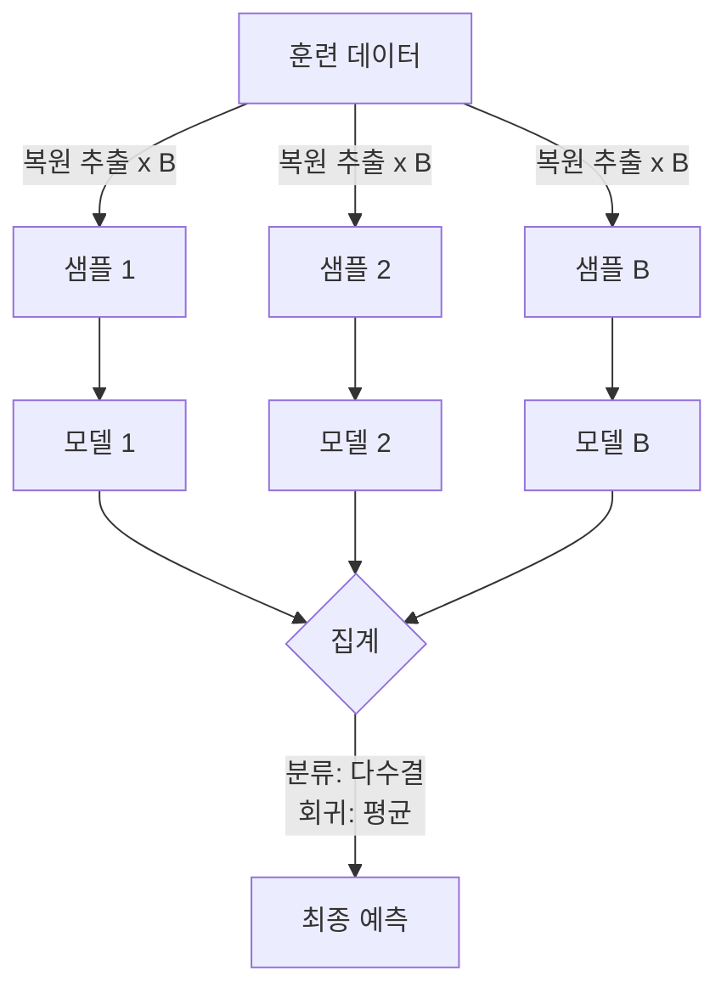

# 앙상블 방법론 (Ensemble Methods)

여러 개의 약한 학습기(weak learner)를 결합하여 단일 강력한 예측기를 만드는 방법론. 개별 모델의 오류가 독립적이라면 결합 시 오류가 상쇄된다는 원리에 기반한다.

## 편향-분산 분해에서 앙상블의 효과

예측 오류는 $\text{MSE} = \text{Bias}^2 + \text{Variance} + \text{Noise}$로 분해된다.

- **Bagging**: 분산(Variance) 감소에 초점. 각기 다른 부트스트랩 샘플로 훈련 → 예측 평균화 → 분산 감소
- **Boosting**: 편향(Bias) 감소에 초점. 이전 모델의 잔류 오류를 순차적으로 보정 → 편향 감소

## Bagging (Bootstrap Aggregating)

- 데이터를 복원 추출(bootstrap)로 B개의 부분집합 생성
- 각 부분집합으로 독립 모델 훈련
- 예측 집계: 분류는 다수결(majority vote), 회귀는 평균(averaging)
- 대표 알고리즘: **랜덤 포레스트(Random Forest)** - 특징(feature) 무작위 선택까지 추가

## Boosting

### AdaBoost
- 잘못 분류된 샘플의 가중치를 증가시켜 다음 학습기가 집중하도록 유도
- 최종 예측: 각 약한 학습기의 정확도에 비례한 가중 투표

### Gradient Boosting
- 잔류 오류(residual)를 다음 트리가 예측하도록 설계
- 손실 함수의 음의 기울기(negative gradient)를 목표로 학습
- 핵심 하이퍼파라미터: `n_estimators`, `learning_rate`, `max_depth`

### XGBoost / LightGBM / CatBoost

| 항목 | XGBoost | LightGBM | CatBoost |
|------|---------|----------|----------|
| 분할 방식 | Level-wise | Leaf-wise (GOSS) | Ordered Boosting |
| 속도 | 중간 | 빠름 | 중간 |
| 범주형 처리 | 수동 인코딩 | 기본 지원 | 자동 처리 (핵심 강점) |
| 메모리 | 중간 | 낮음 | 중간-높음 |
| 정규화 | L1/L2 | L1/L2 | 내장 |

LightGBM은 GOSS(Gradient-based One-Side Sampling)와 EFB(Exclusive Feature Bundling)로 대규모 데이터에서 압도적인 속도를 보인다.

## Stacking (스태킹)

기본 학습기(base learner)의 예측을 새로운 특징으로 삼아 메타 학습기(meta learner)가 최종 예측을 수행한다.

- 레벨 0: 다양한 이질적 모델 (RF, SVM, NN 등) 훈련
- 레벨 1: 레벨 0 모델의 Out-of-Fold 예측을 입력으로 메타 모델 훈련
- 과적합 방지를 위해 반드시 교차검증(Out-of-Fold) 예측 사용

## 앙상블 방법 비교

| 항목 | Bagging | Boosting | Stacking |
|------|---------|----------|----------|
| 학습 방식 | 병렬 | 순차적 | 이단계 |
| 주 효과 | 분산 감소 | 편향 감소 | 둘 다 |
| 과적합 위험 | 낮음 | 높음 (lr 크면) | 주의 필요 |
| 구현 복잡도 | 낮음 | 중간 | 높음 |

## 관련 문서

- [[decision-trees-random-forests]]
- [[bias-variance-tradeoff]]
- [[overfitting-regularization]]
