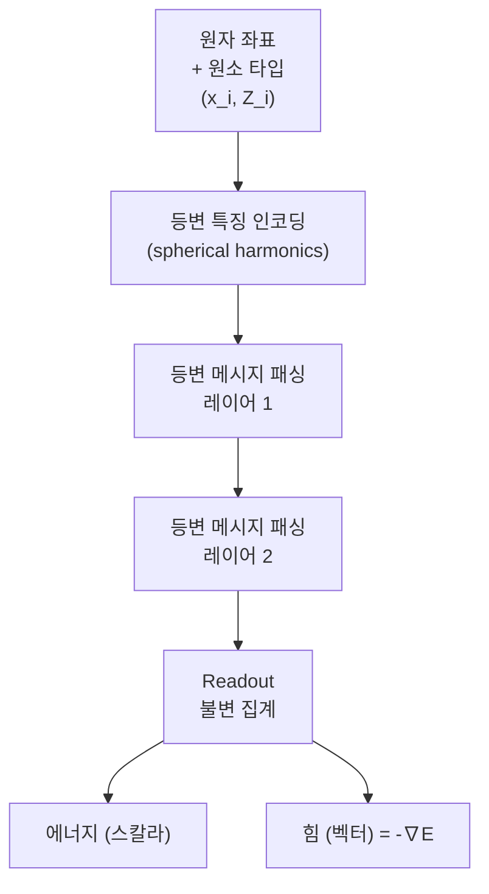

# 등변 신경망 (Equivariant Neural Networks)

## 정의

**등변 신경망(Equivariant Neural Networks)**은 입력의 대칭 변환(회전, 반사, 평행이동 등)에 대해 출력이 **예측 가능하게 변환되는** 신경망이다. 표준 신경망이 불변성(invariance)을 학습하도록 데이터를 증강하는 것과 달리, 등변 신경망은 이 대칭 구조를 **아키텍처에 내재화**한다.

### 수학적 정의

함수 $f: X \to Y$가 변환 $g \in G$에 대해 등변(equivariant)이라면:

$$f(g \cdot x) = \rho_Y(g) \cdot f(x)$$

- $G$: 군(group), 예) 회전군 SO(3), 유클리드 군 SE(3)
- $g \cdot x$: 입력에 변환 $g$ 적용
- $\rho_Y(g)$: 출력 공간에서의 $g$ 표현

**불변(invariant)**은 등변의 특수 경우로 $\rho_Y(g) = I$ (항등)일 때다:

$$f(g \cdot x) = f(x) \quad \text{(에너지, 스칼라 출력 등)}$$

## 등변성 vs 불변성

| 속성 | 수식 | 예시 |
|------|------|------|
| 불변(Invariant) | $f(gx) = f(x)$ | 분자 에너지, 그래프 동형 |
| 등변(Equivariant) | $f(gx) = g \cdot f(x)$ | 원자 힘, 분자 쌍극자 모멘트 |

에너지 예측은 분자를 회전해도 에너지가 같아야 하므로 **불변**. 힘(force) 예측은 분자를 회전하면 힘 벡터도 함께 회전해야 하므로 **등변**.

## 대칭군과 표현

### SO(3) - 3차원 회전군
분자, 단백질, 포인트 클라우드에서 가장 중요한 대칭:

- **스칼라(l=0)**: 회전 불변, 에너지, 질량 등
- **벡터(l=1)**: 회전 등변, 힘, 쌍극자 모멘트
- **텐서(l>=2)**: 더 복잡한 등변 표현

이러한 표현을 **구면 고조파(spherical harmonics)**로 분해하여 다룬다.

### SE(3) - 유클리드 군
SO(3) 회전 + 3차원 평행이동:

$$\text{SE}(3) = \mathbb{R}^3 \rtimes \text{SO}(3)$$

분자 좌표계에서 평행이동 불변성도 요구되므로 SE(3) 등변성이 완전한 물리 대칭을 반영한다.

## 주요 아키텍처

### E(n)-Equivariant GNN (EGNN)

Satorras et al. (2021) 제안. 복잡한 구면 고조파 없이 벡터 연산만으로 E(n) 등변성을 달성:

$$\mathbf{m}_{ij} = \phi_e(\mathbf{h}_i, \mathbf{h}_j, \|\mathbf{x}_i - \mathbf{x}_j\|^2, a_{ij})$$

$$\mathbf{x}_i' = \mathbf{x}_i + \sum_{j \neq i} (\mathbf{x}_i - \mathbf{x}_j) \phi_x(\mathbf{m}_{ij})$$

$$\mathbf{h}_i' = \phi_h(\mathbf{h}_i, \sum_j \mathbf{m}_{ij})$$

- 상대 거리와 방향만 사용
- 구현 단순, 효율적

### SE(3)-Transformer

Fuchs et al. (2020). Transformer의 어텐션 메커니즘을 SE(3) 등변으로 확장:

- Tensor Field Networks (TFN)을 기반으로 한 등변 어텐션
- 구면 고조파 특징 타입(l=0,1,2...)을 처리

### SchNet & DimeNet

SchNet (Schütt et al., 2017): 거리 기반 메시지 패싱, 회전 불변 에너지 예측
DimeNet (Klicpera et al., 2020): 거리 + 각도 정보 활용, 더 표현력 풍부

### NequIP & Allegro

- **NequIP**: 등변 표현으로 원자간 상호작용 포텐셜 학습, 극소 데이터로 SOTA
- **Allegro**: NequIP의 완전 국소화(strictly local) 버전, 병렬화 효율

### EquiformerV2

Transformer + E(3) 등변성: 분자 특성 예측 SOTA, OC20 데이터셋.



등변 GNN의 일반 구조: 좌표 입력에서 등변 메시지 패싱을 통해 에너지(불변)와 힘(등변)을 동시 예측.

## 응용 분야

### 분자 역학 및 단백질 구조
- **분자 포텐셜 에너지면(PES)**: NequIP, Allegro로 DFT 정확도 + 고전 MD 속도
- **단백질 구조 예측**: SE(3) 등변성으로 회전/반사 불변 구조 학습
- **약물 발견**: 분자 그래프에서 결합 친화도 예측

### 컴퓨터 비전
- **포인트 클라우드 처리**: 3D 객체 분류, 세그멘테이션
- **PointNet++의 등변 확장**: 회전 불변 특징 학습
- **로봇 조작**: 객체 자세 추정에서 SO(3) 등변성 활용

### 물리 시뮬레이션
- **粒子 역학 시뮬레이션**: 뉴턴 법칙의 등변성 내재화
- **유체 역학**: 벡터장 예측의 등변성

## 기존 방식과 비교

| 방식 | 방법 | 한계 |
|------|------|------|
| 데이터 증강 | 회전/반사 데이터 추가 | 모든 대칭 커버 어려움, 샘플 비효율 |
| 불변 특징 | 거리행렬, 내각 등 수공예 특징 | 정보 손실 가능, 설계 어려움 |
| 등변 아키텍처 | 대칭을 구조에 내재화 | 구현 복잡도, 계산 비용 |

## 구현 라이브러리

- **e3nn**: PyTorch 기반, 임의의 E(3) 등변 연산 구성
- **TorchMD-Net**: 분자 동역학 특화 등변 GNN
- **MACE**: 고속 등변 원자간 포텐셜

```python
# e3nn을 이용한 간단한 등변 선형 레이어 스케치
import torch
from e3nn import o3

# l=0 (스칼라) + l=1 (벡터) 표현
irreps_in = o3.Irreps("32x0e + 16x1o")
irreps_out = o3.Irreps("32x0e + 16x1o")

# 등변 선형 변환
linear = o3.Linear(irreps_in, irreps_out)
```

## 관련 문서

- [[gnn]] - 그래프 신경망, 등변 GNN의 기반
- [[graph-transformer]] - 그래프 구조에서의 Transformer
- [[tensor-networks-ml]] - 텐서 표현의 또 다른 관점
- [[neural-ode]] - 물리 대칭을 내재화한 또 다른 신경망
- [[universal-approximation-theorem]] - 등변 신경망의 표현력 이론
