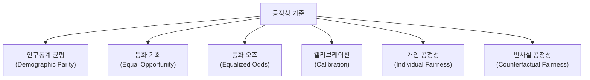
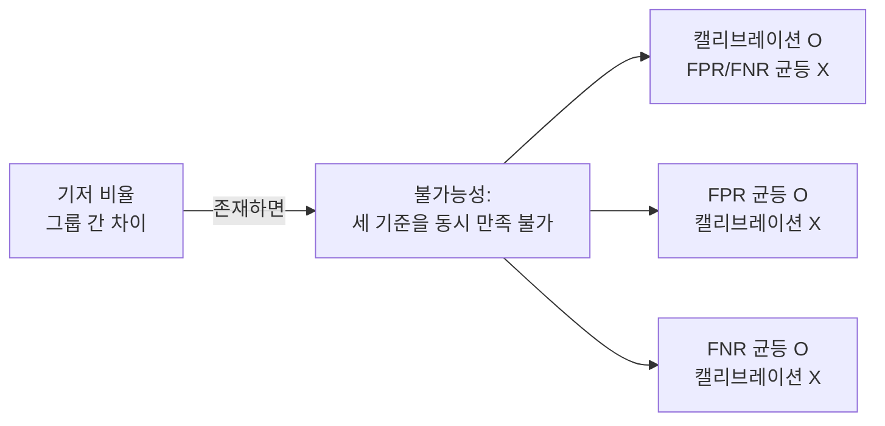

# 알고리즘 공정성 수학 기초

## 한 줄 요약

ML 모델의 공정성을 수학적으로 정의하는 여러 기준(인구통계 균형, 등화 오즈, 캘리브레이션 등)과, 이 기준들이 동시에 성립할 수 없다는 불가능성 정리(impossibility theorems).

## 왜 수학적 정의가 필요한가

"공정한 알고리즘"은 직관적으로 이해하기 어렵지 않다. 그러나 다음 상황을 생각해 보자:

- 대출 심사 모델이 두 그룹에서 동일한 승인률을 갖지만, 실제 상환 능력이 있는 사람 중 그룹별 승인률이 다르다면?
- 재범 위험 예측 모델이 그룹별로 동일한 정확도를 갖지만, 오류의 방향이 다르다면?

이런 질문에 답하려면 **공정성의 수학적 정의**가 필요하다.

## 기본 설정

- 입력 특성: $X \in \mathcal{X}$
- 보호 속성(protected attribute): $A \in \{0, 1\}$ (예: 성별, 인종)
- 실제 레이블: $Y \in \{0, 1\}$ (예: 상환 여부)
- 예측 점수: $\hat{R} \in [0, 1]$ (연속형)
- 예측 결정: $\hat{Y} = \mathbf{1}[\hat{R} > \tau]$ (임계값 $\tau$ 이진화)

## 주요 공정성 기준



### 1. 인구통계 균형 (Demographic Parity / Statistical Parity)

$$P(\hat{Y} = 1 | A = 0) = P(\hat{Y} = 1 | A = 1)$$

두 그룹에서 **양성 예측 비율이 동일**해야 한다.

예: 대출 승인률이 남성과 여성에서 동일해야 한다.

한계: 두 그룹의 실제 상환 능력 분포가 다르더라도 동일 승인률을 강제하면, 상환 능력 없는 사람에게 대출하거나 상환 능력 있는 사람을 거절하게 된다.

### 2. 등화 기회 (Equal Opportunity)

$$P(\hat{Y} = 1 | Y = 1, A = 0) = P(\hat{Y} = 1 | Y = 1, A = 1)$$

실제 양성($Y=1$)인 사람에 대한 **진양성률(TPR, True Positive Rate)이 동일**해야 한다.

예: 실제로 상환 능력이 있는 사람의 승인률이 두 그룹에서 동일해야 한다.

Hardt et al. (2016) 제안. 지표:

$$\text{TPR}_a = P(\hat{Y}=1 | Y=1, A=a), \quad a \in \{0, 1\}$$

### 3. 등화 오즈 (Equalized Odds)

$$P(\hat{Y} = 1 | Y = y, A = 0) = P(\hat{Y} = 1 | Y = y, A = 1), \quad \forall y \in \{0, 1\}$$

**진양성률(TPR)과 위양성률(FPR) 모두** 두 그룹에서 동일해야 한다.

동시 조건:
- $P(\hat{Y}=1|Y=1, A=0) = P(\hat{Y}=1|Y=1, A=1)$ (TPR 균등)
- $P(\hat{Y}=1|Y=0, A=0) = P(\hat{Y}=1|Y=0, A=1)$ (FPR 균등)

등화 기회보다 더 강한 조건. 두 조건이 동시에 성립하기 어렵다.

### 4. 예측 동등성 (Predictive Parity / Calibration within Groups)

$$P(Y = 1 | \hat{R} = r, A = 0) = P(Y = 1 | \hat{R} = r, A = 1), \quad \forall r$$

예측 점수 $r$이 동일할 때 **두 그룹에서 실제 양성 확률이 동일**해야 한다. "내 모델의 0.7 점수가 모든 그룹에서 70% 확률을 의미해야 한다."

컨텍스트: ProPublica-Northpointe COMPAS 논쟁. 재범 예측 도구가 백인과 흑인에서 FPR, FNR이 다르다 (Angwin et al.) vs 그룹 내 캘리브레이션은 동등하다 (Northpointe).

### 5. 개인 공정성 (Individual Fairness)

Dwork et al. (2012):

$$d_Y(\hat{Y}(x), \hat{Y}(x')) \leq L \cdot d_X(x, x'), \quad \forall x, x' \in \mathcal{X}$$

유사한 개인은 유사하게 처우받아야 한다. 문제: "유사성" 척도 $d_X$의 정의가 어렵다.

### 6. 반사실 공정성 (Counterfactual Fairness)

Kusner et al. (2017):

$$P(\hat{Y}_{A \leftarrow a} = y | X = x, A = a) = P(\hat{Y}_{A \leftarrow a'} = y | X = x, A = a)$$

보호 속성 $A$를 반사실적으로 변경했을 때 결과가 달라지지 않아야 한다. 인과 그래프(causal graph) 기반 정의.

## 불가능성 정리 (Impossibility Theorems)

### Chouldechova 정리 (2017)

다음 세 기준은 기저 비율(base rate)이 그룹 간 다를 경우 **동시에 성립할 수 없다**:

1. 캘리브레이션 (예측 동등성)
2. FPR 균등
3. FNR (= 1 - TPR) 균등

**증명 스케치**:

그룹 $a$에 대해: $\text{FPR}_a = \frac{\text{FP}_a}{N_a}, \text{FNR}_a = \frac{\text{FN}_a}{P_a}$

PPV $= \frac{\text{TP}}{\text{TP}+\text{FP}}$이 그룹 간 동일하고, FPR이 동일하면 양성 비율(prevalence) $P(Y=1|A=a)$가 같아야 한다. 기저 비율이 다르면 이 세 조건은 동시에 불가능하다.

### Kleinberg 등 정리 (2016)

캘리브레이션과 등화 오즈는 그룹 간 기저 비율이 다를 경우 동시에 성립 불가능하다.



### 함의

공정성 기준 간에 본질적인 트레이드오프가 존재한다. **어떤 공정성 기준을 선택할지는 기술적 문제가 아닌 가치 판단 문제**다.

## 공정성 지표 계산 예시

```python
import numpy as np
from sklearn.metrics import confusion_matrix

def fairness_metrics(y_true, y_pred, group):
    """그룹별 공정성 지표 계산."""
    results = {}
    for g in np.unique(group):
        mask = group == g
        yt, yp = y_true[mask], y_pred[mask]
        tn, fp, fn, tp = confusion_matrix(yt, yp).ravel()

        tpr = tp / (tp + fn) if (tp + fn) > 0 else 0  # 진양성률
        fpr = fp / (fp + tn) if (fp + tn) > 0 else 0  # 위양성률
        ppv = tp / (tp + fp) if (tp + fp) > 0 else 0  # 양성예측값
        sel_rate = yp.mean()  # 선발률

        results[g] = {
            "TPR": tpr, "FPR": fpr,
            "PPV": ppv, "Selection_Rate": sel_rate,
        }

    # 등화 기회: TPR 차이
    groups = list(results.keys())
    tpr_diff = abs(results[groups[0]]["TPR"] - results[groups[1]]["TPR"])
    fpr_diff = abs(results[groups[0]]["FPR"] - results[groups[1]]["FPR"])
    demo_parity_diff = abs(
        results[groups[0]]["Selection_Rate"] - results[groups[1]]["Selection_Rate"]
    )
    return results, {
        "Equal_Opportunity_Diff": tpr_diff,
        "FPR_Diff": fpr_diff,
        "Demographic_Parity_Diff": demo_parity_diff,
    }
```

## 공정성 향상 기법

### 전처리 (Pre-processing)
- **Reweighting**: 소수 그룹에 더 높은 가중치
- **Resampling**: 오버샘플링 / 언더샘플링
- **Fair Representation Learning**: 보호 속성 정보를 제거한 표현

### 학습 중 (In-processing)
- **Constrained Optimization**: 공정성 기준을 제약 조건으로 추가
  
$$\min_\theta \mathcal{L}(\theta) \quad \text{s.t.} \quad |\text{TPR}_0 - \text{TPR}_1| \leq \epsilon$$

- **Adversarial Debiasing**: 보호 속성 예측 불가능하게 훈련

### 후처리 (Post-processing)
- **Threshold Optimization**: 그룹별 서로 다른 임계값 적용
- 그룹 0은 $\tau_0$, 그룹 1은 $\tau_1$으로 TPR 균등화

## 실무 고려사항

| 상황 | 권장 기준 | 이유 |
|------|----------|------|
| 채용, 대출 | 인구통계 균형 / 등화 기회 | 기회 균등이 핵심 가치 |
| 의료 선별 검사 | 등화 오즈 (FNR 우선) | 놓치는 환자 최소화 |
| 재범 위험 예측 | 캘리브레이션 (법원 신뢰) vs 등화 오즈 (개인 공정) | 사회적 가치 선택 필요 |
| 콘텐츠 추천 | 다양성 지표 | 필터 버블 방지 |

## 규제 맥락

- **EU AI Act**: 고위험 AI 시스템의 공정성 기록 및 감사 의무
- **GDPR**: 자동화 의사결정의 설명 권리
- **미국 Equal Credit Opportunity Act**: 신용 결정의 그룹 공정성
- **EEOC 4/5ths Rule**: 선발률 비가 80% 미만이면 차별적 영향 검토

## 왜 중요한가

- ML 시스템이 사회적 결정(대출, 채용, 판결 등)에 적용될 때 그룹 간 불평등을 강화할 수 있다
- 공정성 기준의 수학적 이해 없이는 "편향 제거" 주장이 공허해진다
- 불가능성 정리는 공정성이 기술 문제가 아닌 가치 선택의 문제임을 보여준다

## 관련 문서

- [[differential-privacy]] - 프라이버시와 공정성의 상호작용
- [[bayesian-inference]] - 캘리브레이션의 확률론적 기반
- [[causal-inference-ml]] - 반사실 공정성의 인과 이론 기반
