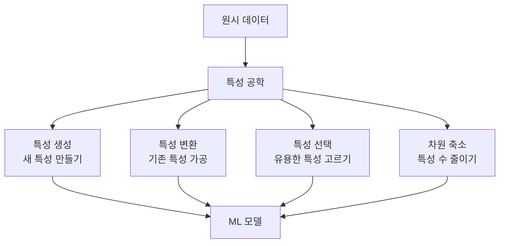
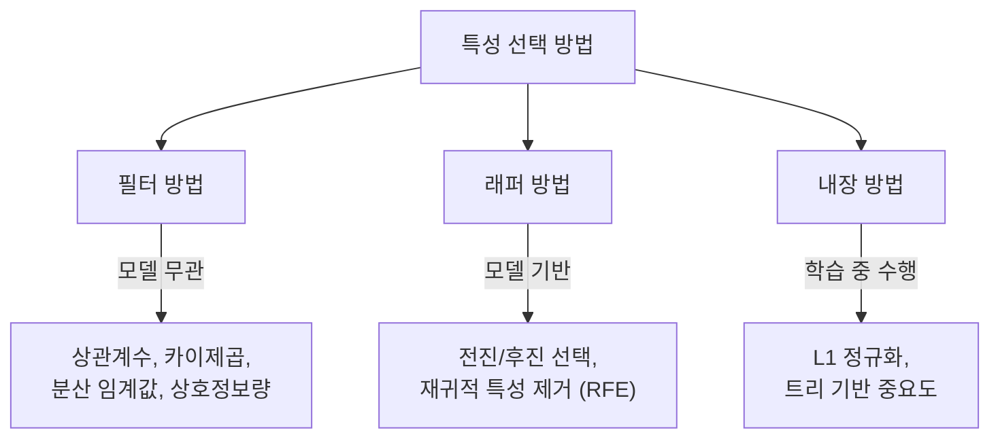

# 특성 공학 (Feature Engineering)

특성 공학은 원시 데이터를 모델이 학습하기 좋은 형태로 변환하는 과정이다. "Garbage in, garbage out" -- 아무리 정교한 알고리즘도 입력 데이터의 품질을 넘을 수 없다. 전통 ML에서는 모델 선택보다 특성 공학이 성능에 더 큰 영향을 미치는 경우가 많다.

## 특성 공학의 범위

## 특성 변환

### 스케일링 (Scaling)

특성들의 범위를 통일하여 모델 학습을 안정화한다.

| 방법 | 변환 | 결과 범위 | 적합 상황 |
|------|------|----------|----------|
| Min-Max | (x - min) / (max - min) | [0, 1] | 범위가 알려진 경우 |
| 표준화 (Z-score) | (x - mean) / std | 평균 0, 분산 1 | 가우시안 분포 가정 |
| Robust | (x - median) / IQR | 가변 | 이상치가 있을 때 |

스케일링이 중요한 알고리즘:
- [[gradient-descent-backpropagation|경사 하강법]] 기반 모델 (신경망, 로지스틱 회귀)
- 거리 기반 모델 (KNN, SVM, K-Means)
- 트리 기반 모델은 스케일링에 불변

주의: [[cross-validation-model-evaluation|교차 검증]] 시 스케일링은 반드시 학습 세트에서만 fit하고, 검증/테스트 세트에는 같은 파라미터를 transform으로 적용해야 한다. 그렇지 않으면 데이터 누출이 발생한다.

### 인코딩 (Encoding)

범주형 데이터를 수치형으로 변환한다.

**원-핫 인코딩 (One-Hot):**
- 각 범주를 이진 벡터로 표현
- 범주 수가 적을 때 적합 (도시, 성별 등)
- 범주가 많으면 차원이 폭발 -- 해시 인코딩이나 임베딩 사용

**레이블 인코딩:**
- 범주를 정수로 매핑 (서울=0, 부산=1, ...)
- 트리 기반 모델에서는 사용 가능
- 순서가 없는 범주에 적용하면 모델이 순서를 가정할 수 있어 위험

**타겟 인코딩:**
- 범주를 해당 범주의 타겟 평균으로 대체
- 정보량이 높지만 과적합 위험 -- 교차 검증 기반 구현 필요

**임베딩:**
- 고차원 범주를 저차원 밀집 벡터로 학습
- 딥러닝에서 범주 수가 많을 때 표준적 방법

### 변환 (Transformation)

- **로그 변환**: 오른쪽 꼬리가 긴 분포를 정규 분포에 가깝게
- **제곱근/Box-Cox**: 분포 정규화
- **다항 특성**: 특성 간 상호작용 포착 (x1*x2, x1^2 등)

## 특성 생성

도메인 지식을 활용하여 원시 데이터에서 의미 있는 새 특성을 만든다:

- **날짜/시간**: 요일, 월, 계절, 공휴일 여부, 시간대
- **텍스트**: 단어 수, 문장 길이, 감정 점수, TF-IDF, 임베딩
- **지리**: 두 지점 간 거리, 클러스터 ID, 인구 밀도
- **집계**: 그룹별 평균, 최대, 최소, 카운트
- **시차(Lag)**: 시계열에서 이전 시점의 값

## 특성 선택 (Feature Selection)

불필요한 특성을 제거하여 모델 성능과 해석 가능성을 개선한다.

| 방법 | 속도 | 정확도 | 모델 의존성 |
|------|------|--------|-----------|
| 필터 | 빠름 | 낮음 | 없음 |
| 래퍼 | 느림 | 높음 | 강함 |
| 내장 | 중간 | 높음 | 중간 |

[[overfitting-regularization|L1 정규화]]는 자동으로 특성 선택을 수행하는 내장 방법의 대표적 예다.

## 차원 축소 (Dimensionality Reduction)

### PCA (주성분 분석)

[[linear-algebra-for-ml|고유값 분해]]를 사용하여 분산을 최대한 보존하는 방향으로 데이터를 투영한다:

- 비지도 방법: 레이블 없이 동작
- 선형 변환만 포착
- 특성 간 상관관계를 제거 (직교화)
- 설명 분산 비율로 차원 수를 결정 (보통 95% 이상 보존)

### t-SNE / UMAP

비선형 차원 축소:
- 고차원 데이터의 2D/3D 시각화에 주로 사용
- 지역 구조를 잘 보존
- t-SNE는 느리고 UMAP이 더 빠르면서 전역 구조도 잘 보존

## 딥러닝과 특성 공학

딥러닝의 등장으로 특성 공학의 역할이 바뀌었다:

- **전통 ML**: 특성 공학이 성능의 핵심. 도메인 전문가의 수작업
- **딥러닝**: 모델이 원시 데이터에서 특성을 자동 학습 (표현 학습)
- **그럼에도**: 데이터 전처리(스케일링, 정규화)는 여전히 중요하고, 도메인 특성을 추가하면 성능이 향상되는 경우가 많다

Kaggle 대회에서 상위권은 여전히 정교한 특성 공학 + 앙상블로 승부하는 경우가 많다.

## 특성 공학 파이프라인

## 관련 문서

- [[linear-algebra-for-ml]] -- PCA, SVD의 수학적 기반
- [[overfitting-regularization]] -- L1 정규화의 특성 선택 효과
- [[cross-validation-model-evaluation]] -- 전처리의 교차 검증 내 배치
- [[bias-variance-tradeoff]] -- 특성 수와 편향/분산의 관계
- [[probability-statistics-for-ml]] -- 통계 기반 특성 선택 (상관계수, 카이제곱)
- [[supervised-unsupervised-reinforcement]] -- 지도/비지도 학습에서의 특성 역할

## 참고 자료

- [What is Feature Engineering? - IBM](https://www.ibm.com/think/topics/feature-engineering)
- [Feature Engineering in ML: A Practical Guide - DataCamp](https://www.datacamp.com/tutorial/feature-engineering)
- [Feature Selection and Dimensionality Reduction - GeeksforGeeks](https://www.geeksforgeeks.org/machine-learning/dimensionality-reduction/)
