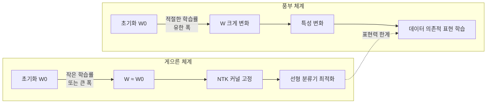

# 특성 학습 이론

특성 학습 이론(Feature Learning Theory)은 신경망이 훈련 중에 실제로 **표현(representation)**을 스스로 바꾸는지, 아니면 초기 표현에 단순히 선형 헤드를 끼워맞추는지를 분석하는 이론 체계다. 이 이론은 왜 실제 딥러닝이 전통적인 커널 방법보다 훨씬 강력한지를 설명하는 핵심 실마리를 제공한다.

## 두 가지 훈련 체계

### 게으른 훈련 체계 (Lazy Training Regime)

모델이 **초기화 지점 근방에 머물며** 학습이 거의 선형으로 진행되는 상황이다. 이 체계에서는:

- 가중치 변화량 $\Delta W = W - W_0$가 $W_0$에 비해 매우 작다.
- 네트워크는 고정된 무한 차원 커널 - [[neural-tangent-kernel]](NTK) - 처럼 동작한다.
- 특성이 바뀌지 않으므로 "특성 학습"이 일어나지 않는다.

이 체계는 수학적으로 분석하기 쉽고, 수렴 보장도 명확하다. 그러나 실제 표현력은 커널 방법 수준에 머문다.

### 풍부 체계 (Rich / Feature Learning Regime)

모델이 데이터에 맞는 표현을 **능동적으로 학습**하는 상황이다.

- 가중치 변화량이 초기화 크기와 비슷하거나 더 크다.
- 은닉층의 특성(feature)이 훈련 중 변화한다.
- 선형 커널로는 달성 불가능한 샘플 효율성을 보인다.

실제 성공적인 딥러닝 모델은 대부분 이 체계에 속한다. 특히 [[self-supervised-learning]] 처럼 레이블 없이 풍부한 표현을 배우는 패러다임은 풍부 체계가 없으면 설명이 불가능하다.

## 체계를 결정하는 요인: 모델 폭

신경망의 폭(width) $n$이 결정적 역할을 한다. 표준 파라미터화(standard parametrization)에서:

$$\text{출력} = \frac{1}{\sqrt{n}} W_2 \sigma(W_1 x)$$

- $n \to \infty$ (무한폭 한계): 가중치 변화가 0으로 수렴 → **게으른 체계** (NTK 체계)
- 유한 $n$, 적절한 학습률: 가중치가 실질적으로 이동 → **풍부 체계**

### $\mu$P (Maximal Update Parametrization)

Greg Yang 등이 제안한 $\mu$P는 폭을 키워도 **풍부 체계가 유지되도록** 파라미터화를 수정한다. 핵심 아이디어는 층별로 학습률을 폭에 맞게 조정하는 것이다:

- 입력층: 학습률 $\propto 1/n$
- 은닉층: 학습률 $\propto 1$ (불변)
- 출력층: 학습률 $\propto 1/n$

이 설정에서 최적 하이퍼파라미터가 폭에 무관하게 전이(transfer)되는 성질이 성립한다.

## 특성 학습의 실증 증거

### 그로킹(Grokking) 현상

[[grokking]] 은 풍부 체계의 극적인 예시다. 모델이 훈련 세트를 이미 암기한 이후에도 계속 훈련하면, 갑자기 일반화 가능한 특성을 학습하는 현상이다. 이는 게으른 체계에서는 발생하지 않는다.

### 플러그인 특성의 재사용

전이 학습(transfer learning)이 잘 되는 이유도 풍부 체계로 설명된다. 사전학습에서 형성된 특성이 실제로 데이터 구조를 담고 있으므로, 다른 태스크에서도 재사용 가능하다.

## 이론적 도전 과제

| 도전 | 현황 |
|------|------|
| 풍부 체계의 수렴 보장 | 일부 설정에서만 증명 |
| 최적 폭 선택 기준 | [[scaling-laws]] 에 의존, 이론 미완성 |
| 특성 학습 속도 정량화 | 초기 단계 |
| 비볼록 환경에서의 증명 | 매우 어려움 |

[[neural-tangent-kernel]] 이론은 게으른 체계를 완전히 설명하지만, 풍부 체계에 대한 동일 수준의 이론은 아직 없다. 이것이 현대 딥러닝 이론의 최전선 문제 중 하나다.

## 실무적 함의

- **학습률**: 너무 작으면 게으른 체계로 빠질 수 있다. 풍부 특성 학습을 원한다면 충분히 큰 학습률로 시작.
- **모델 폭 확장**: 표준 파라미터화로 폭을 키울 경우 NTK 체계로 퇴화할 수 있으므로 $\mu$P 적용 권장.
- **사전학습 평가**: 다운스트림 프로빙(probing)으로 중간층 특성이 실제로 변화했는지 확인.

## 관련 문서

- [[neural-tangent-kernel]] - 게으른 체계의 수학적 토대
- [[scaling-laws]] - 폭·깊이·데이터 크기와 성능의 관계
- [[self-supervised-learning]] - 풍부 체계의 대표적 응용
- [[grokking]] - 지연된 특성 학습의 실증 사례
- [[representation-learning-theory]] - 좋은 표현의 조건
