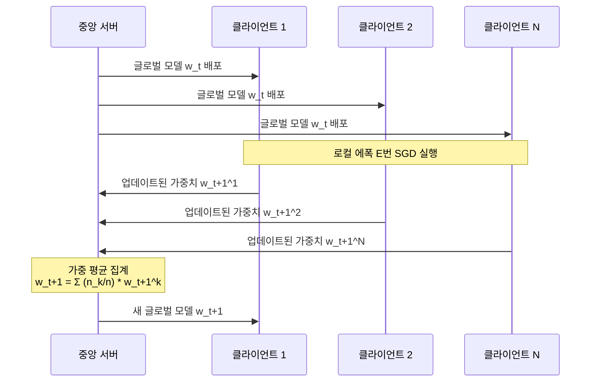
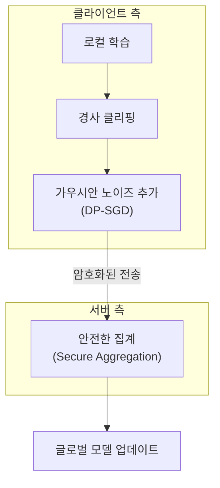

# 연합 학습 (Federated Learning)

## 개요

연합 학습(Federated Learning, FL)은 Google의 McMahan et al.(2017)이 제안한 분산 머신러닝 패러다임이다. 핵심 아이디어는 **데이터를 중앙 서버로 모으지 않고**, 데이터가 있는 기기(클라이언트)에서 직접 모델을 학습시킨 후 그 결과(모델 업데이트, 경사 등)만 서버로 전송하는 것이다.

"데이터는 이동하지 않는다. 모델이 데이터로 찾아간다(The model goes to the data, not the data to the model)."

## 동기와 배경

기존 중앙 집중식 학습의 문제:

- **프라이버시**: 개인 의료 기록, 금융 거래, 스마트폰 활동 로그는 서버 업로드 자체가 민감
- **규제**: GDPR, HIPAA 등 데이터 현지화 요구사항
- **통신 비용**: 대용량 원시 데이터 전송 비용
- **데이터 소유권**: 개인/기업이 데이터를 외부로 내보내기 꺼림

연합 학습은 이 모든 문제를 "데이터는 로컬에 두고 학습"이라는 원칙으로 동시에 완화한다.

## FedAvg 알고리즘

McMahan et al.의 **FedAvg(Federated Averaging)** 는 연합 학습의 기본 알고리즘이다:

집계 공식:

$$w_{t+1} = \sum_{k=1}^{K} \frac{n_k}{n} w_{t+1}^k$$

- $K$: 참여 클라이언트 수
- $n_k$: 클라이언트 $k$의 로컬 데이터 수
- $n = \sum n_k$: 전체 데이터 수
- 로컬에서 SGD를 여러 스텝 실행 후 결과만 전송 -> 통신 효율화

## 연합 학습의 주요 도전

### 1. 비 IID 데이터 (Non-IID Data)

현실에서 각 클라이언트의 데이터 분포가 크게 다르다. 스마트폰 사용자마다 언어, 습관, 지역이 달라 로컬 업데이트가 서로 다른 방향으로 경사를 당긴다. 이를 **클라이언트 드리프트(Client Drift)** 라 한다.

해결 방법:
- **SCAFFOLD**: 제어 변수로 드리프트 보정
- **FedProx**: 글로벌 모델과의 거리를 손실에 페널티로 추가
- **Moon**: 대조학습으로 표현 수준 정렬

### 2. 시스템 이질성 (System Heterogeneity)

클라이언트의 계산 능력, 통신 속도, 배터리 상태가 각각 다르다. 느린 클라이언트(스트래글러)를 기다리면 전체 학습이 지연된다.

### 3. 통신 효율성

모델이 클수록 매 라운드 전송 비용 증가. 해결:
- **경사 압축**: Top-K 스파스화, 양자화
- **로컬 학습 강화**: 라운드당 로컬 에폭 수 증가 (통신 빈도 감소)

### 4. 프라이버시 공격

경사(gradient)만 공유해도 원본 데이터 복원 공격(Gradient Inversion Attack)이 가능하다. [[differential-privacy]] 와의 결합이 필수다.

## 프라이버시 보호와의 결합

- **로컬 DP**: 클라이언트가 전송 전에 노이즈 추가 (강한 프라이버시, 성능 하락)
- **중앙 DP**: 서버가 집계 후 노이즈 추가 (약한 프라이버시, 나은 성능)
- **안전한 집계(Secure Aggregation)**: 암호화 프로토콜로 서버가 개별 업데이트를 볼 수 없게

## 연합 학습 유형

| 유형 | 설명 | 예시 |
|------|------|------|
| 수평 연합 학습 | 클라이언트가 같은 특징, 다른 샘플 | 다른 병원의 같은 진단 데이터 |
| 수직 연합 학습 | 클라이언트가 다른 특징, 같은 샘플 | 같은 고객의 은행+쇼핑 데이터 |
| 연합 전이 학습 | 특징·샘플 모두 일부만 겹침 | 산업 협력 |

## 실제 배포 사례

- **Google Gboard**: 스마트폰 키보드 다음 단어 예측 모델을 연합 학습으로 개선
- **Apple**: Siri 음성 인식, Face ID 개선에 로컬 DP + 연합 학습 적용
- **의료**: 여러 병원이 환자 데이터 공유 없이 공동 진단 모델 학습

## [[distributed-training-overview]] 와의 차이

| 항목 | 분산 학습 | 연합 학습 |
|------|----------|----------|
| 목적 | 학습 속도 향상 | 프라이버시 보호 |
| 데이터 위치 | 중앙화 가능 | 클라이언트 로컬 |
| 클라이언트 수 | 수십~수백 서버 | 수백만 엣지 기기 |
| 데이터 분포 | IID 가정 가능 | 심각한 비 IID |
| 통신 빈도 | 매 미니배치 | 매 글로벌 라운드 |

## 관련 문서

- [[distributed-training-overview]] - 데이터/모델 병렬 분산 학습 기법
- [[differential-privacy]] - 연합 학습의 프라이버시 강화 도구
- [[optimization-theory]] - FedAvg의 수렴 분석 기반
- [[transfer-learning]] - 연합 전이 학습의 사전학습 활용
