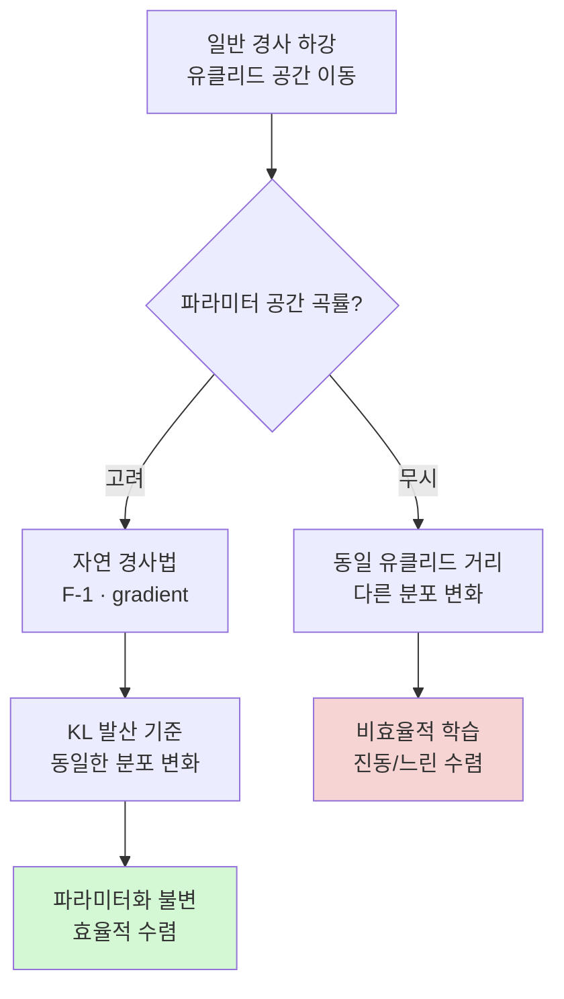

# 피셔 정보 행렬과 자연 경사

## 개요

피셔 정보 행렬(Fisher Information Matrix, FIM)은 확률 분포 $p(x | \theta)$가 파라미터 $\theta$에 대해 얼마나 민감하게 변화하는지를 나타내는 2차 통계량이다. 정보 기하학(information geometry)에서 파라미터 공간의 **리만 계량(Riemannian metric)**을 정의하며, 자연 경사법(natural gradient descent)의 이론적 기반이 된다.

일반 경사 하강은 유클리드 공간에서의 이동을 가정하지만, 확률 모델의 파라미터 공간은 KL 발산으로 정의되는 비유클리드 구조를 갖는다. 피셔 정보 행렬은 이 곡률을 정량화한다.

## 정의

### 스코어 함수 (Score Function)

로그 우도의 기울기를 스코어 함수라 한다:

$$s(\theta; x) = \nabla_\theta \log p(x | \theta)$$

스코어 함수의 기댓값은 항상 0이다:

$$\mathbb{E}_{x \sim p(\cdot|\theta)}[s(\theta; x)] = 0$$

### 피셔 정보 행렬

스코어 함수의 공분산(covariance)으로 정의된다:

$$F(\theta) = \mathbb{E}_{x \sim p(\cdot|\theta)}\left[s(\theta; x) s(\theta; x)^\top\right]$$

$$= \mathbb{E}_{x \sim p(\cdot|\theta)}\left[\nabla_\theta \log p(x|\theta) \nabla_\theta \log p(x|\theta)^\top\right]$$

### 헤시안과의 관계

충분히 정규적인 분포에서 FIM은 로그 우도의 **음의 기댓값 헤시안**과 동일하다:

$$F(\theta) = -\mathbb{E}_{x \sim p(\cdot|\theta)}\left[\nabla_\theta^2 \log p(x|\theta)\right]$$

이를 **크라메르-라오 동치(Cramér-Rao equivalence)**라 한다.

### 경험적 피셔 행렬 (Empirical Fisher)

실제 데이터 분포에서 기댓값을 취하기 어려우므로 훈련 데이터로 근사한다:

$$\hat{F}(\theta) = \frac{1}{N}\sum_{i=1}^N \nabla_\theta \log p(y_i | x_i, \theta) \nabla_\theta \log p(y_i | x_i, \theta)^\top$$

## 정보 기하학적 의미

### KL 발산의 2차 근사

파라미터 $\theta$에서 $\theta + \delta$로 이동할 때 KL 발산:

$$D_\text{KL}(p(\cdot|\theta) \| p(\cdot|\theta+\delta)) \approx \frac{1}{2} \delta^\top F(\theta) \delta$$

FIM은 분포 공간에서의 **거리 측도** 역할을 한다. 일반 유클리드 거리 $\|\delta\|^2$와 달리, 분포가 실제로 얼마나 변화하는지를 측정한다.

### 리만 계량 (Riemannian Metric)

확률 분포의 통계 다양체(statistical manifold)에서 FIM은 리만 계량 텐서를 정의한다. 이 공간에서의 측지선(geodesic)이 정보 기하학적으로 최단 경로를 나타낸다.

## 자연 경사법 (Natural Gradient Descent)

### 동기

일반 경사 하강은 파라미터 공간의 유클리드 구조를 암묵적으로 가정한다:

$$\theta_{t+1} = \theta_t - \eta \nabla_\theta L$$

그러나 신경망 파라미터는 분포를 매개변수화하므로, 같은 유클리드 거리를 이동해도 분포의 변화량이 다를 수 있다. **자연 경사(natural gradient)**는 분포 공간에서 동일한 변화량을 이동하도록 보정한다.

### 자연 경사 업데이트

$$\theta_{t+1} = \theta_t - \eta F(\theta_t)^{-1} \nabla_\theta L$$

$F(\theta)^{-1}$이 곡률 역행렬(inverse metric) 역할을 한다. FIM이 큰(분포가 민감한) 방향은 작게, FIM이 작은 방향은 크게 이동한다.

### 성질

- **파라미터화 불변성(reparameterization invariance)**: 파라미터 변환에 무관하게 동일한 분포 이동
- **최적 수렴**: 볼록 문제에서 뉴턴법과 유사한 2차 수렴률
- **REINFORCE 관계**: 강화학습 정책 기울기의 자연 경사 버전이 TRPO/PPO의 이론적 기반



자연 경사법은 분포 공간에서 일관된 크기의 업데이트를 보장한다.

## 크라메르-라오 하한 (Cramér-Rao Lower Bound)

피셔 정보 행렬은 추정량의 분산에 하한을 줌으로써 통계 추정의 최적성을 정의한다.

불편 추정량 $\hat{\theta}$에 대해:

$$\text{Cov}(\hat{\theta}) \geq F(\theta)^{-1}$$

- 이 부등식은 행렬 반정부호(positive semi-definite) 의미
- 등호가 성립하는 추정량을 **효율적 추정량(efficient estimator)**이라 함
- 최대 우도 추정(MLE)은 점근적으로 효율적 (피셔 정보를 모두 활용)

## KFAC: 크론네커 인수 분해 근사

### 문제: FIM의 계산 복잡도

파라미터 수 $P$에 대해 FIM은 $P \times P$ 행렬이다. 대형 신경망($P \sim 10^8$)에서는 저장 불가. 역행렬 계산은 $O(P^3)$.

### KFAC 해법

Martens & Grosse (2015)는 레이어별 FIM 블록을 입력 통계와 기울기 통계의 크론네커 곱(Kronecker product)으로 근사:

$$F_l \approx A_l \otimes G_l$$

- $A_l = \mathbb{E}[a_{l-1} a_{l-1}^\top]$: 레이어 $l$의 입력 활성화 공분산
- $G_l = \mathbb{E}[\delta_l \delta_l^\top]$: 레이어 $l$의 역전파 신호 공분산
- $\otimes$: 크론네커 곱

크론네커 곱의 역행렬: $(A \otimes G)^{-1} = A^{-1} \otimes G^{-1}$

저장 복잡도: $O(d_l^2)$ → $O(d_{l-1}^2 + d_l^2)$으로 크게 감소.

### KFAC의 활용

- 2차 최적화 근사로 빠른 수렴
- 계속 학습(continual learning)에서 EWC (Elastic Weight Consolidation)의 기반
- 배치 강화학습에서 ACKTR (actor-critic using Kronecker-factored trust region)

## 딥러닝에서의 활용

### 1. 재앙적 망각 방지 (Catastrophic Forgetting)

Elastic Weight Consolidation (EWC):

$$L_\text{EWC} = L_B(\theta) + \frac{\lambda}{2} \sum_i F_i (\theta_i - \theta^*_i)^2$$

피셔 정보가 큰 파라미터(이전 태스크에 중요)는 변화를 억제한다.

### 2. 모델 가지치기 (Pruning)

파라미터의 중요도를 FIM 대각선으로 근사하여 중요도 낮은 가중치를 제거 (Optimal Brain Damage 방식).

### 3. 전이 학습 (Transfer Learning)

사전훈련 모델의 FIM을 분석하여 미세조정 시 어떤 레이어를 동결할지 결정.

### 4. 강화학습 - 자연 정책 경사 (Natural Policy Gradient)

정책 $\pi_\theta$의 자연 경사:

$$\theta_{t+1} = \theta_t + \eta F_\pi^{-1} \nabla_\theta J(\theta)$$

TRPO는 FIM 역행렬을 신뢰 영역 제약으로 대체한 실용적 구현이다.

## 계산 방법

### 몬테카를로 근사

```python
# 경험적 피셔 행렬의 대각선 추정 (예시 의사코드)
fisher_diag = []
for x, y in data_loader:
    log_prob = model.log_prob(y, x)
    grad = autograd.grad(log_prob, model.parameters())
    fisher_diag += [g.pow(2) for g in grad]
fisher_diag = [f.mean(0) for f in fisher_diag]
```

### 효율적 추정: 역직렬화 없는 방법

대각 FIM 또는 KFAC를 사용하면 전체 FIM 계산 없이 자연 경사법의 효과를 근사할 수 있다.

## 관련 문서

- [[natural-gradient]] - 자연 경사법 구현과 실용적 근사
- [[kl-divergence]] - KL 발산: FIM의 2차 근사 기반
- [[second-order-optimization]] - KFAC 등 2차 최적화와의 관계
- [[matrix-calculus-deep-learning]] - 행렬 미적분: FIM 계산의 수학적 도구
- [[information-theory]] - 정보 이론: 피셔 정보의 맥락
- [[optimization-theory]] - 최적화 이론과 수렴 보장
