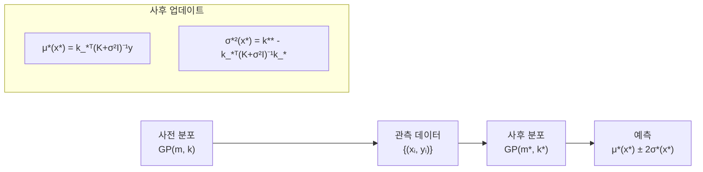
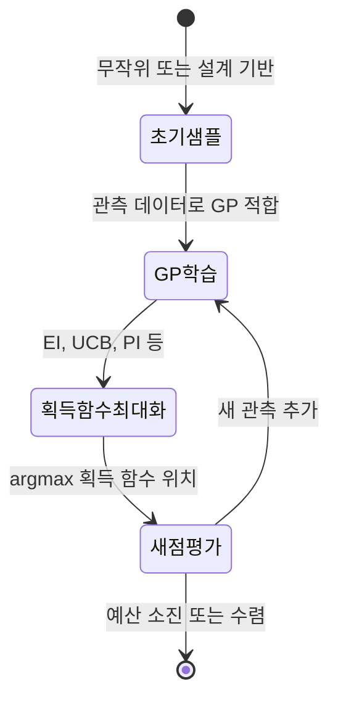
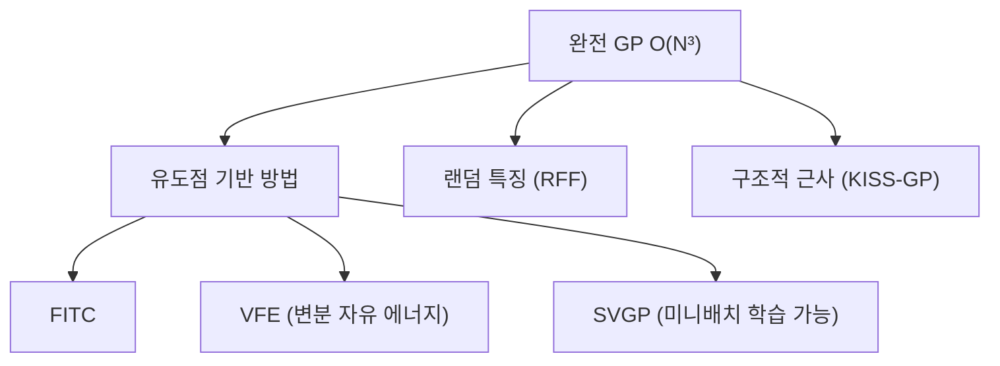

# 가우시안 프로세스 (Gaussian Process, GP)

가우시안 프로세스(GP)는 **함수의 분포(distribution over functions)**를 정의하는 확률 과정이다. 임의의 유한한 입력 집합에 대한 함수값이 항상 다변량 가우시안 분포를 따른다는 성질로 정의된다. 딥러닝의 등장 이전에는 회귀와 분류의 강력한 비모수(non-parametric) 베이지안 방법이었으며, 현재도 소량 데이터, 불확실성 정량화, 베이지안 최적화에 널리 사용된다.

## 공식 정의

$f: \mathcal{X} \to \mathbb{R}$가 가우시안 프로세스라는 것은 임의의 유한 입력 집합 $\{x_1, ..., x_n\} \subset \mathcal{X}$에 대해:

$$[f(x_1), ..., f(x_n)]^T \sim \mathcal{N}(\mu, K)$$

가 성립한다는 것을 의미한다. 여기서:
- $\mu_i = m(x_i)$: 평균 함수(mean function)
- $K_{ij} = k(x_i, x_j)$: 커널 함수(covariance/kernel function)

GP는 $f \sim \mathcal{GP}(m, k)$로 표기한다.

## 커널 함수 (Kernel Function)

커널은 "두 입력이 얼마나 유사한가"를 측정하며, GP의 모든 표현력을 결정한다. 유효한 커널은 양반정치(positive semi-definite) 행렬을 생성해야 한다.

| 커널 | 식 | 특성 |
|------|---|------|
| SE (Squared Exponential) | $\exp(-\frac{\|x-x'\|^2}{2l^2})$ | 무한 번 미분 가능, 매끄러운 함수 |
| Matern-5/2 | $...\exp(-\frac{\sqrt{5}\|r\|}{l})$ | 2번 미분 가능, 실용적 기본값 |
| Periodic | $\exp(-\frac{2\sin^2(\pi\|r\|/p)}{l^2})$ | 주기적 패턴 |
| Linear | $\sigma_b^2 + \sigma_v^2(x-c)(x'-c)$ | 선형 추세 |
| RBF + Linear | 합성 커널 | 추세 + 부드러운 변동 |

커널 합성(kernel composition)으로 복잡한 구조를 표현할 수 있다: $k = k_1 + k_2$ 또는 $k = k_1 \times k_2$.

## GP 회귀 (GPR)

관측 데이터 $\mathcal{D} = \{(x_i, y_i)\}_{i=1}^n$ (여기서 $y_i = f(x_i) + \epsilon_i$, $\epsilon_i \sim \mathcal{N}(0, \sigma_n^2)$)가 주어졌을 때, 새 입력 $x^*$에서의 사후 예측 분포를 구하는 것이 GP 회귀다.



사후 평균과 분산의 폐쇄형(closed-form) 해:

$$\mu^*(x^*) = k_*^T (K + \sigma_n^2 I)^{-1} y$$
$$\sigma^{*2}(x^*) = k(x^*, x^*) - k_*^T (K + \sigma_n^2 I)^{-1} k_*$$

$k_*$는 새 입력과 학습 입력 사이의 공분산 벡터다. 이 공식이 베이지안 업데이트의 정확한 해를 제공한다.

## 하이퍼파라미터 학습

커널의 하이퍼파라미터 $\theta$ (예: 길이 스케일 $l$, 진폭 $\sigma_f$)는 **주변 로그 우도(log marginal likelihood)**를 최적화하여 학습한다:

$$\log p(y|X, \theta) = -\frac{1}{2}y^T(K+\sigma_n^2 I)^{-1}y - \frac{1}{2}\log|K+\sigma_n^2 I| - \frac{n}{2}\log 2\pi$$

이 과정 자체가 자동 오컴의 면도날(Automatic Occam's Razor) 역할을 하여 과적합을 방지한다.

## GP와 신경망의 관계 (NNGP)

무한 너비 신경망의 사전 분포가 가우시안 프로세스에 수렴한다는 것이 증명되었다(Neal, 1994). 이를 **NNGP(Neural Network Gaussian Process)**라 한다. [[neural-tangent-kernel]]은 이 관계를 학습 동역학 관점으로 확장한다.

## 베이지안 최적화에서의 활용

GP는 **획득 함수(acquisition function)**와 결합해 블랙박스 함수의 최적값을 효율적으로 탐색하는 **베이지안 최적화(Bayesian Optimization)**의 대리 모델로 가장 많이 쓰인다.



- **Expected Improvement (EI)**: 현재 최적 대비 개선 기댓값 최대화
- **Upper Confidence Bound (UCB)**: $\mu(x) + \kappa \sigma(x)$ 최대화 (탐색/활용 균형)
- **Thompson Sampling**: GP 사후에서 샘플링 후 최대화

## 확장과 한계

### 계산 확장성 문제

표준 GP의 계산 복잡도는 $O(n^3)$ (행렬 역산). 학습 데이터가 10,000개를 넘으면 실용성이 낮아진다.

**근사 방법:**



- **Inducing points (희소 GP)**: $m \ll n$개의 유도점으로 근사. 복잡도 $O(nm^2)$
- **SVGP (Stochastic Variational GP)**: 미니배치 학습으로 수백만 데이터에도 적용 가능
- **Deep GP**: GP의 계층적 합성. 표현력 증가
- **Random Fourier Features (RFF)**: 커널을 명시적 특징으로 근사해 선형 GP 구현

### GP vs. 딥러닝

| 기준 | GP | 딥러닝 |
|------|-----|--------|
| 데이터 요건 | 소량도 가능 | 대량 필요 |
| 불확실성 | 정확한 베이지안 | 추가 기법 필요 (MC Dropout 등) |
| 계산 비용 | $O(n^3)$ | $O(n)$ (미니배치) |
| 커널 설계 | 도메인 지식 필요 | 자동 특징 추출 |
| 해석 가능성 | 높음 | 낮음 |

## 코드 예시 (GPyTorch)

```python
import torch
import gpytorch

class ExactGPModel(gpytorch.models.ExactGP):
    def __init__(self, train_x, train_y, likelihood):
        super().__init__(train_x, train_y, likelihood)
        self.mean_module = gpytorch.means.ConstantMean()
        self.covar_module = gpytorch.kernels.ScaleKernel(
            gpytorch.kernels.RBFKernel()
        )

    def forward(self, x):
        mean_x = self.mean_module(x)
        covar_x = self.covar_module(x)
        return gpytorch.distributions.MultivariateNormal(mean_x, covar_x)

likelihood = gpytorch.likelihoods.GaussianLikelihood()
model = ExactGPModel(train_x, train_y, likelihood)

# 하이퍼파라미터 학습 (주변 우도 최대화)
optimizer = torch.optim.Adam(model.parameters(), lr=0.1)
mll = gpytorch.mlls.ExactMarginalLogLikelihood(likelihood, model)

for _ in range(100):
    optimizer.zero_grad()
    loss = -mll(model(train_x), train_y)
    loss.backward()
    optimizer.step()

# 예측: 평균 + 95% 신뢰 구간
model.eval()
with torch.no_grad(), gpytorch.settings.fast_pred_var():
    preds = likelihood(model(test_x))
    mean = preds.mean
    lower, upper = preds.confidence_region()
```

## 관련 문서

- [[bayesian-inference]] - GP의 이론적 기반인 베이지안 추론
- [[bayesian-deep-learning]] - 딥러닝에서의 베이지안 접근과 GP의 관계
- [[kernel-methods]] - GP의 핵심 수학적 기반인 커널 이론
- [[reproducing-kernel-hilbert-space]] - 커널 함수의 함수 공간 이론
- [[neural-tangent-kernel]] - 무한 신경망과 GP의 연결
- [[probability-statistics-for-ml]] - GP가 의존하는 확률론적 기초
- [[causal-inference-ml]] - 비모수 방법의 또 다른 응용
