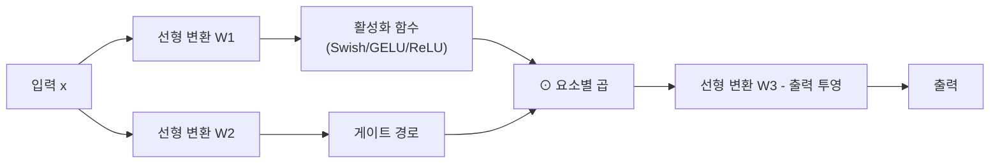

# GLU 변형 활성화 함수 (SwiGLU/GEGLU/ReGLU)

## 개요

게이트 선형 유닛(Gated Linear Unit, GLU)은 피드포워드 네트워크(Feed-Forward Network, FFN) 내에서 활성화 함수 대신 혹은 그 역할을 확장하여 게이트 메커니즘을 도입한 구조다. 기본 활성화 함수(ReLU, GELU 등)가 단일 선형 변환에 비선형성을 씌우는 방식인 것과 달리, GLU 계열은 두 개의 병렬 선형 변환 결과를 요소별(element-wise) 곱셈으로 결합한다. 이를 통해 하나의 경로가 다른 경로의 정보 흐름을 조절하는 게이트 역할을 수행한다.

## 수식 정의

GLU 기본 구조:

$$\text{GLU}(x, W, V, b, c) = \sigma(xW + b) \odot (xV + c)$$

여기서 $\sigma$는 시그모이드 함수, $\odot$은 요소별 곱셈이다. 시그모이드 자리에 어떤 활성화 함수를 쓰느냐에 따라 변형이 결정된다:

| 변형 | 게이트 활성화 | 수식 |
|------|-------------|------|
| **ReGLU** | ReLU | $\text{ReLU}(xW) \odot (xV)$ |
| **GEGLU** | GELU | $\text{GELU}(xW) \odot (xV)$ |
| **SwiGLU** | Swish (SiLU) | $\text{Swish}(xW) \odot (xV)$ |

SwiGLU는 Shazeer(2020)가 제안했으며, $\text{Swish}(x) = x \cdot \sigma(\beta x)$를 게이트에 적용한다. $\beta = 1$일 때 SiLU와 동일하다.

## FFN 내 적용 구조

위 구조에서 활성화된 경로가 게이트 경로를 조건부로 통과시킨다. 결과적으로 표준 FFN의 파라미터 수와 유사하게 맞추려면 은닉 차원을 약 2/3로 줄여야 한다: 표준 FFN이 $d_{model} \rightarrow 4d_{model} \rightarrow d_{model}$ 구조라면, SwiGLU FFN은 두 선형 변환을 더 좁게 설정한다.

## 주요 모델에서의 채택

SwiGLU와 GEGLU는 최근 대형 언어 모델(LLM)의 표준 FFN 구성 요소로 자리잡았다:

- **PaLM (Google, 2022)**: SwiGLU를 FFN 활성화로 채택
- **LLaMA 시리즈 (Meta, 2023-2024)**: SwiGLU 사용, 표준 ReLU 대비 일관된 성능 향상 보고
- **Mistral**: SwiGLU 기반 FFN
- **T5 후속 연구**: GEGLU 변형 탐색

## 왜 GLU 변형이 더 잘 동작하는가

GLU 계열이 단순 ReLU/GELU 대비 성능이 우수한 이유에 대해 여러 가설이 있다:

1. **동적 게이팅**: 입력 맥락에 따라 어떤 특징을 통과시킬지 적응적으로 결정
2. **기울기 흐름 개선**: 시그모이드 또는 Swish 게이트가 죽은 뉴런(dead neuron) 문제를 완화
3. **표현력 증가**: 두 경로의 상호작용이 단일 경로보다 풍부한 비선형성 생성
4. **Swish의 부드러운 비단조성**: Swish는 음수 구간에서 완전히 0이 되지 않아 더 유연한 특성 전달

Shazeer(2020)의 분석에 따르면, GEGLU와 SwiGLU가 원본 Transformer FFN 대비 perplexity를 꾸준히 낮추며, 그 중에서도 SwiGLU가 가장 일관된 성능을 보인다.

## 파라미터 수 균등화

표준 FFN과 파라미터 수를 맞추기 위해 GLU FFN의 은닉 차원 $d_{ff}'$를 조정한다:

$$d_{ff}' = \frac{2}{3} \times 4 \times d_{model} = \frac{8}{3} d_{model}$$

실제 구현에서는 이 값을 특정 배수의 배수로 반올림해 사용한다(예: 128 단위 정렬). LLaMA 2 7B 모델의 경우 $d_{model} = 4096$에서 FFN 은닉 차원을 11008로 설정하는데, 이는 $8/3 \times 4096 \approx 10922$를 128의 배수로 올림한 값이다.

## 실무 적용 관점

- **기존 ReLU FFN 교체**: 구현이 단순하며, 대부분의 딥러닝 프레임워크에서 직접 구현 가능
- **하이퍼파라미터**: 은닉 차원 재조정 외 별도 조정 불필요
- **컴파일러 최적화**: FlashAttention 대응 커널이 FFN에도 개발 중이며, SwiGLU 패턴 지원 증가
- **MoE 결합**: 희소 MoE 구조와 결합 시 각 전문가(expert)가 GLU FFN을 사용하는 것이 일반적

## 관련 문서

- [[activation-functions]] - ReLU, GELU, Swish 등 기반 활성화 함수 개요
- [[transformer-architecture]] - 표준 Transformer FFN 블록 구조
- [[scaling-laws]] - GLU 변형이 대형 모델 성능에 미치는 영향
