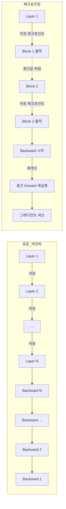
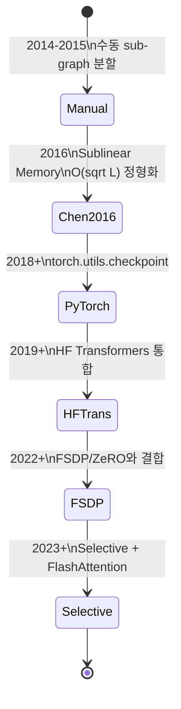

# 그래디언트 체크포인팅 (Gradient Checkpointing)

그래디언트 체크포인팅(Gradient Checkpointing) 또는 **활성값 체크포인팅(Activation Checkpointing)** 은 신경망 학습 시 **메모리를 시간(컴퓨트)으로 교환**하는 기법이다. 순전파(forward pass)에서 모든 활성값을 메모리에 저장하지 않고 일부 "체크포인트"만 저장한 뒤, 역전파(backward pass)에서 필요할 때 부분적으로 다시 계산한다. Chen et al. (2016) "Training Deep Nets with Sublinear Memory Cost"가 이 기법을 정식화했다.

## 왜 필요한가

표준 역전파는 forward 시 모든 중간 활성값(activation)을 저장해야 backward에서 그래디언트를 계산할 수 있다. $L$개 레이어를 가진 신경망에서:

- **메모리**: $O(L)$ — 각 레이어의 출력을 모두 보관
- **시간**: $O(L)$ — forward 1회 + backward 1회

큰 모델에서 활성값 메모리는 가중치 메모리를 압도한다. 예: 1,000-layer ResNet의 활성 메모리가 ImageNet 입력에서 48GB까지 치솟는다 (Chen et al. 2016 보고).

GPU/TPU 메모리는 한정되어 있으므로, 학습 가능한 배치 크기와 모델 크기를 제한한다. 그래디언트 체크포인팅은 이 한계를 완화한다.

## 핵심 아이디어



이 다이어그램은 표준 역전파(모든 활성값 저장)와 체크포인팅(일부만 저장하고 나머지는 재계산)의 차이를 보여준다.

## 메모리/시간 복잡도

Chen et al. 2016의 핵심 결과:

- **메모리**: $O(L) \to O(\sqrt{L})$ — 균등 간격으로 $\sqrt{L}$개 체크포인트 배치
- **시간**: 약 30-33% 추가 (forward 1회 추가에 해당)

수학적으로, $L$개 레이어를 $\sqrt{L}$개 세그먼트로 나누면 각 세그먼트의 forward 결과만 저장하고 backward 시 해당 세그먼트 내부를 다시 forward한다.

추가 비용으로 메모리를 $O(\log L)$까지도 줄일 수 있으나 시간 오버헤드가 더 크다 (Chen et al. 2016).

> "the algorithm achieves O(√n) memory cost to train an n-layer network ... only 30 percent additional running time cost"
> — Chen et al. 2016 Abstract

## PyTorch 사용법

PyTorch는 `torch.utils.checkpoint` 모듈로 체크포인팅을 제공한다 (공식 문서: https://docs.pytorch.org/docs/stable/checkpoint.html).

```python
import torch
from torch.utils.checkpoint import checkpoint, checkpoint_sequential


def block(x):
    # 비용이 큰 transformer block
    return some_layers(x)


# 단일 함수 체크포인팅
out = checkpoint(block, x, use_reentrant=False)

# 시퀀셜 모델을 K개 세그먼트로 나눠 체크포인팅
seq_model = torch.nn.Sequential(*[block_i for block_i in blocks])
out = checkpoint_sequential(seq_model, segments=4, input=x, use_reentrant=False)
```

### 주요 파라미터

| 파라미터 | 의미 |
|----------|------|
| `use_reentrant` | reentrant vs non-reentrant 변형 선택. **명시적 전달 필수**. 공식 권장은 `False` |
| `preserve_rng_state` | RNG 상태 저장/복원 여부 (기본 `True`). 비결정성 허용 시 `False`로 가속 |
| `context_fn` | autocast 등 사용자 지정 컨텍스트 매니저 |
| `determinism_check` | 재계산 결과 일관성 검사 모드 |

`use_reentrant=False`(non-reentrant)는 내부적으로 saved-tensor hooks를 사용해 더 유연하며, `nn.DataParallel`/grad scaler/`torch.compile` 등과의 호환성도 더 좋다.

## 다른 메모리 최적화와의 결합

```mermaid
flowchart TD
    Memory[메모리 최적화 기법] --> Ckpt[Gradient\nCheckpointing\nO(sqrt L)]
    Memory --> Mixed[[[mixed-precision-training]]\nFP16/BF16]
    Memory --> ZeRO[[[zero-optimization]]\nstate sharding]
    Memory --> FSDP[[[fsdp]]\nparam sharding]
    Memory --> Offload[CPU/NVMe\nOffload]

    Ckpt -->|결합| Combo
    Mixed -->|결합| Combo
    ZeRO -->|결합| Combo
    FSDP -->|결합| Combo
    Offload -->|결합| Combo

    Combo[Llama/GPT 급\n수백억-수조 파라미터\n학습 가능]
```

체크포인팅은 거의 모든 메모리 최적화와 직교적이다. 실무에서는 다음과 같이 조합한다:

- **Mixed precision** ([[mixed-precision-training]]): 활성값을 FP16/BF16로 저장 → 활성 메모리 절반
- **ZeRO** ([[zero-optimization]]) / **FSDP** ([[fsdp]]): optimizer state, gradient, parameter를 GPU 간에 sharding
- **Activation offload**: 일부 활성값을 CPU/NVMe로 오프로드 (체크포인팅의 dual)
- **Gradient accumulation**: 작은 마이크로 배치 여러 번 누적해 효과적 배치 크기 확대

Hugging Face Transformers는 `model.gradient_checkpointing_enable()` 한 줄로 transformer block 단위 체크포인팅을 켤 수 있다.

## Transformer 레이어 단위 적용

대형 트랜스포머에서는 보통 **각 transformer block을 하나의 체크포인트 단위**로 한다:

```python
class TransformerBlock(nn.Module):
    def forward(self, x):
        if self.use_checkpoint and self.training:
            return checkpoint(self._forward, x, use_reentrant=False)
        return self._forward(x)

    def _forward(self, x):
        x = x + self.attn(self.norm1(x))
        x = x + self.mlp(self.norm2(x))
        return x
```

선택적 체크포인팅(selective checkpointing): attention 출력 같은 메모리 무거운 텐서만 체크포인팅하고, 가벼운 연산은 저장 — FlashAttention과 결합하면 효율이 더 높다.

## 트레이드오프

| 측면 | 체크포인팅 켜기 | 체크포인팅 끄기 |
|------|------------------|------------------|
| 활성 메모리 | $O(\sqrt{L})$ | $O(L)$ |
| 학습 시간 | +30-35% | 기준 |
| 배치 크기 | 더 크게 가능 | 메모리 한계 |
| 구현 복잡도 | 약간 증가 (use_reentrant 등) | 단순 |
| 디버깅 | 재계산으로 인해 약간 어려움 | 직관적 |

체크포인팅은 **메모리가 병목**일 때만 가치가 있다. 메모리 여유가 있으면 시간 오버헤드만 키운다.

## 한계와 주의

- **In-place 연산 주의**: 체크포인트 내부에서 in-place 연산은 재계산 시 일관성 문제를 일으킬 수 있다.
- **RNG 결정성**: `preserve_rng_state=True` (기본)이 forward와 재forward의 dropout/random 동일성을 보장. 끄면 약간 빨라지지만 학습 결과가 미세하게 달라질 수 있다.
- **Backward custom function 호환**: 체크포인트 내부에서 custom autograd Function을 쓸 때는 reentrant 모드 호환성 확인 필요 [교차검증 필요].
- **재계산 비용 = forward 1회 추가**: 매우 깊지 않은 모델에서는 이득이 작다.

## 역사적 맥락



대형 LLM 학습이 일상화되면서 그래디언트 체크포인팅은 **선택이 아닌 필수**가 되었다. Megatron-LM, DeepSpeed, FSDP, Llama 학습 코드가 모두 기본으로 활성화한다.

## 관련 문서

- [[backpropagation]] - 역전파 기초
- [[gradient-descent-backpropagation]] - 기울기 기반 학습 전반
- [[transformer-architecture]] - 체크포인팅이 가장 자주 적용되는 구조
- [[fsdp]] - Fully Sharded Data Parallel
- [[zero-optimization]] - DeepSpeed ZeRO와 메모리 분할
- [[mixed-precision-training]] - FP16/BF16과 결합한 메모리 절감
- [[flash-attention-fundamentals]] - 어텐션 메모리 최적화
- [[automatic-differentiation]] - autograd 동작 원리
