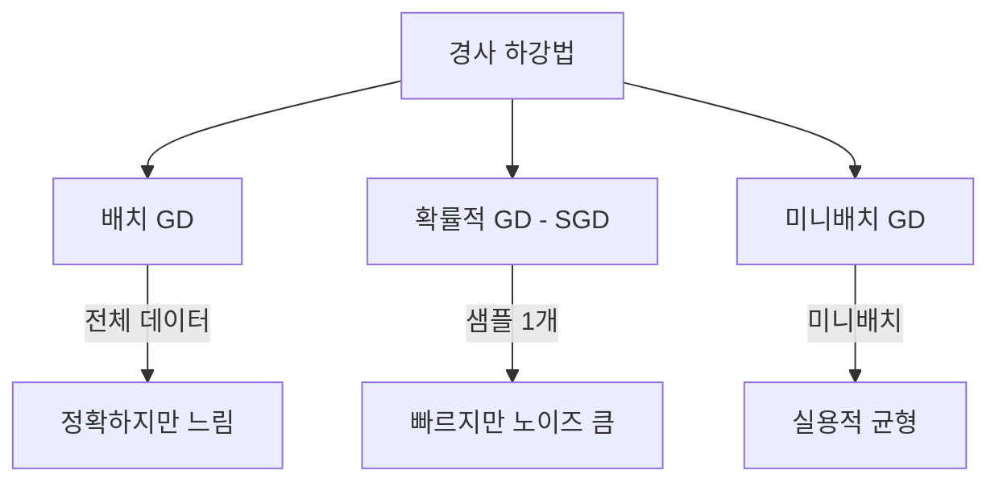
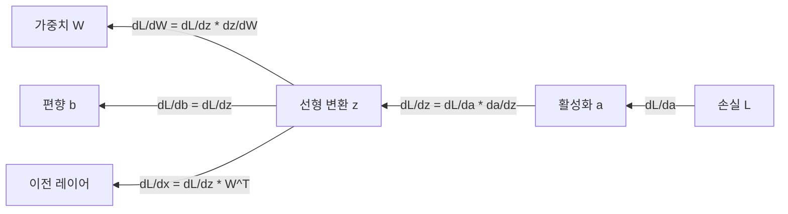
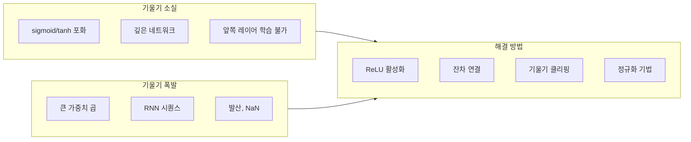

# 경사 하강법과 역전파 (Gradient Descent & Backpropagation)

경사 하강법은 [[loss-functions|손실 함수]]를 최소화하기 위해 파라미터를 반복적으로 업데이트하는 알고리즘이다. 역전파는 신경망에서 각 파라미터의 기울기를 효율적으로 계산하는 방법이다. 이 둘이 결합되어 현대 딥러닝의 학습 엔진을 형성한다.

## 경사 하강법의 직관

경사 하강법을 산에서 내려오는 것에 비유할 수 있다. 안개가 자욱해서 전체 지형을 볼 수 없지만, 발밑의 경사(기울기)는 느낄 수 있다. 가장 가파른 내리막 방향으로 한 걸음씩 내딛는 것이 경사 하강법이다.

```
theta <- theta - lr * dL/d(theta)
```

- `theta`: 모델 파라미터 (가중치)
- `lr`: 학습률 ([[optimization-theory|최적화 이론]] 참조)
- `dL/d(theta)`: 손실의 파라미터에 대한 기울기

## 경사 하강법의 변형



| 변형 | 배치 크기 | 장점 | 단점 |
|------|----------|------|------|
| 배치 GD | 전체 데이터 | 안정적 수렴 | 메모리, 속도 |
| SGD | 1개 샘플 | 빠른 반복, 안장점 탈출 | 높은 분산 |
| 미니배치 GD | 32-512 | 실용적 균형 | 배치 크기 튜닝 필요 |

실무에서는 미니배치 GD가 표준이며, 이를 보통 "SGD"라고 부른다.

## 연쇄 법칙 (Chain Rule)

역전파의 수학적 기반은 미적분의 연쇄 법칙이다:

```
dy/dx = dy/du * du/dx
```

신경망은 함수의 합성이다: `f = f_n(f_{n-1}(...f_1(x)))`. 각 레이어를 통과할 때마다 연쇄 법칙을 적용하여 최종 손실에 대한 각 파라미터의 기울기를 계산한다.

## 역전파 알고리즘

### 순전파 (Forward Pass)

입력에서 출력 방향으로 계산을 수행하고, 중간 결과를 저장한다:

```
z = W * x + b        (선형 변환)
a = activation(z)    (활성화 함수)
L = loss(a, y)       (손실 계산)
```

### 역전파 (Backward Pass)

출력에서 입력 방향으로 기울기를 전파한다:



핵심: 순전파 시 저장해둔 중간 결과를 역전파에서 재사용한다. 이것이 역전파가 효율적인 이유다 -- 같은 연쇄 법칙 계산을 중복하지 않는다.

## 자동 미분 (Automatic Differentiation)

역전파는 자동 미분의 **역방향 모드 (reverse mode)**의 특수한 경우다.

- **수치 미분**: `(f(x+h) - f(x)) / h` -- 느리고 부정확
- **기호 미분**: 수식을 직접 미분 -- 표현이 폭발적으로 커짐
- **자동 미분**: 컴퓨터가 연쇄 법칙을 자동 적용 -- 정확하고 효율적

PyTorch의 `autograd`, TensorFlow의 `GradientTape`이 자동 미분을 구현한다. 사용자가 순전파 코드만 작성하면 프레임워크가 기울기를 자동 계산한다.

## 기울기 문제들

### 기울기 소실 (Vanishing Gradient)

깊은 네트워크에서 기울기가 연쇄 곱셈을 거치며 지수적으로 작아지는 현상:

- sigmoid, tanh 활성화 함수의 포화 영역에서 기울기가 0에 근접
- 앞쪽 레이어의 가중치가 거의 업데이트되지 않음
- **해결책**: ReLU 활성화, 잔차 연결(ResNet), 배치/레이어 정규화, LSTM의 게이트

### 기울기 폭발 (Exploding Gradient)

기울기가 지수적으로 커지는 역방향의 문제:

- 가중치 업데이트가 비정상적으로 커져 발산
- RNN에서 특히 빈번
- **해결책**: 기울기 클리핑 (gradient clipping), 적절한 가중치 초기화, 정규화



## 실무에서의 역전파

현대 딥러닝 프레임워크에서 역전파를 직접 구현할 일은 거의 없다. 하지만 원리를 이해해야:

- 학습이 실패할 때 (NaN loss, 수렴하지 않음) 디버깅할 수 있다
- 기울기 클리핑, 학습률 조절 등의 결정을 내릴 수 있다
- [[overfitting-regularization|정규화]] 기법이 기울기에 미치는 영향을 이해할 수 있다

## 관련 문서
- [[mean-field-theory-nn]] -- 신경망 평균장 이론 (Mean Field Theory for Neural Networks)

- [[loss-functions]] -- 역전파가 최소화하는 대상
- [[optimization-theory]] -- SGD 변형과 학습률 스케줄링
- [[linear-algebra-for-ml]] -- 행렬 연산으로서의 순전파/역전파
- [[overfitting-regularization]] -- 기울기에 정규화 항 추가
- [[bias-variance-tradeoff]] -- 최적화의 목표와 일반화

## 참고 자료

- [Backpropagation - Wikipedia](https://en.wikipedia.org/wiki/Backpropagation)
- [The Chain Rule: Backbone of Backpropagation - TensorTonic](https://www.tensortonic.com/ml-math/calculus/chain-rule)
- [Vanishing Gradient Problem - DigitalOcean](https://www.digitalocean.com/community/tutorials/vanishing-gradient-problem)
