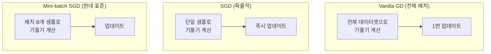
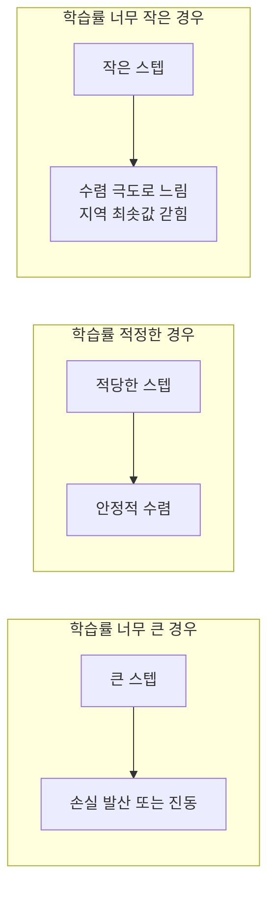
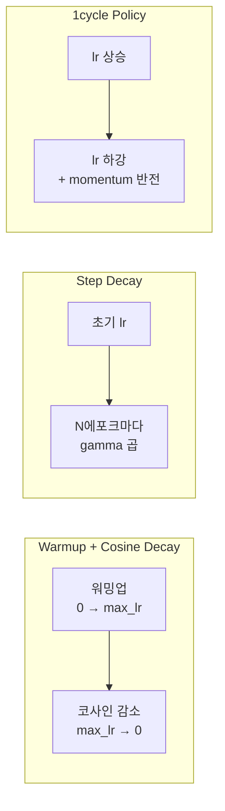

# 경사하강법 (Gradient Descent)

경사하강법(Gradient Descent)은 신경망 학습의 핵심 최적화 알고리즘이다. 손실 함수(loss function) $L(\theta)$를 파라미터 $\theta$에 대해 최소화하기 위해, 손실의 기울기([[backpropagation|역전파]]로 계산)의 반대 방향으로 파라미터를 반복적으로 이동시킨다.

기본 업데이트 규칙:
$$\theta \leftarrow \theta - \eta \nabla_\theta L(\theta)$$

여기서 $\eta$는 **학습률(learning rate)**이고, $\nabla_\theta L$은 손실의 기울기다.

## 왜 중요한가

딥러닝에서 모델 학습이란 수백만~수조 개의 파라미터를 조정해 데이터를 잘 설명하는 점을 찾는 문제다. 이 고차원 공간에서 직접 최솟값을 계산하는 것은 불가능하므로, 반복적인 기울기 기반 업데이트가 유일한 실용적 접근이다.

## Vanilla GD vs SGD vs Mini-batch



| 방식 | 배치 크기 | 기울기 노이즈 | 메모리 | 수렴 특성 |
|------|-----------|--------------|--------|-----------|
| **Vanilla GD** | 전체 N | 없음 (정확) | 많음 | 느리지만 안정적 |
| **SGD** | 1 | 매우 높음 | 최소 | 빠르지만 불안정 |
| **Mini-batch SGD** | 32~512 | 적당함 | 중간 | 현대 표준, 병렬 가속 |

**Mini-batch가 표준인 이유:**
- GPU 병렬 연산 최적화 (배치 행렬 곱)
- 기울기 노이즈가 오히려 지역 최솟값(local minima) 탈출에 도움
- 메모리와 속도의 균형

```python
# Mini-batch SGD 기본 구현
import torch

def sgd_step(
    params: list[torch.Tensor],
    grads: list[torch.Tensor],
    lr: float,
) -> None:
    for param, grad in zip(params, grads):
        param.data -= lr * grad
```

## 학습률 (Learning Rate)

학습률은 경사하강법에서 가장 중요한 하이퍼파라미터다. 잘못 설정하면 학습이 발산하거나 지나치게 느려진다.



**실무 가이드라인:**
- Adam: `1e-3` ~ `3e-4` (기본값 `1e-3`)
- SGD + 모멘텀: `1e-2` ~ `1e-1`
- 파인튜닝(fine-tuning): `1e-5` ~ `5e-5` (기학습 모델 손상 방지)
- Learning rate finder (fastai 방식): 작은 LR부터 점진적으로 높이며 손실 관찰

## 모멘텀 (Momentum)

기울기 방향에 관성을 부여하여 수렴을 가속하고 진동을 줄인다. 이전 업데이트 방향을 기억해 현재 기울기와 가중합한다.

$$v_t = \beta v_{t-1} + (1-\beta) \nabla_\theta L$$
$$\theta \leftarrow \theta - \eta v_t$$

$\beta = 0.9$ (일반적 기본값): 이전 기울기들의 지수 이동 평균.

**물리적 직관:** 공이 언덕을 굴러 내려갈 때 이전 속도가 유지되듯, 기울기 방향이 일관되면 점점 빠르게 수렴하고, 진동하는 방향은 상쇄된다.

**Nesterov 모멘텀:** 현재 위치가 아닌 "다음 위치 예측"에서 기울기를 계산. 더 빠른 수렴.

$$v_t = \beta v_{t-1} + \nabla_\theta L(\theta - \beta v_{t-1})$$

## 적응형 학습률 옵티마이저

파라미터마다 학습률을 개별 조정하는 방식. 희소한 특징(sparse feature)이나 다양한 스케일의 파라미터를 효과적으로 처리한다.

### AdaGrad

각 파라미터의 기울기 제곱합에 반비례하는 학습률 적용. 자주 업데이트되는 파라미터는 학습률이 낮아진다.

$$G_t = G_{t-1} + g_t^2$$
$$\theta \leftarrow \theta - \frac{\eta}{\sqrt{G_t + \epsilon}} g_t$$

**단점:** $G_t$가 단조 증가하여 후반 학습에서 학습률이 0에 수렴 ("학습 소멸").

### RMSProp

AdaGrad의 학습 소멸 문제를 지수 이동 평균으로 해결. [[adagrad-rmsprop]] 참조.

$$G_t = \gamma G_{t-1} + (1-\gamma) g_t^2$$
$$\theta \leftarrow \theta - \frac{\eta}{\sqrt{G_t + \epsilon}} g_t$$

$\gamma = 0.9$ (일반적 기본값): 최근 기울기에 더 가중치.

### Adam (Adaptive Moment Estimation)

현재 가장 널리 사용되는 옵티마이저. 모멘텀(1차 모멘트)과 RMSProp(2차 모멘트)를 결합. [[adam-original-paper]] 참조.

$$m_t = \beta_1 m_{t-1} + (1-\beta_1) g_t \quad \text{(1차 모멘트)}$$
$$v_t = \beta_2 v_{t-1} + (1-\beta_2) g_t^2 \quad \text{(2차 모멘트)}$$
$$\hat{m}_t = \frac{m_t}{1-\beta_1^t}, \quad \hat{v}_t = \frac{v_t}{1-\beta_2^t} \quad \text{(편향 보정)}$$
$$\theta \leftarrow \theta - \frac{\eta}{\sqrt{\hat{v}_t} + \epsilon} \hat{m}_t$$

**기본값:** $\beta_1=0.9$, $\beta_2=0.999$, $\epsilon=10^{-8}$, $\eta=10^{-3}$

**AdamW:** Adam에 L2 정규화(weight decay)를 적용할 때, 일반적인 방식 대신 파라미터에 직접 감쇠(decoupled weight decay)를 적용. 현대 LLM 학습의 표준.

```python
import torch.optim as optim

# AdamW (현대 표준)
optimizer = optim.AdamW(
    model.parameters(),
    lr=3e-4,
    betas=(0.9, 0.999),
    weight_decay=0.01,
)
```

### 옵티마이저 비교

| 옵티마이저 | 메모리 오버헤드 | 튜닝 난이도 | 적합 상황 |
|-----------|----------------|------------|-----------|
| SGD | 없음 | 높음 (lr, momentum 튜닝 필요) | 컴퓨터 비전 파인튜닝 |
| SGD+Momentum | 낮음 | 높음 | 이미지 분류 표준 |
| Adam | 2배 (m, v 저장) | 낮음 | 일반 딥러닝 기본값 |
| AdamW | 2배 | 낮음 | LLM, Transformer 표준 |
| Adafactor | 0.5배 수준 | 중간 | 메모리 제한 환경 (T5 학습) |
| Lion | 1배 (방향만) | 낮음 | 메모리 효율 Adam 대안 |

## 학습률 스케줄링

학습 과정에서 학습률을 동적으로 조정하는 전략. [[learning-rate-scheduling]] 참조.



**대표 스케줄:**

1. **Warmup + Cosine Decay**: LLM 학습 표준. 초반 불안정 방지 후 천천히 감소
   ```python
   from transformers import get_cosine_schedule_with_warmup
   scheduler = get_cosine_schedule_with_warmup(
       optimizer, num_warmup_steps=1000, num_training_steps=10000
   )
   ```

2. **ReduceLROnPlateau**: 검증 손실이 개선 없을 때 자동으로 학습률 감소
   ```python
   scheduler = optim.lr_scheduler.ReduceLROnPlateau(
       optimizer, mode="min", factor=0.5, patience=5
   )
   ```

3. **Cosine Annealing with Restarts**: 주기적으로 학습률 리셋. 다양한 손실 경관 탐색

## 수렴 이론

**볼록(Convex) 함수:** 경사하강법은 전역 최솟값 수렴이 이론적으로 보장된다. 다만 딥러닝의 손실 경관은 비볼록(non-convex).

**비볼록 상황에서의 실제 수렴:**
- 지역 최솟값보다 **안장점(saddle point)**이 더 흔한 장애물
- 현대 대형 모델은 손실 경관이 매우 "평탄"하여 수렴이 오히려 용이
- SGD의 노이즈가 안장점 탈출을 도움

**수렴 조건 (SGD 기준):**
$$\sum_{t=1}^{\infty} \eta_t = \infty \quad \text{및} \quad \sum_{t=1}^{\infty} \eta_t^2 < \infty$$

다시 말해 학습률이 너무 빨리 줄지도, 너무 천천히 줄지도 않아야 한다.

## 기울기 클리핑 (Gradient Clipping)

기울기 폭발(exploding gradient) 방지를 위해 기울기의 노름(norm)을 최대값으로 제한한다. RNN 계열과 LLM 학습 시 표준.

```python
# PyTorch 기울기 클리핑
loss.backward()
torch.nn.utils.clip_grad_norm_(model.parameters(), max_norm=1.0)
optimizer.step()
```

**Global norm clipping:** 모든 파라미터의 기울기를 하나의 벡터로 합쳐 전체 노름을 기준으로 스케일링. 개별 클리핑보다 방향 보존에 유리.

## 배치 크기와 학습률의 관계

배치 크기를 $k$배 늘리면 기울기 추정의 분산이 $1/k$배 줄어든다. 이를 보상하기 위해 **선형 스케일링 규칙(linear scaling rule)**을 적용한다:

> 배치 크기를 $k$배 늘리면 학습률도 $k$배 늘린다 (Goyal et al., 2017)

단, 대형 배치(batch size ≥ 8192)에서는 단순 선형 스케일링이 불안정할 수 있어 warmup 필수.

## 실무 체크리스트

```
학습이 발산하거나 손실이 NaN이 될 때:
1. 학습률을 10배 줄여본다
2. 기울기 클리핑 추가 (max_norm=1.0)
3. 가중치 초기화 확인 (Xavier/Kaiming)
4. 입력 정규화 확인 (배치 정규화, 입력 스케일링)
5. 손실 함수 구현 오류 확인

학습이 너무 느릴 때:
1. 학습률을 높여본다 (lr finder 사용)
2. 배치 크기 증가
3. Warmup 추가 후 cosine decay
4. 옵티마이저를 SGD → AdamW로 변경
```

## 관련 문서

- [[adam-original-paper]] - Adam 옵티마이저 원 논문
- [[adagrad-rmsprop]] - AdaGrad와 RMSProp 상세
- [[learning-rate-scheduling]] - 학습률 스케줄 전략
- [[backpropagation]] - 기울기 계산의 기반
- [[neural-network]] - 신경망 학습 맥락
