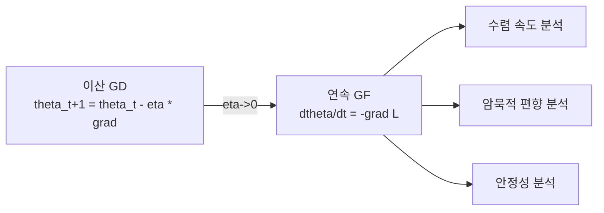

# 그래디언트 흐름 최적화 이론

경사 하강법을 학습률 $\eta \to 0$의 극한에서 **연속 시간 ODE**로 해석하는 이론적 프레임워크. 이산 SGD의 수렴 성질을 연속 동역학으로 분석하여 [[implicit-regularization|암묵적 정규화]], [[loss-landscape|손실 경관]] 탐색 등의 이론적 기반을 제공한다.

## 연속 시간 경사 흐름

$$\frac{d\theta}{dt} = -\nabla L(\theta)$$

이산 경사 하강 $\theta_{t+1} = \theta_t - \eta \nabla L(\theta_t)$는 이 ODE의 **오일러법 근사**다.

## 핵심 결과

### 볼록 최적화에서의 수렴

볼록 함수 $L$에 대해 그래디언트 흐름은 $L(\theta(t)) - L^* = O(1/t)$ 속도로 수렴. 강볼록($\mu$-strongly convex)이면 $O(e^{-\mu t})$ 지수 수렴.

### 비볼록에서의 암묵적 편향

신경망(비볼록)에서 그래디언트 흐름은 **최소 노름 해**에 수렴하는 경향이 있다. 이것이 [[benign-overfitting|양성 오버피팅]]의 이론적 근거.

### Mirror Descent와의 연결

자연 그래디언트 흐름은 KL 발산 공간에서의 mirror descent로 해석 가능 -- [[natural-gradient|자연 경사법]]의 이론적 배경.

## 관련 문서

- [[optimization-theory]] -- 최적화 이론
- [[implicit-regularization]] -- 암묵적 정규화
- [[natural-gradient]] -- 자연 경사법
- [[loss-landscape]] -- 손실 경관
