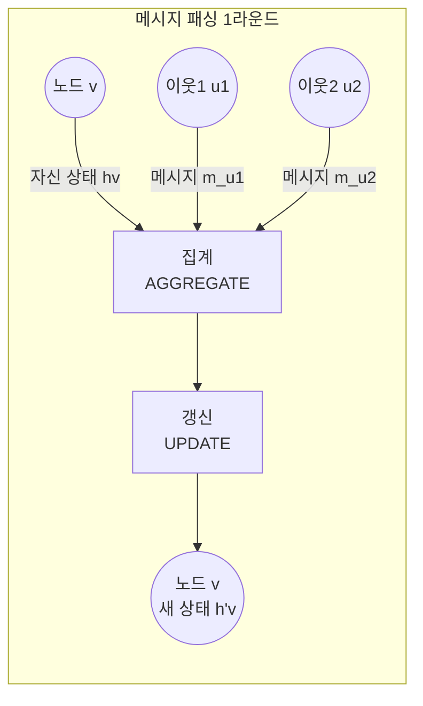

# 그래프 신경망 기초 (Graph Neural Networks)

그래프(Graph) 구조의 데이터를 처리하기 위한 신경망 아키텍처. 소셜 네트워크, 분자 구조, 지식 그래프 등 관계형 데이터에서 노드(node), 엣지(edge) 정보를 함께 학습한다.

## 메시지 패싱 프레임워크 (Message Passing)

대부분의 GNN은 **메시지 패싱 신경망(Message Passing Neural Network, MPNN)** 프레임워크로 통합된다. 각 노드가 이웃 노드로부터 정보를 수집하고 자신의 상태를 갱신하는 과정을 반복한다.

수식으로 표현하면:

$$m_v^{(k)} = \text{AGGREGATE}^{(k)}\left(\{h_u^{(k-1)} : u \in \mathcal{N}(v)\}\right)$$
$$h_v^{(k)} = \text{UPDATE}^{(k)}\left(h_v^{(k-1)}, m_v^{(k)}\right)$$

$K$ 레이어를 쌓으면 각 노드는 $K$-hop 이웃까지의 정보를 통합한다.

## GCN (Graph Convolutional Network)

스펙트럴(Spectral) 방식에서 출발하여 공간적(Spatial) 해석으로 단순화한 모델:

$$H^{(l+1)} = \sigma\left(\tilde{D}^{-1/2}\tilde{A}\tilde{D}^{-1/2} H^{(l)} W^{(l)}\right)$$

- $\tilde{A} = A + I$: 자기 루프를 추가한 인접 행렬
- $\tilde{D}$: $\tilde{A}$의 차수 행렬 (정규화용)
- $W^{(l)}$: 학습 가능한 가중치 행렬
- 실질적으로: "이웃 평균" + 선형 변환 + 비선형 활성화

## GAT (Graph Attention Network)

이웃 간 중요도를 어텐션(attention) 가중치로 동적으로 결정:

$$\alpha_{ij} = \frac{\exp\left(\text{LeakyReLU}(\mathbf{a}^T [W h_i \| W h_j])\right)}{\sum_{k \in \mathcal{N}(i)} \exp\left(\text{LeakyReLU}(\mathbf{a}^T [W h_i \| W h_k])\right)}$$

$$h_i' = \sigma\left(\sum_{j \in \mathcal{N}(i)} \alpha_{ij} W h_j\right)$$

다중 헤드 어텐션(multi-head attention)을 사용하면 안정성이 높아진다. 엣지 유형별로 다른 가중치를 학습할 수 있어 이질적 그래프(heterogeneous graph)에 유리하다.

## GraphSAGE (인덕티브 학습)

GCN과 GAT는 전체 그래프에 대해 학습하는 **트랜스덕티브(transductive)** 방식이라 새 노드에 일반화가 어렵다. GraphSAGE는 집계 함수를 학습하여 보지 못한 노드에도 임베딩을 생성하는 **인덕티브(inductive)** 학습을 가능하게 한다.

- 이웃 노드를 샘플링하여 미니배치 학습 지원
- 집계기: Mean, LSTM, Pooling 방식 선택 가능
- 대규모 그래프(수억 노드)에 적용 가능

## GNN 모델 비교

| 항목 | GCN | GAT | GraphSAGE |
|------|-----|-----|-----------|
| 이웃 가중치 | 균등 (차수 정규화) | 학습된 어텐션 | 집계 함수 기반 |
| 계산 복잡도 | 낮음 | 중간-높음 | 중간 |
| 인덕티브 학습 | 불가 | 불가 | 가능 |
| 이질 그래프 | 제한적 | 가능 | 가능 |

## Over-smoothing 문제

레이어를 깊게 쌓으면 ($K > 6~8$) 모든 노드의 임베딩이 동일해지는 over-smoothing 현상이 발생한다. 메시지 패싱을 반복할수록 모든 이웃의 정보가 과도하게 혼합되어 구분력을 잃는다.

- **완화 방법**: Residual connection(잔차 연결), DropEdge(엣지 드롭아웃), PairNorm

## 주요 응용 분야

- **분자 설계 & 약물 개발**: 원자를 노드, 화학 결합을 엣지로 모델링 - 분자 특성 예측, 신약 후보 생성
- **소셜 네트워크**: 사용자 노드, 팔로우를 엣지 - 추천 시스템, 가짜 뉴스 탐지
- **지식 그래프 (Knowledge Graph)**: 엔티티-관계 표현 - 링크 예측, 질의응답
- **교통망 예측**: 도로망을 그래프로 표현 - 실시간 경로 예측

## 관련 문서
- [[pointnet-point-cloud]] -- PointNet - 포인트 클라우드 딥러닝
- [[point-cloud-networks]] -- 포인트 클라우드 네트워크 (PointNet / Point Transformer)
- [[ka-gnn-molecular]] -- KA-GNN - 콜모고로프-아놀드 분자 GNN

- [[attention-mechanism-overview]]
- [[ensemble-methods]]
- [[self-supervised-learning]]
