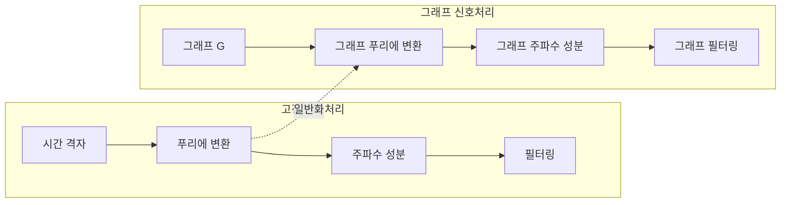
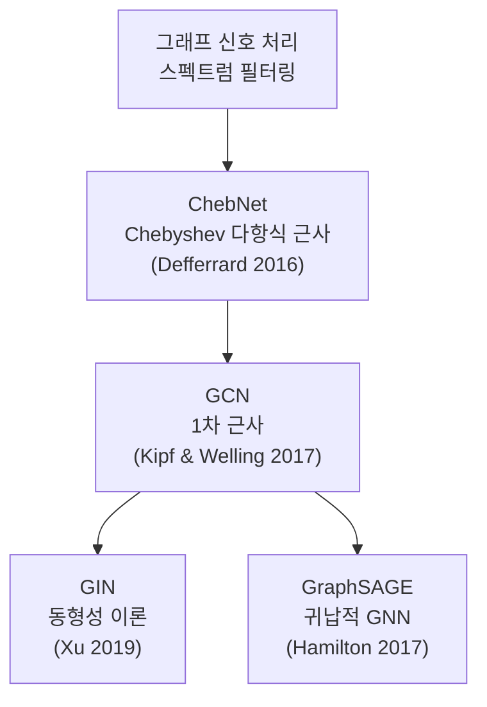

# 그래프 신호 처리 (GSP)

## 한 줄 요약

고전 신호 처리(푸리에 분석, 필터링)를 그래프 위에 정의된 신호로 확장한 수학적 프레임워크. GCN(Graph Convolutional Network) 등 그래프 신경망의 이론적 기반을 제공한다.

## 배경: 고전 신호 처리와의 유사

고전 신호 처리는 **규칙적인 격자(regular grid)** 위의 신호를 다룬다:
- 1D: 시계열, 오디오 (시간 격자)
- 2D: 이미지 (픽셀 격자)

실세계 데이터는 종종 **불규칙한 구조** 위에 놓인다:
- 소셜 네트워크의 사용자 특성
- 교통망 위의 차량 흐름
- 뇌 네트워크 위의 신경 활동
- 분자 그래프 위의 원자 특성

GSP는 이런 데이터를 처리하기 위해 고전 신호 처리 개념을 **그래프 구조**로 일반화한다.

## 그래프 신호 기본 정의

**그래프**: $\mathcal{G} = (\mathcal{V}, \mathcal{E}, W)$
- $\mathcal{V}$: 정점(vertex) 집합, $|\mathcal{V}| = N$
- $\mathcal{E}$: 간선(edge) 집합
- $W \in \mathbb{R}^{N \times N}$: 가중치 인접 행렬(weighted adjacency matrix)

**그래프 신호**: 함수 $f: \mathcal{V} \to \mathbb{R}$. 벡터 $\mathbf{f} \in \mathbb{R}^N$으로 표현하며, $f_i$는 정점 $i$에서의 신호 값.



## 그래프 라플라시안 (Graph Laplacian)

GSP의 핵심 연산자. 두 가지 형태:

**비정규화 라플라시안(Combinatorial Laplacian)**:

$$L = D - W$$

여기서 $D$는 차수 행렬(degree matrix), $D_{ii} = \sum_j W_{ij}$.

**정규화 라플라시안(Normalized Laplacian)**:

$$\mathcal{L} = D^{-1/2} L D^{-1/2} = I - D^{-1/2} W D^{-1/2}$$

**라플라시안의 성질**:
- 대칭 양반정치 행렬 (eigenvalues $\lambda_i \geq 0$)
- 고유값 분해: $L = U \Lambda U^\top$, $\Lambda = \text{diag}(\lambda_0, \ldots, \lambda_{N-1})$
- 최소 고유값 $\lambda_0 = 0$ (균일 신호에 대응)
- 연결 그래프에서 $\lambda_0$의 중복도 = 연결 성분 수

**Rayleigh 상수 해석**:

$$\mathbf{f}^\top L \mathbf{f} = \frac{1}{2}\sum_{(i,j) \in \mathcal{E}} W_{ij}(f_i - f_j)^2$$

신호의 **그래프 매끄러움(graph smoothness)**을 측정한다. 이 값이 작을수록 인접 정점 간 신호 변화가 작다(매끄러운 신호).

## 그래프 푸리에 변환 (GFT)

고전 푸리에 변환에서 기저(basis)는 복소 지수 함수 $e^{j\omega t}$ - 라플라시안 연산자의 고유함수.

그래프에서는 **그래프 라플라시안의 고유벡터**를 기저로 사용:

$$L = U \Lambda U^\top, \quad U = [u_0, u_1, \ldots, u_{N-1}]$$

**그래프 푸리에 변환(GFT)**:

$$\hat{\mathbf{f}} = U^\top \mathbf{f}$$

**역변환**:

$$\mathbf{f} = U \hat{\mathbf{f}}$$

| 고전 신호 처리 | 그래프 신호 처리 |
|-------------|--------------|
| 주파수 $\omega$ | 그래프 주파수 $\lambda_k$ |
| 복소 지수 $e^{j\omega t}$ | 라플라시안 고유벡터 $u_k$ |
| 푸리에 계수 | 그래프 푸리에 계수 $\hat{f}_k$ |
| 저주파 = 천천히 변하는 신호 | 낮은 $\lambda_k$ = 그래프 상 매끄러운 신호 |
| 고주파 = 빠르게 변하는 신호 | 높은 $\lambda_k$ = 인접 정점 간 급격한 변화 |

## 그래프 필터링

고전 신호 처리에서 필터는 주파수 응답 $h(\omega)$로 정의된다. 그래프 필터는:

**스펙트럼 필터링(Spectral Filtering)**:

$$\hat{g}(\mathbf{f}) = U \, \text{diag}(h(\lambda_0), \ldots, h(\lambda_{N-1})) \, U^\top \mathbf{f}$$

또는 행렬 다항식으로:

$$g_\theta(L) = \sum_{k=0}^{K} \theta_k L^k$$

여기서 $\theta$는 학습 가능한 필터 계수.

### 저역/고역 통과 필터

- **저역 통과(low-pass)**: 낮은 $\lambda$에 대응하는 성분 보존 = 그래프에서 매끄러운 신호
- **고역 통과(high-pass)**: 높은 $\lambda$에 대응하는 성분 보존 = 신호의 불연속 경계

## GCN과의 연결

Kipf & Welling (2017)의 GCN (Graph Convolutional Network)은 GSP의 스펙트럼 필터링을 근사한 결과다.

**Chebyshev 다항식 근사** (ChebNet, Defferrard 2016):

$$g_\theta(\tilde{L}) \approx \sum_{k=0}^{K} \theta_k T_k(\tilde{L})$$

여기서 $\tilde{L} = 2L/\lambda_{\max} - I$는 정규화된 라플라시안.

**GCN의 1차 근사** (Kipf & Welling):

$K=1$, $\lambda_{\max} \approx 2$로 근사하면:

$$H^{(l+1)} = \sigma\left(\tilde{D}^{-1/2}\tilde{A}\tilde{D}^{-1/2} H^{(l)} \Theta\right)$$

여기서 $\tilde{A} = A + I$ (자기 루프 추가), $\tilde{D}_{ii} = \sum_j \tilde{A}_{ij}$.



이처럼 GCN은 GSP 프레임워크에서 이론적으로 유도된 결과다.

## 공간 vs 스펙트럼 그래프 합성곱

| 관점 | 정의 | 장단점 |
|------|------|--------|
| **스펙트럼(spectral)** | GFT 도메인에서 곱셈 | 이론적 명확, 고유값 분해 $O(N^3)$ |
| **공간(spatial)** | 정점 이웃에서 직접 집계 | 직관적, 귀납적, 확장성 우수 |

스펙트럼 방법(GCN)은 스펙트럼 시각으로 유도되지만, 실제 계산은 공간 방법으로 등가 변환된다.

## 주요 응용

### 반지도 학습 (Semi-Supervised Learning)

그래프 신호의 매끄러움 가정: 연결된 정점은 유사한 레이블을 가진다.

정규화 목적 함수:

$$\mathcal{L} = \mathcal{L}_{\text{supervised}} + \lambda \, \mathbf{f}^\top L \mathbf{f}$$

두 번째 항이 그래프 매끄러움 정규화.

### 그래프 클러스터링 (Spectral Clustering)

라플라시안 하위 고유벡터로 k-means 클러스터링:

```python
import numpy as np
from sklearn.cluster import KMeans

def spectral_clustering(W, k):
    """스펙트럼 클러스터링 - GSP 기반."""
    D = np.diag(W.sum(axis=1))
    L = D - W
    # 정규화 라플라시안
    D_inv_sqrt = np.diag(1 / np.sqrt(D.diagonal()))
    L_norm = D_inv_sqrt @ L @ D_inv_sqrt
    # 하위 k개 고유벡터
    eigenvalues, eigenvectors = np.linalg.eigh(L_norm)
    U = eigenvectors[:, :k]  # 처음 k개 열
    # U 행벡터로 k-means
    labels = KMeans(n_clusters=k).fit_predict(U)
    return labels
```

### 그래프 신호 보간 (Signal Interpolation)

일부 정점의 신호 값이 주어졌을 때 나머지 정점의 신호를 복원. 저역 통과 필터 적용 + 알려진 값 조건.

### 점 구름 처리 (Point Cloud Processing)

3D 점 구름의 각 점이 정점, k-NN으로 간선 구성. GSP 기반 특징 추출 및 노이즈 제거.

## 그래프 웨이블릿 (Graph Wavelets)

푸리에 변환이 전역 주파수를 분석한다면, 웨이블릿은 시간-주파수(시공간) 국소화를 제공한다. 그래프 웨이블릿은 특정 정점 주변의 국소 구조를 다중 스케일로 분석한다.

$$\Psi_{s,t}(i) = g_s(L)_{it}$$

여기서 $g_s$는 스케일 $s$에서의 웨이블릿 생성 함수, $t$는 국소화 정점.

## 분산 최적화와 GSP

대규모 그래프에서 신호 처리는 각 정점이 이웃과 로컬 통신만으로 전역 최적화를 수행하는 **분산 알고리즘**으로 구현된다:
- ADMM (Alternating Direction Method of Multipliers)
- Gossip 알고리즘
- 연방 학습(Federated Learning)의 그래프 이론 토대

## 왜 중요한가

1. **GCN 등 그래프 신경망의 이론적 토대** 제공 - "왜 이 집계 방식이 효과적인가"를 설명
2. **고전 신호 처리 직관을 비유클리드 공간으로 확장** - 엔지니어/연구자의 수학적 직관 활용
3. **분자 설계·단백질 구조·소셜 분석** 등 다양한 분야의 공통 수학 언어 제공
4. 최신 **3D 포인트 클라우드, LiDAR** 처리의 이론적 기반

## 관련 문서

- [[graph-neural-networks]] - GNN 실용 아키텍처
- [[spectral-methods-ml]] - 스펙트럼 방법 전반
- [[manifold-learning-isomap-lle]] - 비유클리드 구조 학습
- [[rkhs-kernel-methods]] - 커널 기반 함수 공간 이론
- [[pca]] - 스펙트럼 분해의 고전적 응용
