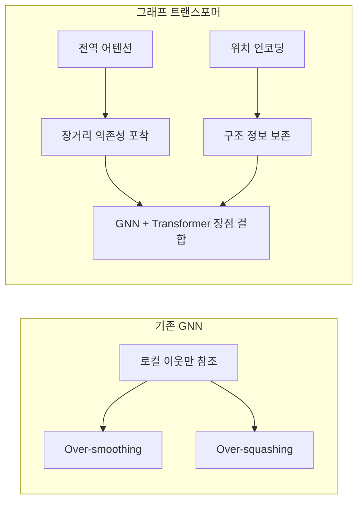

# 그래프 트랜스포머

[[graph-neural-networks|GNN]]의 메시지 패싱과 [[transformer-architecture|Transformer]]의 전역 어텐션을 결합한 아키텍처. 그래프 구조 데이터에서 장거리 의존성을 포착하면서도 그래프 토폴로지 정보를 보존한다.

## GNN의 한계

기존 GNN(GCN, [[graph-attention-network|GAT]])은 k-홉 이웃까지만 정보를 전파하는 **로컬 메시지 패싱**에 의존한다. 깊이가 깊어지면 over-smoothing(모든 노드 표현이 수렴)과 over-squashing(병목 노드에 정보 압축) 문제가 발생한다.

## 핵심 설계 요소

### 1. 그래프 위치 인코딩 (Graph PE)

순서가 없는 그래프에 위치 정보를 부여하는 것이 핵심 과제:

| 방법 | 원리 |
|------|------|
| Laplacian PE | 그래프 라플라시안 고유벡터를 위치 인코딩으로 사용 |
| Random Walk PE (RWSE) | k-스텝 랜덤 워크 확률을 노드 특성으로 추가 |
| SignNet | 고유벡터 부호 모호성을 학습으로 해결 |

### 2. 어텐션 메커니즘

- **Sparse Attention**: 그래프 엣지를 따라만 어텐션 (GAT 스타일)
- **Full Attention**: 모든 노드 쌍에 어텐션 (Transformer 스타일)
- **Biased Attention**: 전역 어텐션 + 그래프 거리 기반 편향

### 3. GraphGPS 프레임워크

Rampasek et al. (2022)의 모듈식 프레임워크:

$$h_i^{(l+1)} = \text{MLP}\Big(\text{MPNN}(h_i^{(l)}, \mathcal{N}_i) + \text{GlobalAttn}(h_i^{(l)}, H^{(l)})\Big)$$

로컬 MPNN과 전역 Transformer를 **병렬로 결합**하고 잔차 연결한다.

## 응용 분야

- **분자 속성 예측**: 원자 그래프에서 분자 전체 속성 예측
- **단백질 구조 분석**: 아미노산 접촉 그래프에서 기능 예측
- **소셜 네트워크**: 사용자 관계 그래프에서 커뮤니티 탐지

## 관련 문서
- [[spectral-gnn]] -- 스펙트럼 GNN / WL 표현력

- [[graph-neural-networks]] -- GNN 기초
- [[graph-attention-network]] -- GAT
- [[transformer-architecture]] -- Transformer 아키텍처
- [[spectral-methods-ml]] -- 스펙트럼 방법
