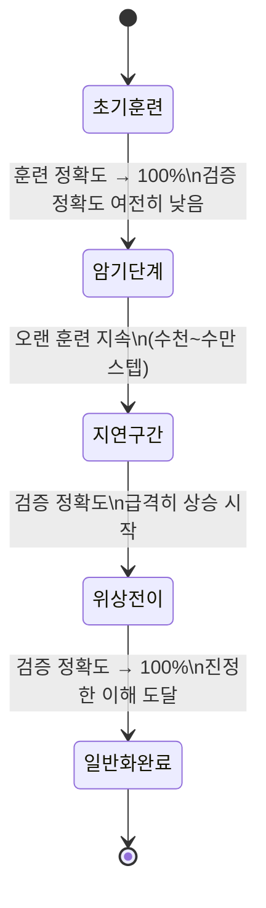

# 그로킹 (Grokking)

## 개요

그로킹(Grokking)은 신경망 훈련에서 관찰되는 지연된 일반화(delayed generalization) 현상이다. Power et al.(2022, OpenAI)이 발견했으며, 훈련 정확도가 거의 100%에 도달한 이후 훨씬 오랜 시간이 지나야 검증 정확도가 갑작스럽게 상승하는 특이한 패턴을 보인다. 즉, 모델이 먼저 훈련 데이터를 "암기(memorization)"한 후, 훈련을 계속하면 어느 순간 진짜 "이해(generalization)"로 전환되는 것이다.

"Grok"은 Robert Heinlein의 SF 소설 "낯선 땅의 이방인"에서 유래한 단어로, 직관적으로 완전히 이해한다는 의미다.

## 현상의 패턴

훈련 손실과 검증 손실의 시간적 궤적은 다음과 같다:

- **초기**: 훈련 손실과 검증 손실 모두 감소
- **암기 단계**: 훈련 손실은 0에 수렴, 검증 손실은 높게 유지 (전형적 과적합처럼 보임)
- **위상 전이 직전**: 검증 손실이 갑자기 빠르게 감소
- **수렴**: 검증 손실도 0에 가까워짐

## 실험 설정

Power et al.(2022)은 주로 **모듈러 산술(modular arithmetic)** 태스크에서 그로킹을 관찰했다:

- 두 수 $a, b$에 대해 $(a + b) \mod p$ 계산 (예: $p = 97$)
- 소형 Transformer 모델 (2레이어, 4헤드)
- 전체 데이터의 일부만을 훈련 세트로 사용

이처럼 수학적으로 명확한 규칙이 있는 태스크에서 그로킹이 특히 잘 나타난다. 이후 연구에서 나눗셈, 순열 연산, 더 복잡한 태스크에서도 확인됐다.

## 그로킹 발생 조건

그로킹이 일어나려면 특정 조건이 필요하다:

| 조건 | 설명 |
|------|------|
| **데이터 비율** | 훈련 데이터가 전체의 일부만 사용될 때. 너무 많으면 처음부터 일반화 |
| **정규화** | 가중치 감소(weight decay)가 강하면 그로킹이 더 잘 발생 |
| **충분히 큰 모델** | 먼저 암기할 수 있는 용량이 필요 |
| **충분히 긴 훈련** | 위상 전이가 일어날 때까지 훈련을 계속해야 함 |

## 이론적 설명 - 효율적 표현 탐색

Neel Nanda et al.(2023)의 메카니스틱 해석 가능성(mechanistic interpretability) 연구는 그로킹의 내부 메커니즘을 분석했다:

모듈러 덧셈 $a + b \mod p$에서 모델은 두 가지 알고리즘 중 하나를 사용한다:

1. **암기 단계**: $(a, b) \rightarrow$ 결과를 룩업 테이블처럼 직접 저장
2. **일반화 단계**: 푸리에 분석(Fourier analysis) 기반의 체계적 알고리즘 발견

위상 전이는 모델이 룩업 테이블 표현에서 더 간결한 알고리즘적 표현으로 전환하는 순간에 해당한다. 이 과정에서 [[loss-functions]] 상의 손실은 훈련 세트에서 사실상 차이가 없지만, 내부 표현의 구조가 완전히 바뀐다.

## [[overfitting-regularization]]과의 관계

그로킹은 [[overfitting-regularization]] 관점에서 흥미로운 역설을 제시한다:

- 암기 단계에서 외부에서 보기에는 "과적합"처럼 보인다
- 하지만 훈련을 멈추면 진정한 일반화에 도달할 기회를 놓친다
- **가중치 노름(weight norm)** 이 지표로: 암기 단계에서 노름이 크고, 일반화 후 노름이 작아진다
- 이는 정규화(가중치 감소)가 일반화로의 전환을 가속할 수 있음을 시사

## [[double-descent]]와의 비교

| 특성 | 이중 하강 | 그로킹 |
|------|----------|--------|
| 주축 | 모델 복잡도 / 파라미터 수 | 훈련 스텝 수 |
| 현상 | 복잡도 증가 시 테스트 오차가 올랐다 내림 | 훈련 완료 후 한참 뒤에 일반화 |
| 설명 | 보간 임계점 통과 | 효율적 표현으로 위상 전이 |
| 공통점 | 과잉 파라미터화, 비직관적 일반화 | |

## 실무적 의미

그로킹은 다음과 같은 실무적 질문을 제기한다:

1. **조기 종료의 위험**: 훈련 정확도 포화 후 검증 정확도가 낮을 때 중단하면 일반화 기회를 놓칠 수 있다
2. **학습률 스케줄**: 그로킹 위상 전이를 유발하려면 충분한 훈련이 필요하며, 너무 이른 학습률 감소가 전환을 방해할 수 있다
3. **정규화 강도**: 가중치 감소 계수가 그로킹 발생 속도에 큰 영향을 미침
4. **대형 모델에서의 일반화**: LLM이 산술 태스크에서 "갑자기" 능력을 보이는 이머전트 능력(emergent ability)이 그로킹과 관련 있다는 가설 존재

## 관련 문서

- [[overfitting-regularization]] - 과적합과 일반화의 전통적 분석
- [[loss-functions]] - 훈련 손실과 검증 손실의 분리 현상
- [[double-descent]] - 또 다른 비직관적 일반화 패턴
- [[neural-collapse]] - 훈련 후반부의 또 다른 위상 전이 현상
