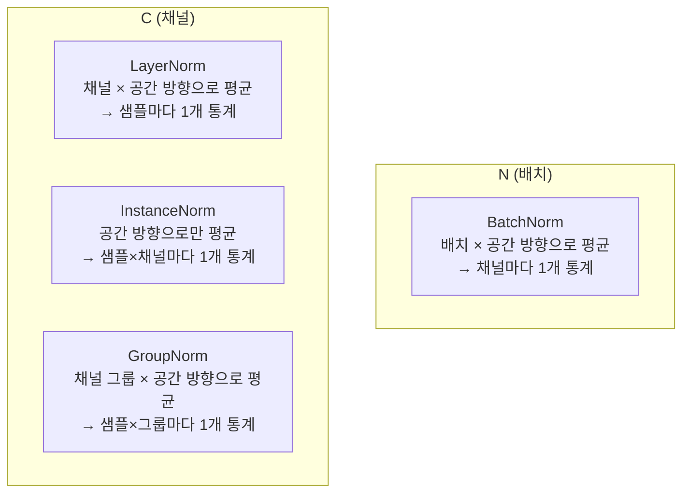
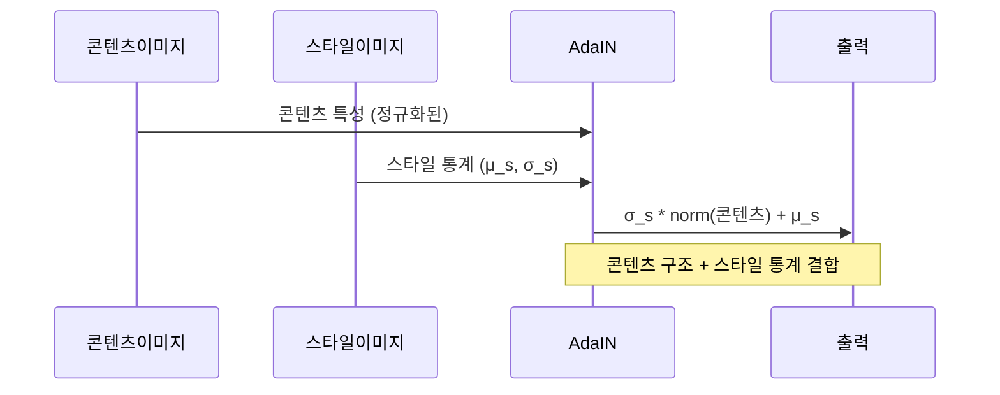
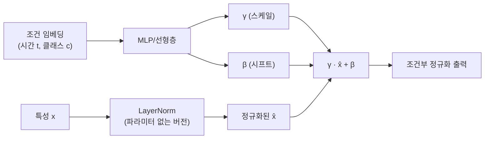
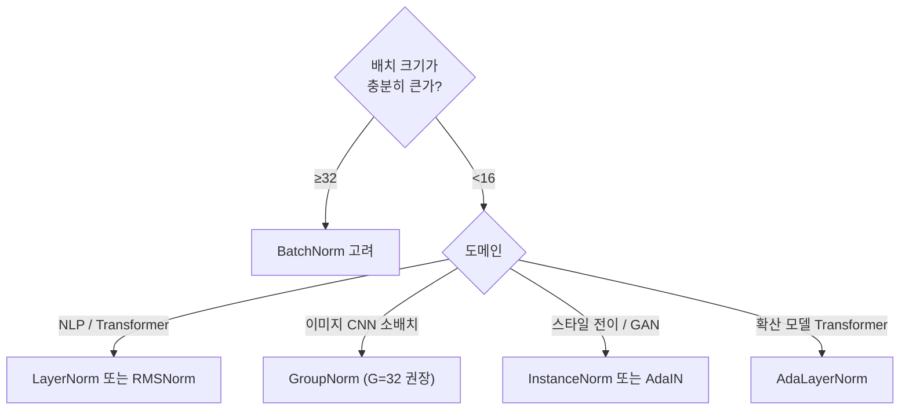

# 그룹 정규화 (GroupNorm / InstanceNorm / AdaLayerNorm)

## 개요

그룹 정규화(Group Normalization, GroupNorm)는 Yuxin Wu와 Kaiming He(Facebook AI Research, 2018)가 제안한 정규화 기법으로, 배치 크기에 의존하지 않으면서도 이미지 특성을 효과적으로 정규화한다. [[batch-norm-layer-norm|배치 정규화(BatchNorm)]]가 소규모 배치에서 불안정해지는 문제를 해결하며, 객체 탐지·분할·생성 모델 등 배치 크기를 크게 하기 어려운 작업에서 강점을 보인다.

## 정규화 기법의 분류

채널 $C$, 높이 $H$, 너비 $W$, 배치 $N$의 4D 특성 맵 $(N, C, H, W)$에서 각 기법의 정규화 축:

| 기법 | 정규화 축 | 배치 의존 | 그룹 수 G |
|------|----------|----------|----------|
| BatchNorm | N, H, W | 의존적 | - |
| LayerNorm | C, H, W | 독립 | G=1 (모든 채널) |
| InstanceNorm | H, W | 독립 | G=C (채널마다) |
| GroupNorm | G묶음, H, W | 독립 | 1 < G < C |

GroupNorm은 LayerNorm(G=1)과 InstanceNorm(G=C)의 일반화로, 그룹 수 $G$로 두 극단 사이를 연속적으로 제어한다.

## GroupNorm 알고리즘

채널 $C$를 $G$개 그룹으로 나누어 각 그룹 내 채널 + 공간 위치에 대해 정규화한다:

$$\text{GroupNorm}(x) = \gamma \frac{x - \mu_g}{\sqrt{\sigma_g^2 + \epsilon}} + \beta$$

각 샘플 $n$, 그룹 $g$에 대해:
- $\mu_g = \frac{1}{|S_g|}\sum_{i \in S_g} x_i$ (그룹 내 평균)
- $\sigma_g^2 = \frac{1}{|S_g|}\sum_{i \in S_g}(x_i - \mu_g)^2$ (그룹 내 분산)
- $S_g = \{(c, h, w) : \lfloor c \cdot G/C \rfloor = g\}$ (그룹 $g$에 속하는 채널 집합)

$\gamma, \beta$는 채널별 학습 가능 파라미터 (BatchNorm과 동일).

## InstanceNorm: 스타일 전이의 핵심

InstanceNorm(IN)은 Ulyanov et al.(2017)이 스타일 전이(style transfer)를 위해 제안했으며, 각 샘플-채널 쌍의 공간 통계(H, W)만으로 정규화한다. 이미지의 "스타일(색상, 질감)"이 채널별 평균·분산에 인코딩되어 있다는 관찰에서 출발했다.

**Adaptive InstanceNorm(AdaIN)**: 콘텐츠 특성을 IN으로 정규화한 뒤, 스타일 이미지에서 추출한 통계로 재스케일:

$$\text{AdaIN}(x, y) = \sigma(y)\left(\frac{x - \mu(x)}{\sigma(x)}\right) + \mu(y)$$

## AdaLayerNorm: 확산 모델의 핵심

AdaLayerNorm(AdaLN)은 DiT(Diffusion Transformer, Peebles & Xie, 2023)에서 채택된 조건부 정규화 기법이다. LayerNorm의 스케일($\gamma$)과 시프트($\beta$)를 외부 조건(시간 스텝 임베딩, 클래스 레이블, 텍스트 임베딩)에서 동적으로 예측한다:

AdaLN의 장점:
- 시간 스텝 또는 클래스 레이블에 따라 전체 레이어의 동작을 전역적으로 조절
- 교차 어텐션(cross-attention) 없이도 강력한 조건부 생성 가능
- DiT가 UNet 기반 확산 모델 대비 FID를 크게 개선한 핵심 요소

## 각 기법 적용 가이드

Wu & He(2018)는 ImageNet 객체 탐지(Faster R-CNN)에서 배치 크기 2 기준 GroupNorm이 BatchNorm 대비 오히려 성능이 높다고 보고했다.

## [[rmsnorm]]과의 비교

[[rmsnorm|RMSNorm]]은 LayerNorm에서 re-centering(평균 빼기)을 제거한 경량화 버전이다. GroupNorm은 공간 차원을 포함하는 반면 RMSNorm은 채널 차원만을 다룬다는 차이가 있다. 현대 LLM(LLaMA, Gemma)에서는 RMSNorm, 확산 모델에서는 AdaLayerNorm이 표준으로 자리잡는 추세다.

## 관련 문서

- [[batch-norm-layer-norm]] - BatchNorm, LayerNorm, RMSNorm과의 종합 비교
- [[rmsnorm]] - LLM에서 LayerNorm을 대체하는 경량 정규화
- [[diffusion-models]] - AdaLayerNorm을 핵심 구성 요소로 사용하는 생성 모델
- [[gans]] - InstanceNorm과 AdaIN이 스타일 제어에 활용되는 대립 생성 모델
