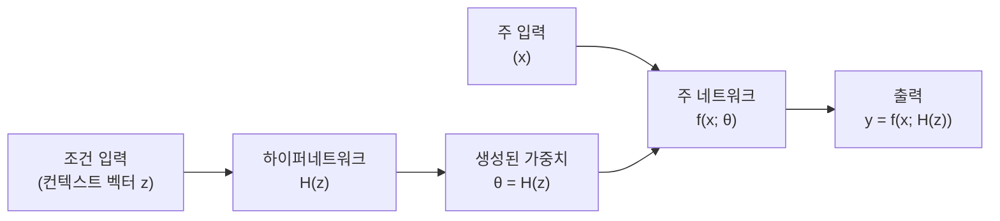
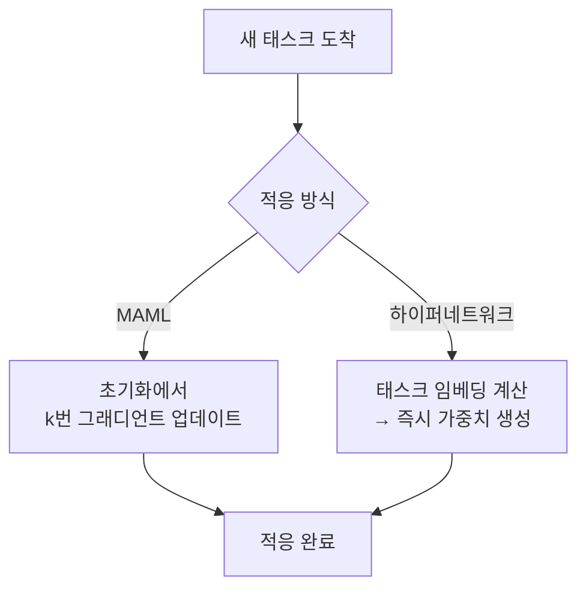

# 하이퍼네트워크 (Hypernetworks)

## 개요

하이퍼네트워크(Hypernetwork)는 다른 신경망(주 네트워크, primary network)의 가중치를 생성하는 신경망이다. Ha et al.(2016, Google Brain)이 체계화한 개념으로, 주 네트워크의 파라미터를 직접 학습하는 대신 하이퍼네트워크가 조건 입력(context input)에 따라 동적으로 가중치를 생성한다.

핵심 아이디어: 고정된 가중치를 학습하는 것이 아니라 **"어떤 가중치를 써야 하는가"를 학습**한다. 이를 통해 단일 모델이 다양한 입력 조건에 적응하거나, 빠른 적응(fast adaptation)이 가능해진다.

## 기본 구조

하이퍼네트워크 $H$는 작은 네트워크로, 임베딩 벡터 $z$를 입력받아 주 네트워크의 가중치 $\theta = H(z)$를 출력한다. 주 네트워크는 이렇게 생성된 $\theta$를 이용해 실제 추론을 수행한다.

## 파라미터 효율성

주 네트워크의 가중치를 직접 저장하면 $O(N)$ 파라미터가 필요하지만, 하이퍼네트워크는 더 작은 임베딩 공간으로 이를 압축한다. 예를 들어 $N$-파라미터 주 네트워크를 $K$-차원 임베딩($K \ll N$)으로 생성하면, 하이퍼네트워크 파라미터는 $O(K \cdot N)$이 아닌 $O(K \cdot d_{in} + d_{out})$ 수준으로 줄일 수 있다 (선형 하이퍼네트워크의 경우).

| 방식 | 파라미터 | 유연성 |
|------|---------|--------|
| 일반 네트워크 | $O(N)$ | 고정 |
| 하이퍼네트워크 생성 | $O(K)$, $K < N$ | 조건부 동적 |
| LoRA (참고) | $O(r \cdot d)$ | 학습 후 고정 |

## 주요 응용 분야

### 1. 지속 학습 / 태스크 적응

조건 입력 $z$를 태스크 ID 또는 태스크 임베딩으로 설정하면, 하나의 하이퍼네트워크가 여러 태스크에 대한 가중치를 생성한다. 태스크가 바뀔 때 파라미터 전환이 아닌 임베딩 전환으로 적응이 이루어진다.

### 2. [[meta-learning-maml]]과의 관계

[[meta-learning-maml|MAML]]이 초기화 파라미터를 학습하여 몇 번의 그래디언트 업데이트로 적응하는 반면, 하이퍼네트워크는 그래디언트 업데이트 없이 순전파 한 번으로 새 태스크의 가중치를 생성할 수 있다. 이를 **비그래디언트 메타학습(gradient-free meta-learning)**이라고도 한다.

### 3. [[neural-architecture-search]]와의 연결

NAS에서 하이퍼네트워크는 수퍼넷(supernet) 패러다임의 한 형태로 볼 수 있다. 아키텍처 임베딩 $z$를 조건으로 가중치를 생성하면, 단일 하이퍼네트워크가 다양한 아키텍처의 가중치를 생성하여 독립적 훈련 없이 아키텍처 탐색을 가능하게 한다.

### 4. 연속 가중치 생성 (INR과의 결합)

하이퍼네트워크는 [[implicit-neural-representations|암묵적 신경 표현(INR)]]과 결합하여, 좌표 기반 신호 표현의 가중치를 조건부로 생성할 수 있다. 다양한 3D 장면이나 이미지를 단일 하이퍼네트워크로 표현하는 연구가 있다.

## 현대적 활용: HyperLoRA / 동적 LoRA

최근 LLM 파인튜닝에서 하이퍼네트워크 개념이 부활하고 있다. 입력 컨텍스트에 따라 LoRA 어댑터 가중치를 동적으로 생성하는 방식으로, 단일 모델이 사용자별/태스크별로 다른 동작을 할 수 있게 된다:

- **HyperPrompt**: 태스크 임베딩으로 소프트 프롬프트 가중치 생성
- **HyperLoRA**: 인스턴스별 LoRA 행렬을 동적으로 생성
- **HINT**: 하이퍼네트워크로 명령어 튜닝 어댑터 생성

## 장점과 한계

| 장점 | 한계 |
|------|------|
| 단일 하이퍼네트워크로 무한 가중치 공간 탐색 | 하이퍼네트워크 자체의 학습 안정성 문제 |
| 빠른 추론 시 태스크 적응 (그래디언트 불필요) | 매우 큰 주 네트워크에는 스케일링 어려움 |
| 연속 조건 공간에서 부드러운 보간 가능 | 하이퍼네트워크 출력 차원 = 주 네트워크 파라미터 수 |
| 파라미터 공유를 통한 정규화 효과 | 목표 두 개(하이퍼+주)를 동시 최적화하는 어려움 |

## 관련 문서

- [[meta-learning-maml]] - 그래디언트 기반 빠른 적응, 하이퍼네트워크의 대안
- [[neural-architecture-search]] - 아키텍처 임베딩을 조건으로 하는 하이퍼네트워크 응용
- [[implicit-neural-representations]] - 좌표 기반 INR 가중치를 생성하는 하이퍼네트워크 결합
- [[transfer-learning]] - 하이퍼네트워크를 이용한 제로샷/퓨샷 전이
