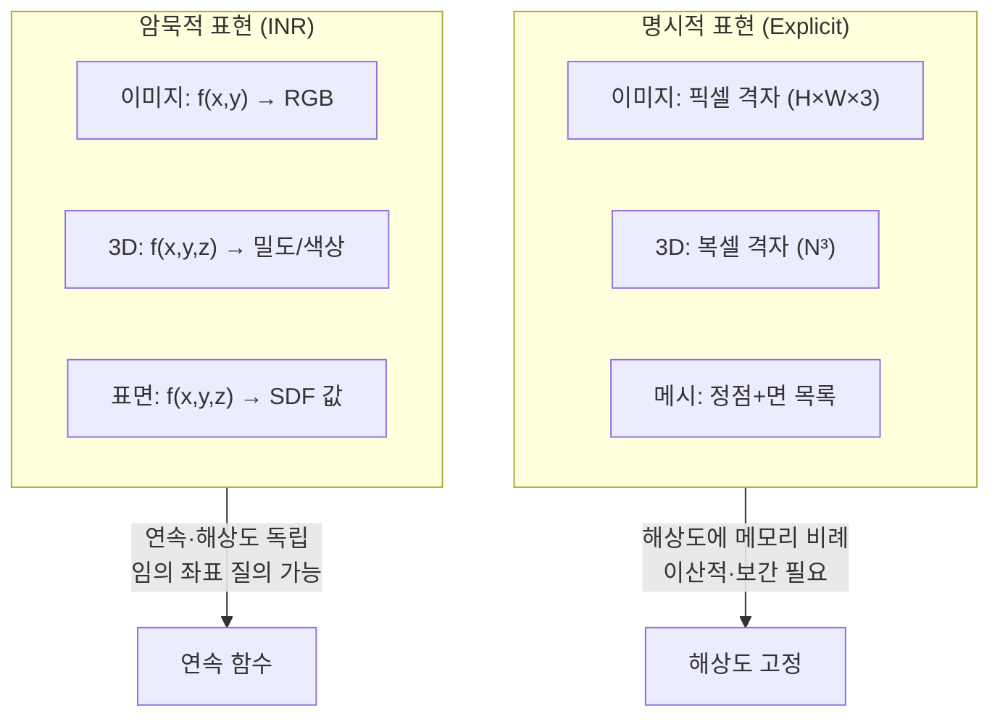
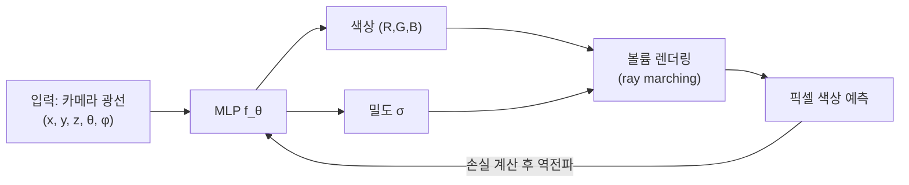

# 암묵적 신경 표현 (Implicit Neural Representations / SIREN)

## 개요

암묵적 신경 표현(Implicit Neural Representations, INR)은 신경망이 이미지·오디오·3D 형상 등의 신호를 픽셀/복셀 배열로 저장하는 대신, **좌표 → 신호 값**을 매핑하는 연속 함수 자체를 학습하는 방식이다. 네트워크 파라미터가 신호를 암묵적으로 인코딩하므로 "암묵적(implicit)" 표현이라 한다.

예시: 이미지를 표현할 때 $f_\theta(x, y) = (R, G, B)$ 형태의 함수를 학습한다. 임의 좌표$(x, y)$를 입력하면 해당 위치의 픽셀 색상을 반환한다.

## 기존 표현과의 비교

| 특성 | 명시적 표현 | INR |
|------|------------|-----|
| 저장 방식 | 배열/격자 | 네트워크 가중치 |
| 해상도 | 고정 | 임의 (연속) |
| 메모리 | 해상도에 선형 | 네트워크 크기에 고정 |
| 미분 | 유한 차분 근사 | 자동 미분으로 정확히 |
| 압축 | 별도 압축 필요 | 네트워크 자체가 압축 |

## SIREN: 사인 활성화 함수를 이용한 INR

ReLU 네트워크는 미분이 상수(구간별 선형)이므로, 신호의 고주파 성분이나 고차 미분을 정확히 표현하지 못한다. Sitzmann et al.(NeurIPS 2020)이 제안한 **SIREN(Sinusoidal Representation Networks)**은 활성화 함수로 사인(sine)을 사용한다:

$$f(\mathbf{x}) = \mathbf{W}_n(\phi_{n-1} \circ \ldots \circ \phi_0)(\mathbf{x}) + \mathbf{b}_n$$
$$\phi_i(\mathbf{x}_i) = \sin(\omega_0 \cdot \mathbf{W}_i\mathbf{x}_i + \mathbf{b}_i)$$

$\omega_0$(주파수 하이퍼파라미터, 보통 30)가 높을수록 더 고주파 신호를 표현한다. SIREN의 장점:

- 무한 미분 가능 — $\nabla f$, $\nabla^2 f$ 등 고차 미분이 의미 있음
- 이미지, 음성, 비디오, SDF(Signed Distance Function) 모두 하나의 아키텍처로 표현
- [[physics-informed-neural-networks|물리 정보 신경망(PINN)]]에서 PDE의 미분 조건을 정확히 만족

## NeRF: INR의 대표 응용

Neural Radiance Fields(NeRF, Mildenhall et al., ECCV 2020)는 INR의 대표적 응용으로, 다시점 이미지로부터 3D 장면을 암묵적으로 표현한다:

NeRF의 핵심 인사이트: 3D 메시 대신 공간의 모든 점에서의 색상과 밀도를 MLP로 표현하고, 볼륨 렌더링으로 2D 이미지를 생성한다. 학습 후 임의 시점에서 고품질 3D 장면을 렌더링할 수 있다.

NeRF 이후 발전:
- **Instant-NGP**: 해시 기반 인코딩으로 학습 속도 1000배 향상
- **3D Gaussian Splatting**: INR 대신 명시적 가우시안으로 실시간 렌더링
- **NeRF-in-the-Wild**: 비통제 환경 사진에서 학습

## [[neural-ode]]와의 연결

[[neural-ode|Neural ODE]]는 미분방정식의 해를 신경망으로 표현한다는 점에서 INR과 유사한 철학을 가진다. INR이 공간적 좌표를 입력으로 받는 반면, Neural ODE는 시간 축의 연속 동역학을 학습한다. 두 패러다임 모두 "이산 격자 대신 연속 함수"라는 공통 원리를 따른다.

## 위치 인코딩 (Positional Encoding)

단순 MLP는 고주파 신호를 학습하지 못하는 스펙트럼 편향(spectral bias) 문제가 있다. Fourier 특성 매핑으로 이를 해결한다:

$$\gamma(p) = [\sin(2^0\pi p), \cos(2^0\pi p), \ldots, \sin(2^{L-1}\pi p), \cos(2^{L-1}\pi p)]$$

NeRF의 위치 인코딩이 이 방식을 사용하며, Transformer의 위치 인코딩과 수학적으로 동일한 구조다.

## 실용적 응용

| 도메인 | INR 응용 | 핵심 이점 |
|--------|---------|----------|
| 3D 재구성 | NeRF, 3DGS | 다시점에서 임의 시점 렌더링 |
| 이미지 압축 | COIN, NeRP | 이미지당 소형 네트워크 |
| 의료 영상 | CT/MRI 초해상도 | 연속 해상도 보간 |
| 물리 시뮬레이션 | PINN과 결합 | PDE 해 근사 |
| 비디오 생성 | NeRF+시간 차원 | 임의 시공간 질의 |

## 관련 문서
- [[siren-periodic-activation]] -- SIREN (사인파 암묵적 신경 표현)

- [[physics-informed-neural-networks]] - SIREN을 이용해 PDE 제약을 만족하는 INR
- [[neural-ode]] - 시간 축의 연속 동역학을 학습하는 유사 패러다임
- [[hypernetworks]] - 여러 INR 인스턴스의 가중치를 생성하는 상위 네트워크
- [[diffusion-models]] - 3D 생성에 INR 표현을 결합하는 최신 연구
