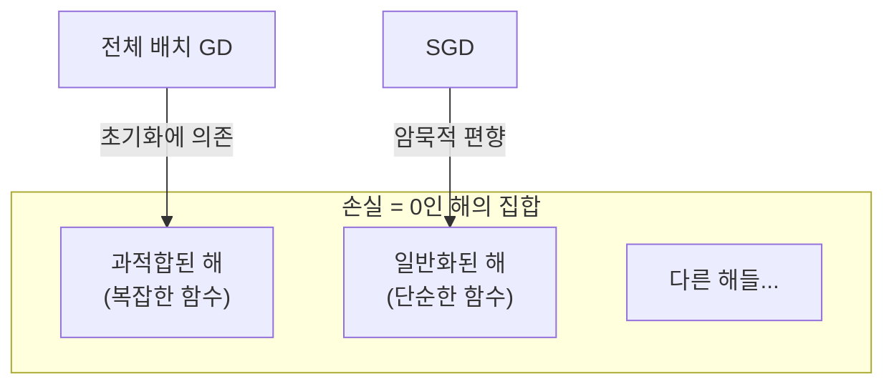
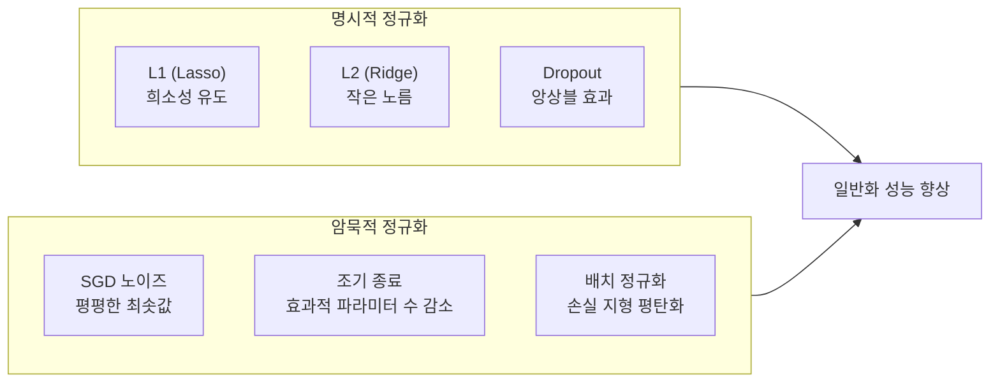

# 암묵적 정규화 (Implicit Regularization)

## 개요

암묵적 정규화(Implicit Regularization)는 명시적인 정규화 항(L1, L2, 드롭아웃 등)을 추가하지 않더라도 **최적화 알고리즘 자체의 성질**로 인해 특정 유형의 해로 편향되는 현상을 말한다. 특히 확률적 경사 하강법(SGD)은 훈련 손실을 최소화하는 수많은 해 중에서 특정한 "좋은" 해를 선택하는 경향이 있다.

이 현상은 과적합이 예상되는 과매개변수화(over-parameterized) 모델에서도 신경망이 잘 일반화되는 이유를 설명하는 핵심 개념 중 하나다.

## 핵심 직관

손실 함수가 최솟값(training loss = 0)을 달성하는 해가 무수히 많다고 가정하자. 이 해들이 형성하는 "최솟값 다양체(minimum manifold)" 위에서 어떤 해로 수렴하느냐에 따라 일반화 성능이 달라진다.

SGD는 작은 미니배치의 노이즈 때문에 손실 풍경(loss landscape)을 탐색하면서 **낮고 평평한(flat) 최솟값**으로 이동하는 경향이 있다.

## SGD의 암묵적 편향 메커니즘

### 1. 평평한 최솟값 선호 (Flat Minima Bias)

미니배치 SGD의 업데이트는 다음과 같이 분해할 수 있다:

$$\theta_{t+1} = \theta_t - \eta \nabla \mathcal{L} - \eta \cdot \underbrace{\xi_t}_{\text{미니배치 노이즈}}$$

노이즈 $\xi_t$는 손실 지형의 **곡률이 높은 뾰족한 최솟값**에서 모델을 밀어내는 효과가 있다. 곡률이 낮은 평평한 최솟값에서만 안정적으로 머문다.

평평한 최솟값은 작은 파라미터 섭동에 강건하여 일반적으로 더 나은 테스트 성능을 보인다.

### 2. 최소 노름 해 선호 (Minimum Norm Bias)

선형 모델에서 SGD는 이론적으로 **L2 노름이 최소인 해**로 수렴함이 증명되어 있다(Soudry et al., 2018):

$$\theta^* = \arg\min_{\theta: \mathcal{L}(\theta)=0} \|\theta\|_2$$

이는 명시적 L2 정규화(가중치 감쇠, weight decay) 없이도 리지 회귀와 유사한 효과다.

### 3. 로지스틱 회귀의 최대 마진 편향

이진 분류에서 SGD로 학습한 선형 모델은 손실이 0에 수렴할 때 **최대 마진 분류기(SVM과 동치)** 방향으로 수렴함이 증명되어 있다.

## 학습률과 배치 크기의 역할

암묵적 정규화 강도는 SGD의 하이퍼파라미터에 의존한다:

| 하이퍼파라미터 | 높을 때 | 낮을 때 |
|--------------|--------|--------|
| 학습률 $\eta$ | 강한 암묵적 정규화 (큰 노이즈) | 약한 정규화 |
| 배치 크기 $B$ | 약한 정규화 (노이즈 감소) | 강한 정규화 |
| $\eta / B$ (유효 학습률) | 강한 정규화 | 약한 정규화 |

이로부터 배치 크기를 늘릴 때 학습률을 비례해서 늘려야 하는 **선형 스케일링 규칙(Linear Scaling Rule)** 의 이론적 근거 중 하나가 나온다.

## 암묵적 정규화 vs 명시적 정규화

실제 딥러닝 모델의 뛰어난 일반화는 명시적 + 암묵적 정규화의 **복합 효과**로 이해해야 한다.

## 과매개변수화와의 연결

현대 딥러닝 모델은 훈련 데이터보다 훨씬 많은 파라미터를 가진다. 고전적 통계학에서 이는 심각한 과적합을 예측하지만, 실제로는 그렇지 않다. 이 "이중 강하(Double Descent)" 현상을 설명하는 핵심 메커니즘 중 하나가 암묵적 정규화다:

과매개변수화 -> 최솟값 다양체가 존재 -> SGD의 암묵적 편향이 좋은 해 선택

## 관련 문서

- [[overfitting-regularization]] - L1/L2 드롭아웃 등 명시적 정규화 기법
- [[optimization-theory]] - SGD, Adam 등 최적화 알고리즘의 성질
- [[gradient-descent-backpropagation]] - SGD 미니배치 메커니즘
- [[bias-variance-tradeoff]] - 일반화 능력의 이론적 틀
