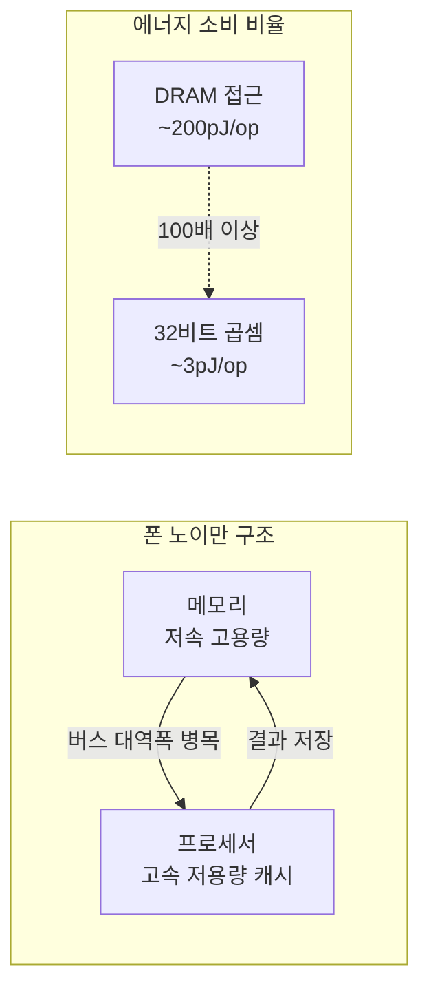
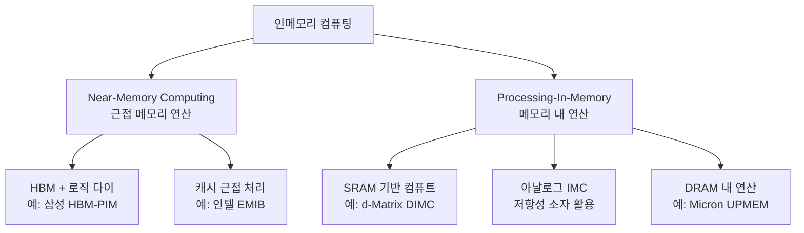
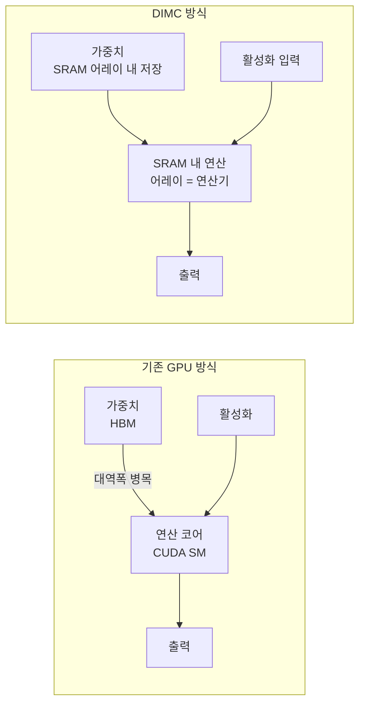

# 인메모리 컴퓨팅 (In-Memory Computing)

인메모리 컴퓨팅(In-Memory Computing, IMC)은 데이터를 저장하는 메모리 셀 내부 또는 극히 근접한 위치에서 직접 연산을 수행하는 컴퓨팅 패러다임이다. "메모리 월(memory wall)" 문제를 근본적으로 해결하기 위한 접근법으로, AI 추론 가속 분야에서 특히 주목받고 있다.

## 메모리 월 문제

현대 폰 노이만 아키텍처에서 프로세서와 메모리는 물리적으로 분리되어 있다. 이 구조에서 발생하는 근본적인 병목이 메모리 월이다.

AI 추론에서 행렬-벡터 곱(Matrix-Vector Multiplication, MVM)은 가장 빈번한 연산이다. 모델 가중치 행렬을 매번 DRAM에서 읽어와야 하므로, 실제 곱셈 연산 시간보다 데이터 이동 시간이 지배적이 된다.

**핵심 수치**: 1B 파라미터 모델의 단일 토큰 생성 시 약 2GB 데이터를 메모리에서 읽어야 한다 (FP16 기준). 이는 배치 크기 1 추론에서 GPU 활용률이 5% 미만인 이유다.

## 인메모리 컴퓨팅의 분류

### 1. Near-Memory Computing (NMC)

메모리와 프로세서를 물리적으로 가깝게 배치해 버스 이동을 줄이는 방식. HBM(High Bandwidth Memory)이 대표적이며, 2.5D/3D 패키징으로 메모리-로직 간 거리를 줄인다.

### 2. Processing-In-Memory (PIM)

메모리 내부에 연산 회로를 직접 내장하는 방식. 데이터가 메모리 밖으로 이동하지 않는다.

### 3. Digital In-Memory Computing (DIMC)

SRAM 어레이를 연산 단위로 직접 사용하는 방식. [[d-matrix-corsair]]가 대표적인 DIMC 기반 AI 추론 가속기다.

## d-Matrix와 DIMC

d-Matrix의 Corsair 칩은 DIMC를 AI 추론에 적용한 대표 사례다. 핵심 아이디어는 다음과 같다:

DIMC에서는 가중치가 SRAM 셀에 저장되는 동시에 그 SRAM 셀들이 연산기 역할도 한다. 데이터 이동이 거의 발생하지 않는다.

### DIMC의 작동 원리 (개념적)

SRAM 비트셀 어레이에서 열(column) 단위로 전류를 누적하면 비트 단위 AND 연산과 누산이 동시에 일어난다. 이를 이진(binary) 또는 저정밀도 정수(INT4/INT8)로 확장하면 행렬-벡터 곱의 핵심 연산인 MAC(Multiply-Accumulate)을 메모리 내에서 수행할 수 있다.

## 아날로그 인메모리 컴퓨팅

아날로그 IMC는 저항성 소자(ReRAM, PCM, MRAM)의 물리적 특성을 이용해 곱셈을 전류로 구현한다. 옴의 법칙($I = V/R$)을 이용:

- 입력 전압 $V_i$ = 활성화 값
- 소자 컨덕턴스 $G_{ij}$ = 가중치 값
- 출력 전류 $I_j = \sum_i V_i \cdot G_{ij}$ = 행렬-벡터 곱 결과

이는 이상적으로 $O(1)$ 시간에 행렬-벡터 곱을 완료한다. 그러나 아날로그 신호의 노이즈, 소자 비선형성, ADC/DAC 변환 오버헤드가 실용화 장벽이다.

## 에너지 효율 비교

인메모리 컴퓨팅의 가장 큰 장점은 에너지 효율이다:

| 방식 | 에너지 효율 (TOPs/W) | 특징 |
|------|---------------------|------|
| NVIDIA H100 | ~50-100 | GPU 클러스터 기준 |
| d-Matrix Corsair | ~100-250 [교차검증 필요] | DIMC 기반 추론 |
| 아날로그 IMC (연구) | 이론상 1000+ | 노이즈 문제 존재 |

## 현재 한계

1. **정밀도 제한**: DIMC는 INT4~INT8 정밀도에 최적화. FP32 학습에는 비효율적
2. **유연성 부족**: 연산 패턴이 하드웨어에 고정되어 임의의 연산을 지원하기 어려움
3. **소프트웨어 생태계**: CUDA 대비 개발 도구, 라이브러리, 최적화 경험이 부족
4. **아날로그 신뢰도**: 온도·전압 변동에 취약, 프로덕션 환경에서 신뢰성 확보 어려움

## AI 추론에서의 실무 적용

인메모리 컴퓨팅은 현재 다음 용도에서 가장 실용적이다:

- **엣지 AI 추론**: 배터리 구동 기기에서 에너지 효율이 최우선인 경우
- **데이터센터 추론 가속**: 배치 크기 1의 저지연 요청 처리 (GPU의 주된 약점 구간)
- **비디오 분석**: 고정된 CNN 연산을 반복 수행하는 워크로드

## [[ai-accelerators]] 생태계와의 관계

인메모리 컴퓨팅은 [[ai-accelerators]] 스펙트럼에서 GPU와 FPGA 사이의 틈새를 채우는 포지션이다. 특히 배치 크기 1~4의 소규모 추론 요청 처리에서 GPU 대비 압도적인 에너지 효율을 보인다.

[[wafer-scale-engine]]이 대규모 온칩 메모리로 메모리 월을 우회하는 접근이라면, 인메모리 컴퓨팅은 메모리 자체를 연산기로 변환하는 더 근본적인 접근이다.

## 관련 문서

- [[d-matrix-corsair]] - DIMC 기반 상용 AI 추론 가속기
- [[ai-accelerators]] - AI 가속기 생태계 전체 개요
- [[wafer-scale-engine]] - 웨이퍼 전체를 단일 칩으로 활용하는 보완적 접근
