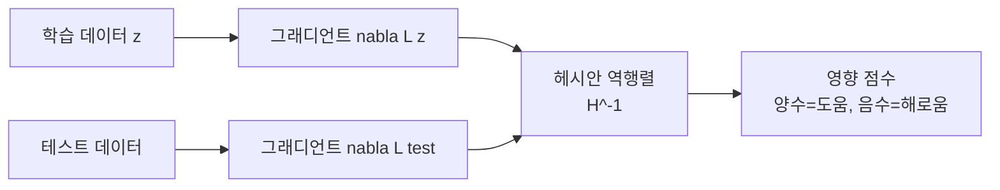

# 영향 함수 (Influence Functions)

Koh & Liang (2017)이 ML에 도입한 **데이터 귀인(data attribution)** 기법. 특정 학습 데이터 포인트를 제거했을 때 모델 예측이 얼마나 변하는지를 헤시안의 역행렬로 근사하여, 재학습 없이 추정한다.

## 핵심 수식

$$\mathcal{I}(z, z_{test}) = -\nabla_\theta L(z_{test})^T H_\theta^{-1} \nabla_\theta L(z)$$

## 응용

| 응용 | 설명 |
|------|------|
| **데이터 디버깅** | 모델 오류에 기여한 학습 데이터 식별 |
| **데이터 정제** | 해로운 데이터 포인트 제거 |
| **[[memorization-in-llms\|기억화 탐지]]** | 과도하게 기억된 데이터 식별 |
| **공정성 감사** | 편향을 유발하는 데이터 추적 |
| **데이터 가치 평가** | 각 데이터의 모델 성능 기여도 |

## LLM에서의 한계

LLM 규모에서 헤시안 역행렬 계산은 비현실적. 대안:
- **TRAK**: 무작위 투영으로 근사
- **DataInf**: LoRA 파라미터 공간에서 영향 계산
- **Datamodels**: 서브셋 재학습 통계로 귀인

## 관련 문서

- [[memorization-in-llms]] -- LLM 기억화
- [[pretraining-data-curation]] -- 데이터 큐레이션
- [[differential-privacy]] -- 차등 프라이버시
