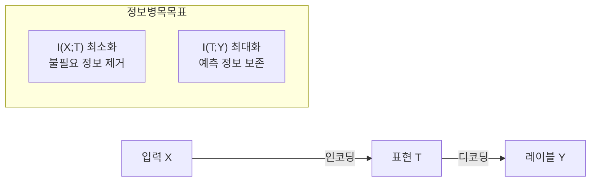
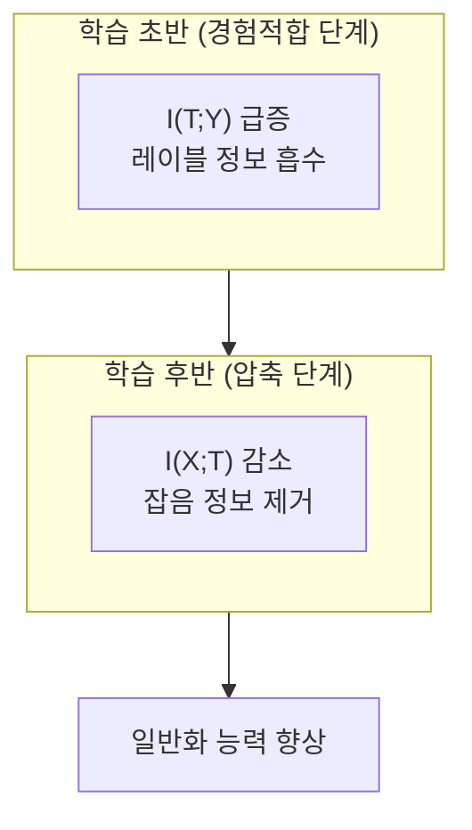

# 정보 병목 원리 (Information Bottleneck)

## 개요

정보 병목(Information Bottleneck, IB) 원리는 입력 변수 $X$에서 목표 변수 $Y$를 예측하는 데 **필요한 정보만을 압축하고 나머지는 버리는** 표현 학습의 이론적 프레임워크다. Tishby et al.(1999)이 제안한 이 원리는 딥러닝 모델이 왜, 그리고 어떻게 유용한 표현을 학습하는지를 정보이론의 언어로 설명한다.

핵심 아이디어는 간단하다: 좋은 표현 $T$는 $X$에서 $Y$를 예측하는 데 **충분한 정보는 보존**하면서, $Y$와 무관한 **잡음과 불필요한 세부사항은 제거**해야 한다.

## 수식적 정의

IB 문제는 다음 목적함수의 최적화로 정식화된다:

$$\min_{p(t|x)} \left[ I(X; T) - \beta \cdot I(T; Y) \right]$$

- $I(X; T)$: 입력과 표현 사이의 상호 정보량 (압축 비용)
- $I(T; Y)$: 표현과 레이블 사이의 상호 정보량 (예측 정확도)
- $\beta$: 압축과 예측 간 트레이드오프를 조절하는 라그랑주 승수

$\beta$가 작을수록 강한 압축이 일어나고, 클수록 원본 정보를 더 많이 보존한다.

## 딥러닝에서의 해석

Tishby와 Schwartz-Ziv(2017)는 딥 뉴럴 네트워크 학습 과정을 **정보 평면(Information Plane)** 위의 궤적으로 분석했다. 정보 평면은 $I(X;T)$ (x축) 와 $I(T;Y)$ (y축) 로 구성된 2차원 공간이다.

학습은 두 단계로 진행된다:

1. **경험적합(Empirical Error Minimization)**: 초반에는 $I(T;Y)$ 가 빠르게 증가하며 레이블 정보를 흡수
2. **표현 압축(Representation Compression)**: 이후 $I(X;T)$ 가 줄어들며 불필요한 입력 정보를 망각

이 "망각" 단계가 일반화 능력을 높인다는 주장이 IB 이론의 핵심 통찰이다. 다만 이 관찰 자체는 활성화 함수나 아키텍처 선택에 따라 재현이 어려울 수 있다는 반론도 존재한다.

## 정보 평면 시각화

## 변분 정보 병목 (VIB)

실제 신경망에서 상호 정보량을 정확히 계산하기 어렵기 때문에, 실용적 적용을 위해 **변분 하한(variational lower bound)** 을 최대화하는 방식이 사용된다. 이를 변분 정보 병목(Variational Information Bottleneck, VIB)이라 한다.

$$\mathcal{L}_{\text{VIB}} = \mathbb{E}_{z \sim p(z|x)} [\log q(y|z)] - \beta \cdot D_{\text{KL}}(p(z|x) \| r(z))$$

여기서:
- $z$는 잠재 표현, $q(y|z)$는 디코더, $r(z)$는 사전 분포
- [[kl-divergence]] 항이 압축 페널티 역할을 수행
- 구조적으로 VAE(Variational Autoencoder)와 매우 유사

## 실무 연결

| 응용 영역 | IB 원리의 역할 |
|-----------|--------------|
| 데이터 증강 | 불변 표현 학습 (불필요 변이 제거) |
| 공정한 AI | 민감 속성 정보 제거 (공정성 병목) |
| 연합 학습 | 전송 데이터의 최소 정보화 |
| 도메인 적응 | 도메인 무관 표현 추출 |

## 한계와 논쟁

- IB 이론이 주장하는 압축 단계는 **relu 활성화 함수** 환경에서 잘 관찰되지 않는다는 반론이 있다(Saxe et al., 2019)
- 상호 정보량 추정이 고차원에서 매우 불안정하다
- 이론적 우아함에도 불구하고 실무적 설계 지침으로는 아직 제한적

그럼에도 IB 원리는 딥러닝에서 **표현의 질**을 논의하는 중요한 이론적 언어를 제공하며, [[information-theory]] 의 핵심 개념들과 딥러닝을 연결짓는 역할을 한다.

## 관련 문서

- [[kl-divergence]] - IB 목적함수의 압축 항 계산에 사용
- [[information-theory]] - 상호 정보량, 엔트로피 기초 개념
- [[overfitting-regularization]] - IB 압축과 정규화의 이론적 연결
- [[self-supervised-learning]] - 대조학습에서 IB 원리의 응용
