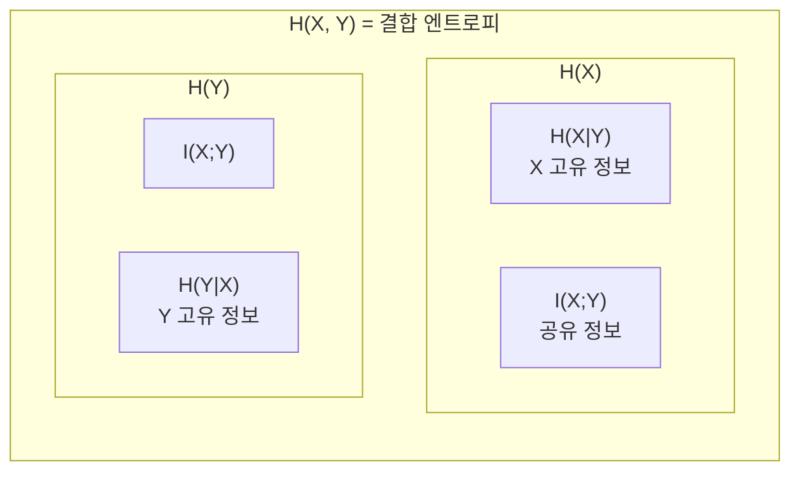

# 정보 이론 기초 (Information Theory)

## Shannon 엔트로피

Claude Shannon은 1948년 "A Mathematical Theory of Communication"에서 정보의 불확실성을 수량화하는 엔트로피(entropy) 개념을 정립했다.

$$H(X) = -\sum_{x \in \mathcal{X}} P(x) \log_2 P(x) \quad \text{[단위: bits]}$$

- 균등 분포(uniform distribution)에서 최대 엔트로피: $H = \log_2 |\mathcal{X}|$
- 결정론적 분포(하나의 사건 확률 = 1)에서 최소 엔트로피: $H = 0$
- **코딩 정리(source coding theorem)**: 평균 최소 코드 길이 = 엔트로피

## Joint / Conditional Entropy

$$H(X, Y) = -\sum_{x,y} P(x,y) \log P(x,y)$$

$$H(Y \mid X) = -\sum_{x,y} P(x,y) \log P(y \mid x) = H(X, Y) - H(X)$$

**연쇄 법칙(chain rule)**: $H(X, Y) = H(X) + H(Y \mid X)$

$Y$를 알면 $X$의 불확실성이 감소하거나 유지된다: $H(X \mid Y) \leq H(X)$.

## 상호 정보량 (Mutual Information)

$$I(X; Y) = H(X) + H(Y) - H(X, Y) = H(X) - H(X \mid Y)$$

$X$와 $Y$가 공유하는 정보의 양이다. 두 변수가 독립이면 $I(X;Y) = 0$.

위 다이어그램은 엔트로피의 집합론적 관계를 보여준다. $I(X;Y)$는 두 원의 교집합에 해당한다.

## 크로스 엔트로피 = 엔트로피 + KL 발산

$$H(P, Q) = -\sum_x P(x) \log Q(x) = H(P) + D_{KL}(P \| Q)$$

- $H(P)$: 실제 분포 $P$의 엔트로피 (고정값, 최소 코드 길이)
- $D_{KL}(P \| Q)$: 근사 분포 $Q$를 사용할 때 발생하는 추가 비용
- 따라서 **크로스 엔트로피 최소화 = KL 발산 최소화** (실제 분포가 고정되어 있으므로)

LLM 학습에서 크로스 엔트로피 손실이 곧 KL 발산을 줄이는 것과 동치인 이유가 이 분해에서 나온다.

## 상호 정보량의 응용: Feature Selection

특성 선택(feature selection)에서 MI는 입력 특성 $X_i$와 레이블 $Y$ 간의 의존성을 측정한다.

$$I(X_i; Y) = H(Y) - H(Y \mid X_i)$$

MI가 높은 특성일수록 레이블 예측에 더 유용하다. 모델 구조와 무관한 비모수(non-parametric) 방법이므로 전처리 단계 특성 필터링에 널리 쓰인다.

## 정보 이론과 딥러닝의 접점

- **정보 병목 이론(Information Bottleneck Theory)**: 신경망이 학습하는 과정을 입력 $X$에서 레이블 $Y$에 관한 정보를 최대한 유지하면서 불필요한 정보는 압축하는 과정으로 해석
- **퍼플렉시티(Perplexity)**: $\exp(H(P, Q))$, 언어 모델 평가 지표
- **MDL(Minimum Description Length)**: 복잡도-성능 트레이드오프의 이론적 근거

## 관련 문서

- [[cross-entropy-loss]]
- [[kl-divergence]]
- [[language-model-foundations]]
- [[autoencoders-vae]]
