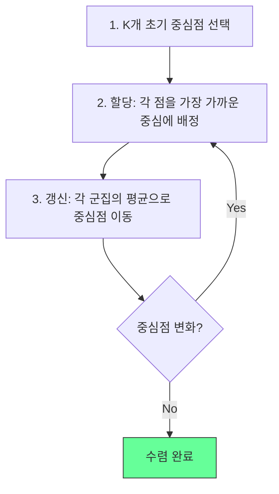
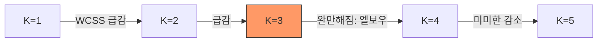

## 개요

K-평균(K-Means)은 데이터를 K개의 군집(cluster)으로 분할하는 비지도 학습(unsupervised learning) 알고리즘이다. 각 데이터 포인트를 가장 가까운 중심점(centroid)에 할당하고, 중심점을 재계산하는 과정을 반복하여 군집 내 분산을 최소화한다. Lloyd(1982)가 알고리즘을 공식화했으며, 단순함과 확장성 덕분에 가장 널리 사용되는 군집화 방법이다. [[supervised-unsupervised-reinforcement]]에서 비지도 학습의 대표적 사례다.

## 알고리즘

### 동작 과정



1. **초기화**: K개의 초기 중심점을 선택
2. **할당 단계(Assignment)**: 각 데이터 포인트를 유클리드 거리 기준으로 가장 가까운 중심점의 군집에 배정
3. **갱신 단계(Update)**: 각 군집에 속한 데이터 포인트의 평균을 새 중심점으로 계산
4. **수렴 확인**: 중심점이 더 이상 변하지 않거나, 변화량이 임계값 이하면 종료

### 목적 함수

K-평균은 **군집 내 제곱 거리의 합(WCSS, Within-Cluster Sum of Squares)**을 최소화한다:

```
J = SUM_k SUM_{x in C_k} ||x - mu_k||^2
```

이 목적 함수는 EM(Expectation-Maximization) 알고리즘의 특수한 경우로 볼 수 있다.

### 계산 복잡도

Lloyd 알고리즘의 시간 복잡도는 O(n * k * d * i)이다 (n: 데이터 수, k: 군집 수, d: 차원, i: 반복 횟수). 최악의 경우 지수적이지만, 실제 데이터에서는 효율적으로 수렴한다.

## 초기화 방법

초기 중심점 선택은 결과에 큰 영향을 미친다. K-평균은 전역 최적(global optimum)이 아닌 **지역 최적(local optimum)**으로 수렴하므로, 초기화가 최종 군집 품질을 좌우한다.

### 주요 초기화 전략

| 방법 | 설명 | 특성 |
|------|------|------|
| 무작위(Forgy) | 데이터에서 K개를 무작위 선택 | 단순하지만 불안정 |
| 무작위 할당 | 각 점에 무작위 군집 배정 후 평균 계산 | Forgy보다 초기 중심이 중앙에 모임 |
| **K-means++** | 거리 기반 확률적 선택 | 이론적 성능 보장, 실무 표준 |

### K-means++

Arthur & Vassilvitskii(2007)가 제안한 초기화 방법으로, 첫 중심점을 무작위로 선택한 뒤, 나머지 중심점은 **기존 중심과의 거리에 비례하는 확률**로 선택한다. 중심점이 서로 멀리 퍼지도록 유도하여 지역 최적에 빠질 확률을 줄인다. scikit-learn 등 대부분의 라이브러리에서 기본 초기화로 채택되었다.

## 최적 K 선택

K-평균은 군집 수 K를 사전에 지정해야 하며, 적절한 K를 찾는 것이 핵심 과제다.

### 엘보우 방법 (Elbow Method)

K를 1부터 증가시키며 WCSS를 그래프로 그렸을 때, 감소 속도가 급격히 둔화되는 "팔꿈치" 지점이 적절한 K다.



### 실루엣 분석 (Silhouette Analysis)

각 데이터 포인트의 군집 응집도(같은 군집 내 평균 거리)와 분리도(가장 가까운 다른 군집과의 평균 거리)를 비교한다. 실루엣 계수가 1에 가까울수록 잘 군집화된 것이다.

### 기타 방법

- **갭 통계량(Gap Statistic)**: 실제 WCSS와 균등 분포 기대값의 차이 비교
- **Davies-Bouldin 지수**: 군집 간 유사도의 평균
- **Calinski-Harabasz 지수**: 군집 간 분산 / 군집 내 분산 비율

## 한계와 대안

### K-평균의 가정과 한계

- **구형 군집 가정**: 각 군집이 구형이고 크기가 비슷하다고 가정. 타원형, 불규칙한 모양의 군집을 잘 포착하지 못함
- **거리 척도 민감**: 유클리드 거리 기반이므로 특성 스케일링이 필수. [[feature-engineering]]에서 표준화(standardization) 전처리 필요
- **이상치 민감**: 평균 기반이므로 이상치에 의해 중심점이 크게 왜곡
- **K 사전 지정**: 군집 수를 미리 알아야 함

### 대안 알고리즘

| 알고리즘 | 특성 | 적합한 경우 |
|----------|------|------------|
| DBSCAN | 밀도 기반, K 불필요, 불규칙 형태 | 노이즈 포함 데이터, 비구형 군집 |
| GMM | 확률적 모델, 타원형 군집 | 군집 경계가 불명확할 때 |
| 계층적 군집화 | 덴드로그램, K 유연 | 계층 구조 탐색 |
| 스펙트럴 군집화 | 그래프 기반 | 비선형 구조 |

## 활용 사례

- **벡터 양자화**: 이미지 압축에서 색상 수 감소
- **고객 세분화**: 구매 패턴 기반 마케팅 그룹화
- **특성 학습**: [[perceptron-mlp]] 등 지도 학습의 전처리 단계
- **문서 군집화**: TF-IDF 벡터 기반 문서 주제 분류
- **이상 탐지**: 어떤 군집에도 속하지 않는 포인트 식별

[[pca]]로 고차원 데이터를 시각화한 뒤 K-평균을 적용하면 군집 구조를 직관적으로 파악할 수 있다.

## 관련 문서

- [[supervised-unsupervised-reinforcement]] - 비지도 학습 패러다임
- [[pca]] - 군집화 전 차원 축소 및 시각화
- [[feature-engineering]] - 군집화 전 특성 스케일링
- [[cross-validation-model-evaluation]] - 군집 품질 평가
- [[bias-variance-tradeoff]] - K 선택에 따른 편향-분산 관계
- [[decision-trees-random-forests]] - 정형 데이터의 지도 학습 대안
