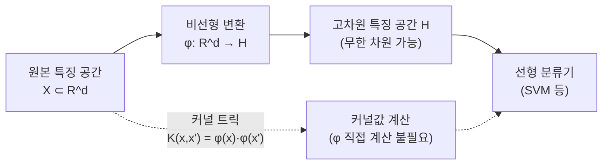
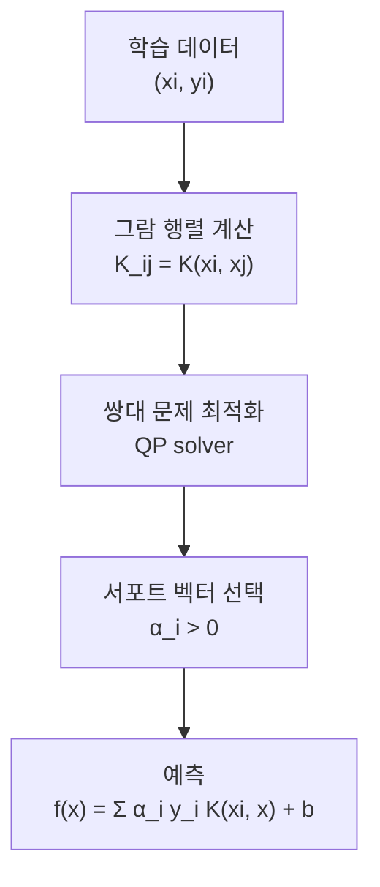
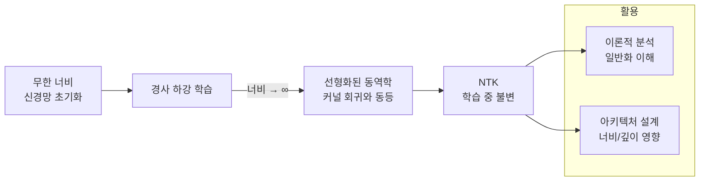

# 커널 방법 (Kernel Methods)

커널 방법(kernel methods)은 데이터를 고차원(혹은 무한 차원) 특징 공간으로 매핑하는 비용 없이, 내적(inner product)만으로 고차원 연산을 수행하는 기법이다. 서포트 벡터 머신(SVM)이 대표적 응용이며, 가우시안 프로세스(GP), 커널 PCA, 커널 리지 회귀 등 다양한 머신러닝 알고리즘의 토대가 된다.

딥러닝 시대에 들어서도 커널 방법은 신경 접선 커널(NTK, Neural Tangent Kernel)을 통해 신경망의 이론적 이해에 핵심 역할을 한다.

## 커널 트릭 직관



핵심 아이디어: 고차원 특징 공간에서 두 점의 내적은 원본 공간에서 커널 함수로 계산할 수 있다.

$$K(x, x') = \langle \phi(x), \phi(x') \rangle_{\mathcal{H}}$$

$\phi$를 명시적으로 계산하지 않아도 $K$만으로 알고리즘을 실행할 수 있다. 이것이 **커널 트릭(kernel trick)** 이다.

---

## 머서 조건 (Mercer's Condition)

임의의 함수가 커널이 될 수 있는 것은 아니다. 유효한 커널은 **양의 반정치(positive semi-definite)** 조건을 만족해야 한다.

임의의 유한 점 집합 $\{x_1, ..., x_n\}$에 대해 그람 행렬(Gram matrix) $K_{ij} = K(x_i, x_j)$이 양의 반정치이면 유효한 커널이다:

$$\sum_{i,j} c_i c_j K(x_i, x_j) \geq 0 \quad \forall c_i \in \mathbb{R}$$

이 조건을 만족하면 대응되는 재생 커널 힐베르트 공간(RKHS)이 존재한다.

---

## 주요 커널 함수

### 선형 커널 (Linear Kernel)

$$K(x, x') = x^\top x'$$

특징 공간이 원본 공간과 동일. 선형 분류 문제에 사용.

### 다항식 커널 (Polynomial Kernel)

$$K(x, x') = (x^\top x' + c)^d$$

차수 $d$의 다항식 특징 공간에 대응. 예를 들어 $d=2$이면 이차 교차항 특징을 모두 포함.

$$K(x, x') = (x_1 x_1' + x_2 x_2' + 1)^2 = x_1^2 x_1'^2 + 2x_1 x_1' x_2 x_2' + x_2^2 x_2'^2 + 2x_1 x_1' + 2x_2 x_2' + 1$$

- $c > 0$이면 저차항 특징도 포함
- $c = 0$이면 동차(homogeneous) 다항식 특징

### RBF 커널 / 가우시안 커널 (Radial Basis Function)

$$K(x, x') = \exp\left(-\frac{\|x - x'\|^2}{2\sigma^2}\right)$$

가장 널리 사용되는 커널. 두 점 사이의 거리가 가까울수록 커널값이 1에 가깝다.

- **무한 차원** 특징 공간에 대응 (테일러 급수 전개)
- $\sigma$ (폭 파라미터): 결정 경계의 복잡도 조절
  - 작은 $\sigma$: 복잡한 결정 경계 (과적합 위험)
  - 큰 $\sigma$: 부드러운 결정 경계 (과소적합 위험)

### 마테른 커널 (Matern Kernel)

$$K(x, x') = \frac{2^{1-\nu}}{\Gamma(\nu)} \left(\frac{\sqrt{2\nu} \|x-x'\|}{l}\right)^\nu K_\nu\left(\frac{\sqrt{2\nu} \|x-x'\|}{l}\right)$$

가우시안 프로세스에서 자주 사용. 파라미터 $\nu$로 함수 매끄러움 조절.

- $\nu = 1/2$: Ornstein-Uhlenbeck 프로세스 (연속이지만 미분불가)
- $\nu \to \infty$: RBF 커널로 수렴

---

## 재생 커널 힐베르트 공간 (RKHS)

[[reproducing-kernel-hilbert-space]] 문서에서 상세하게 다루지만, 핵심 개념을 요약한다.

RKHS(Reproducing Kernel Hilbert Space) $\mathcal{H}$는 커널 $K$에 대응하는 함수 공간으로:

1. $\mathcal{H}$의 모든 함수 $f$는 커널의 선형 결합으로 표현 가능
2. **재생 성질(reproducing property)**: $f(x) = \langle f, K(x, \cdot) \rangle_{\mathcal{H}}$

이 성질이 커널 방법 전반의 수학적 토대다.

**표현자 정리(Representer Theorem)**: 정칙화 최적화 문제의 해는 항상 학습 데이터의 커널 함수 선형 결합으로 표현된다.

$$f^*(x) = \sum_{i=1}^n \alpha_i K(x_i, x)$$

이 정리 덕분에 무한 차원 최적화 문제가 유한 파라미터 $\alpha_i$에 대한 최적화로 축소된다.

---

## 서포트 벡터 머신 (SVM)

[[support-vector-machines]] 상세 페이지가 있으며, 여기서는 커널과의 관계 중심으로 다룬다.

SVM은 마진을 최대화하는 결정 초평면을 찾는다. 커널 SVM의 쌍대 문제(dual problem):

$$\max_\alpha \sum_{i=1}^n \alpha_i - \frac{1}{2} \sum_{i,j} \alpha_i \alpha_j y_i y_j K(x_i, x_j)$$

$$\text{subject to} \quad 0 \leq \alpha_i \leq C, \quad \sum_{i=1}^n \alpha_i y_i = 0$$

예측 시: $\hat{y} = \text{sign}\left(\sum_{i \in SV} \alpha_i y_i K(x_i, x) + b\right)$

커널 트릭으로 인해 $\phi$를 계산하지 않고도 고차원 특징 공간에서 SVM을 실행할 수 있다.



### 하이퍼파라미터

- **C (정규화 상수)**: 마진 위반 허용 정도. 클수록 하드 마진(과적합)
- **σ 또는 γ (RBF 커널 폭)**: 결정 경계 복잡도

---

## 가우시안 프로세스 (Gaussian Processes)

[[gaussian-process|gaussian-processes]] 상세 페이지 참조. 커널 방법과의 연결만 요약한다.

가우시안 프로세스(GP)는 임의의 함수에 대한 분포로, 커널이 공분산 함수 역할을 한다.

$$f(x) \sim \mathcal{GP}(m(x), K(x, x'))$$

GP 회귀는 커널 리지 회귀(kernel ridge regression)와 동등한 예측을 내놓지만, 불확실성 추정을 추가로 제공한다. 베이지안 최적화, 능동 학습 등에서 활발히 사용된다.

---

## 신경 접선 커널 (NTK, Neural Tangent Kernel)

Jacot et al. (2018)이 발견한, 딥러닝과 커널 방법을 연결하는 핵심 개념이다.

### 핵심 아이디어

무한히 넓은 신경망이 경사 하강법으로 학습될 때, 네트워크의 출력 변화는 **NTK**로 표현되는 선형 모델처럼 행동한다.

$$K_\text{NTK}(x, x') = \left\langle \nabla_\theta f(x; \theta), \nabla_\theta f(x'; \theta) \right\rangle$$



### 의미

1. **학습 수렴 보장**: NTK가 양의 정치이면 전체 최솟값으로 수렴
2. **일반화 이해**: 편향-분산 트레이드오프를 커널 관점으로 분석
3. **신경망 ≈ 커널 머신**: 무한 너비 극한에서 두 프레임워크가 동등

단, NTK는 **유한 너비** 실제 신경망에서는 근사에 불과하며, 특히 특징 학습(feature learning)이 중요한 경우에는 NTK 분석이 잘 맞지 않는다.

---

## 커널 방법 vs 딥러닝

| 항목 | 커널 방법 | 딥러닝 |
|------|---------|--------|
| 특징 학습 | 수동 커널 설계 | 자동 표현 학습 |
| 계산 복잡도 | $O(n^3)$ (학습), $O(n)$ (예측) | $O(n)$ 학습 가능 |
| 이론적 보장 | RKHS 이론, 일반화 경계 | 경험적 이해 위주 |
| 불확실성 | GP를 통한 자연스러운 추정 | 별도 베이지안 처리 필요 |
| 적합 데이터 규모 | 수천~수십만 (그람 행렬 한계) | 수백만~수십억 |
| 도메인 지식 통합 | 커널 설계로 통합 용이 | 아키텍처 설계로 통합 |

---

## 커널 근사 (Kernel Approximation)

대규모 데이터에서 커널 방법의 $O(n^2)$ 그람 행렬 계산은 병목이 된다. 근사 기법들이 개발됐다.

### 랜덤 푸리에 특징 (Random Fourier Features)

Rahimi & Recht (2007). RBF 커널을 랜덤 코사인 특징으로 근사:

$$K(x, x') \approx z(x)^\top z(x'), \quad z(x) = \sqrt{2/D} [\cos(\omega_1^\top x + b_1), ..., \cos(\omega_D^\top x + b_D)]$$

```python
import numpy as np

def rbf_random_features(X: np.ndarray, n_components: int, gamma: float) -> np.ndarray:
    """
    RBF 커널의 랜덤 푸리에 특징 근사.

    Args:
        X: (n_samples, n_features) 입력
        n_components: 근사 특징 수
        gamma: RBF 커널 파라미터 (1 / 2σ^2)
    Returns:
        (n_samples, n_components) 근사 특징
    """
    n_features = X.shape[1]
    rng = np.random.default_rng(42)

    # 주파수 샘플: N(0, 2*gamma)에서 샘플
    omega = rng.normal(0, np.sqrt(2 * gamma), size=(n_features, n_components))
    b = rng.uniform(0, 2 * np.pi, size=n_components)

    # z(x) = sqrt(2/D) * cos(Ω^T x + b)
    Z = np.cos(X @ omega + b)
    return np.sqrt(2.0 / n_components) * Z
```

이 근사로 SVM의 복잡도를 $O(n \cdot D)$로 낮출 수 있다 ($D$ = 근사 특징 수).

### Nystrom 근사

학습 데이터의 서브셋 $m$개를 선택해 그람 행렬을 저랭크 근사한다.

$$K \approx K_{nm} K_{mm}^{-1} K_{mn}$$

---

## 실무 코드 예시

### SVM 커널 선택 실험

```python
from sklearn.svm import SVC
from sklearn.model_selection import cross_val_score
from sklearn.preprocessing import StandardScaler
from sklearn.pipeline import Pipeline
import numpy as np

def compare_kernels(X: np.ndarray, y: np.ndarray) -> dict:
    """
    여러 커널로 SVM 성능 비교.

    Args:
        X: 특징 행렬
        y: 레이블
    Returns:
        커널별 교차 검증 점수
    """
    kernels = {
        "linear": SVC(kernel="linear", C=1.0),
        "rbf": SVC(kernel="rbf", C=1.0, gamma="scale"),
        "poly_d2": SVC(kernel="poly", degree=2, C=1.0),
        "poly_d3": SVC(kernel="poly", degree=3, C=1.0),
    }

    results = {}
    for name, svc in kernels.items():
        pipeline = Pipeline([
            ("scaler", StandardScaler()),
            ("svm", svc),
        ])
        scores = cross_val_score(pipeline, X, y, cv=5, scoring="accuracy")
        results[name] = {
            "mean": scores.mean(),
            "std": scores.std(),
        }
    return results
```

### 커스텀 커널 정의

```python
from sklearn.svm import SVC
import numpy as np

def string_kernel(X: np.ndarray, Y: np.ndarray) -> np.ndarray:
    """
    예시: 간단한 스펙트럼 커널 (k-mer 기반).
    실제 문자열 커널은 더 복잡하지만 개념 시연용.
    """
    # 여기서는 단순히 두 벡터의 내적을 반환 (선형 커널과 동일)
    return X @ Y.T

# 커스텀 커널로 SVM 학습
X_train = np.random.randn(100, 10)
y_train = np.random.choice([-1, 1], 100)

clf = SVC(kernel=string_kernel)
clf.fit(X_train, y_train)
```

### NTK 계산 (PyTorch)

```python
import torch
from torch import nn

def compute_ntk(model: nn.Module, x1: torch.Tensor, x2: torch.Tensor) -> torch.Tensor:
    """
    두 입력 배치 간의 Neural Tangent Kernel 행렬 계산.

    Args:
        model: PyTorch 모델
        x1: (n1, d) 입력 배치 1
        x2: (n2, d) 입력 배치 2
    Returns:
        (n1, n2) NTK 행렬
    """
    def get_jacobian(x: torch.Tensor) -> torch.Tensor:
        """모델 출력에 대한 파라미터 야코비안 행렬 계산."""
        outputs = model(x)  # (n, output_dim)
        jacobians = []
        for i in range(outputs.shape[0]):
            for j in range(outputs.shape[1]):
                grads = torch.autograd.grad(
                    outputs[i, j],
                    model.parameters(),
                    retain_graph=True,
                    create_graph=False,
                )
                flat_grad = torch.cat([g.flatten() for g in grads])
                jacobians.append(flat_grad)
        return torch.stack(jacobians)  # (n * output_dim, n_params)

    J1 = get_jacobian(x1)  # (n1, n_params)
    J2 = get_jacobian(x2)  # (n2, n_params)

    # NTK = J1 @ J2^T
    ntk = J1 @ J2.T
    return ntk
```

---

## 커널 방법이 현재도 중요한 이유

딥러닝이 대부분의 벤치마크를 지배하지만 커널 방법은 다음 영역에서 여전히 우위를 갖는다:

1. **소규모 데이터**: 수천 샘플 이하에서 SVM이 신경망보다 안정적인 경우 많음
2. **이론적 보장**: 일반화 경계(generalization bound), 수렴 이론 등
3. **해석 가능성**: 커널 함수의 기하학적 해석
4. **구조화 데이터**: 그래프, 문자열, 집합 등 비정형 데이터에 맞춤 커널 설계 가능
5. **GP와 베이지안 최적화**: 하이퍼파라미터 탐색, 실험 설계에 필수

NTK를 통한 딥러닝 이론 이해는 현재도 활발한 연구 주제이며, 큰 배치 학습, 너비-깊이 트레이드오프 분석 등에 활용된다.

---

## 관련 문서

- [[reproducing-kernel-hilbert-space]] - RKHS 이론 상세
- [[support-vector-machines]] - SVM 알고리즘 상세
- [[gaussian-process|gaussian-processes]] - 가우시안 프로세스와 커널
- [[activation-function-theory]] - 활성화 함수와 RKHS
- [[bayesian-neural-networks]] - 베이지안 딥러닝과 커널의 연결
- [[attention-mechanism-overview]] - 소프트맥스 어텐션과 커널 기반 어텐션 비교
