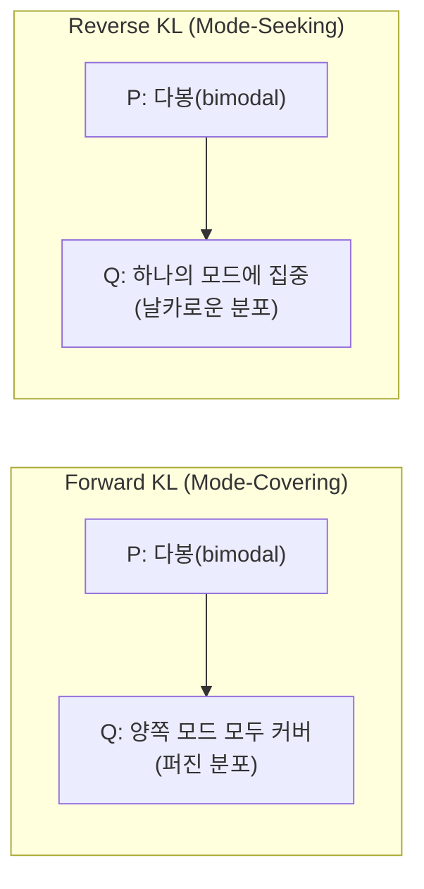

# KL 발산과 정보 기하학 (KL Divergence)

## KL 발산 정의

쿨백-라이블러 발산(Kullback-Leibler divergence)은 근사 분포 $Q$가 실제 분포 $P$를 얼마나 잘 설명하지 못하는지 측정한다.

$$D_{KL}(P \| Q) = \sum_x P(x) \log \frac{P(x)}{Q(x)} = \mathbb{E}_{x \sim P}\left[\log \frac{P(x)}{Q(x)}\right]$$

**핵심 성질**:
- 항상 $\geq 0$ (깁스 부등식(Gibbs inequality)에 의해)
- $P = Q$이면 $D_{KL} = 0$
- **비대칭(asymmetric)**: $D_{KL}(P \| Q) \neq D_{KL}(Q \| P)$

## 비대칭성: Forward vs Reverse KL

두 방향의 KL은 근사 분포 $Q$를 최적화할 때 질적으로 다른 행동을 보인다.

| | **Forward KL**: $D_{KL}(P \| Q)$ | **Reverse KL**: $D_{KL}(Q \| P)$ |
|---|---|---|
| 다른 이름 | Inclusive KL, M-projection | Exclusive KL, I-projection |
| $P(x) > 0$인 곳 | $Q(x) > 0$ 강요 | 무시 가능 |
| 행동 양식 | **Mode-covering**: $P$의 모든 모드를 커버하려 함 | **Mode-seeking**: $P$의 하나의 모드에 집중 |
| 응용 | 최대우도 추정(MLE), 크로스 엔트로피 학습 | Variational Inference, RLHF KL 페널티 |

실제 분포 $P$가 다봉(multimodal)일 때 Forward KL은 두 모드 사이 빈 공간에도 확률을 할당하는 반면, Reverse KL은 하나의 모드를 선택해 집중적으로 근사한다.

## f-Divergence 계열

KL 발산은 더 넓은 f-발산(f-divergence) 계열의 특수 사례다.

$$D_f(P \| Q) = \sum_x Q(x) f\left(\frac{P(x)}{Q(x)}\right)$$

| 발산 | $f(t)$ | 특징 |
|------|--------|------|
| KL 발산 | $t \log t$ | 비대칭, 무한대 범위 |
| Reverse KL | $-\log t$ | 비대칭 |
| **Jensen-Shannon (JS)** | 대칭 KL 평균 | 대칭, 범위 $[0, \log 2]$ |
| **Hellinger** | $(\sqrt{t} - 1)^2$ | 대칭, 범위 $[0, 2]$ |
| Total Variation | $\frac{1}{2}|t-1|$ | 대칭, 범위 $[0, 1]$ |

JS 발산은 GAN(Generative Adversarial Network) 이론 분석의 핵심 도구다.

## VAE ELBO에서의 역할

변분 오토인코더(Variational Autoencoder, VAE)의 목표는 $\log P(x)$를 최대화하는 것이다. 이를 직접 계산할 수 없으므로 하한(ELBO: Evidence Lower BOund)을 최대화한다.

$$\log P(x) \geq \underbrace{\mathbb{E}_{z \sim q_\phi(z|x)}[\log p_\theta(x|z)]}_{\text{재구성 손실}} - \underbrace{D_{KL}(q_\phi(z|x) \| p(z))}_{\text{정규화 항}}$$

- **재구성 손실**: 인코딩 후 디코딩이 원본을 얼마나 복원하는가
- **KL 정규화 항**: 사후 분포(posterior) $q_\phi(z|x)$가 사전 분포(prior) $p(z)$(보통 $\mathcal{N}(0, I)$)와 얼마나 가까운가

KL 항이 너무 크면 잠재 공간(latent space)이 붕괴(posterior collapse)되어 인코더를 무시하는 문제가 발생한다.

## RLHF에서의 KL 페널티

RLHF(Reinforcement Learning from Human Feedback)에서 정책(policy) $\pi_\theta$가 보상(reward)만 최대화하면 보상 해킹(reward hacking)이 발생한다. 이를 막기 위해 참조 정책(reference policy) $\pi_{\text{ref}}$와의 KL 발산을 페널티로 추가한다.

$$\mathcal{L} = \mathbb{E}\left[r(x, y)\right] - \beta \cdot D_{KL}(\pi_\theta \| \pi_{\text{ref}})$$

DPO(Direct Preference Optimization)는 이 KL-제약 최적화 문제를 닫힌 형태(closed form)로 풀어 PPO 없이도 선호 학습을 가능하게 한다.

## 관련 문서
- [[dpo-paper]] -- Direct Preference Optimization: Your Language Model is Secretly a Reward Model (Rafailov et al., 2023)

- [[information-theory]]
- [[autoencoders-vae]]
- [[cross-entropy-loss]]
- [[RLHF 파이프라인]]
- [[DPO와 선호 학습]]
