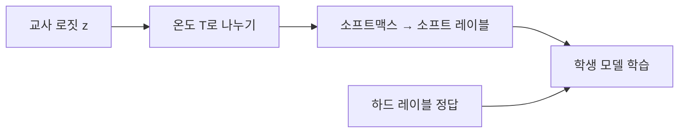

# 지식 증류 이론

Hinton et al. (2015)이 정립한 교사-학생 모델 간 지식 전이의 이론적 토대. 교사 모델의 **소프트 레이블(soft label)**에 담긴 "어두운 지식(dark knowledge)"--클래스 간 유사도 정보--을 학생 모델에 전달하는 원리를 다룬다.

## 온도 스케일링

$$p_i = \frac{\exp(z_i / T)}{\sum_j \exp(z_j / T)}$$

- $T=1$: 표준 소프트맥스 (정답에 확률 집중)
- $T \gg 1$: 균일에 가까운 분포 (클래스 간 관계 노출)

높은 온도에서 "고양이와 호랑이가 비슷하다"는 교사의 암묵적 지식이 드러나며, 학생이 이를 학습하면 하드 레이블만으로 학습할 때보다 **일반화가 향상**된다.

## 증류 손실

$$L = \alpha \cdot L_{CE}(y, p_S^{T=1}) + (1-\alpha) \cdot T^2 \cdot L_{KL}(p_T^{T}, p_S^{T})$$

$T^2$ 스케일링은 소프트 레이블의 그래디언트 크기를 보정하기 위함.

## [[knowledge-distillation|실전 증류]]와의 차이

이 페이지는 이론(왜 소프트 레이블이 효과적인가)에 초점. [[on-policy-distillation|On-Policy]], [[black-box-distillation|Black-Box]] 등 실전 변형은 별도 페이지 참조.

## 관련 문서
- [[self-distillation]] -- 셀프 증류 (Self-Distillation)

- [[knowledge-distillation]] -- 지식 증류 실전
- [[on-policy-distillation]] -- On-Policy 증류
- [[cross-tokenizer-distillation]] -- Cross-Tokenizer 증류
