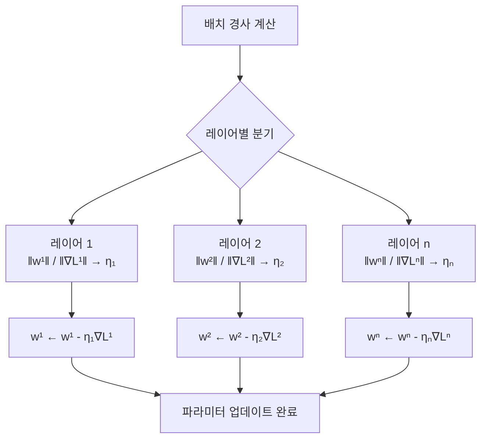
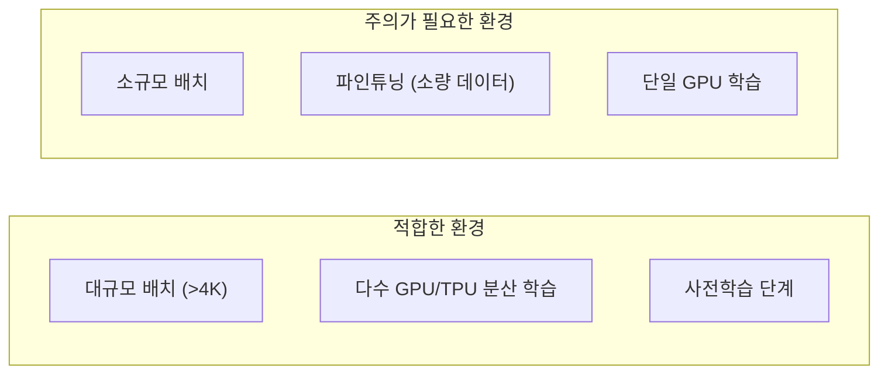

# LAMB/LARS 옵티마이저

## 개요

LAMB(Layer-wise Adaptive Moments optimizer for Batch training)과 LARS(Layer-wise Adaptive Rate Scaling)는 **대규모 배치 학습**을 위해 설계된 옵티마이저다. 수천~수만 GPU를 동원하는 분산 학습([[distributed-training-overview]])에서 배치 크기를 크게 늘리면 표준 SGD나 Adam의 수렴이 불안정해지는 문제를 해결한다.

두 방법의 핵심 아이디어는 동일하다: **레이어(layer)마다 독립적으로 학습률을 조정**하여 레이어 간 파라미터 스케일 차이가 업데이트를 망치지 않게 한다.

## 대규모 배치의 문제

배치 크기를 $k$배 늘리면 통계적으로 학습률도 $\sqrt{k}$ 또는 $k$배 늘려야 한다(선형 스케일링 법칙). 그러나 이를 단순 적용하면:

- 일부 레이어에서 경사 폭발(gradient explosion)
- 일부 레이어에서 파라미터가 거의 업데이트되지 않는 불균형
- 전반적 수렴 실패

레이어마다 파라미터의 크기($\|w\|$)와 경사의 크기($\|g\|$)가 크게 다르기 때문이다.

## LARS (Layer-wise Adaptive Rate Scaling)

You et al.(2017)이 ImageNet 대규모 학습을 위해 제안했다. 레이어 $l$에 대한 업데이트:

$$\eta_l = \eta_{\text{base}} \cdot \frac{\|w^l\|}{\|\nabla \mathcal{L}^l\| + \lambda \|w^l\|}$$

- $\|w^l\|$: 레이어 파라미터의 노름
- $\|\nabla \mathcal{L}^l\|$: 레이어 경사의 노름
- $\lambda$: 가중치 감쇠(weight decay) 계수
- $\eta_{\text{base}}$: 전역 기본 학습률

로컬 학습률 $\eta_l$은 **파라미터 노름 대비 경사 노름의 비율**로 결정된다. 경사가 작은 레이어는 더 큰 스텝을, 경사가 큰 레이어는 더 작은 스텝을 밟는다.

LARS는 모멘텀 SGD 위에 레이어별 학습률 조정 레이어를 추가한 구조다.

## LAMB (Layer-wise Adaptive Moments)

You et al.(2019)이 BERT의 대규모 사전학습 가속화를 위해 LARS 아이디어를 **Adam** 위에 적용했다. LAMB의 업데이트:

1. Adam과 동일하게 1차/2차 모멘트 추정: $m_t$, $v_t$
2. Adam 업데이트 $r_t = m_t / (\sqrt{v_t} + \epsilon)$ 계산
3. 레이어별 신뢰 비율(trust ratio) 적용:

$$\phi(l) = \frac{\|w^l\|}{\|r_t^l + \lambda w^l\|}$$

$$w^l_{t+1} = w^l_t - \eta \cdot \phi(l) \cdot (r_t^l + \lambda w^l_t)$$

LAMB = Adam의 적응적 2차 모멘트 + LARS의 레이어별 신뢰 비율

## LARS vs LAMB 비교

| 항목 | LARS | LAMB |
|------|------|------|
| 기반 방법 | 모멘텀 SGD | Adam |
| 적응성 | 레이어별 학습률만 | 레이어별 + 파라미터별 |
| 주요 사용처 | 이미지 분류 (ResNet, etc.) | 언어 모델 사전학습 (BERT) |
| 배치 크기 | 최대 수만 | 최대 수만 ~ 수십만 |
| 수렴 안정성 | 좋음 | 더 좋음 (Adam 기반) |

## 실제 성능

LAMB을 사용한 BERT 사전학습:

- 배치 크기 32,768 + TPU Pod: **76분** 만에 BERT-Large 학습 완료
- 표준 Adam + 배치 256: ~3일 소요
- 약 50배 학습 시간 단축

[[optimization-theory]]의 관점에서 이는 하드웨어 확장과 알고리즘 설계가 결합한 중요한 사례다.

## 적용 시 주의사항

- **웜업(Warmup)** 단계는 여전히 필요: 초반에 신뢰 비율이 불안정
- 배치 크기가 너무 작으면 LARS/LAMB의 이점이 사라짐 (일반적으로 4,096 이상)
- 레이어별 신뢰 비율 클리핑(기본값 0~10)으로 폭발 방지

## 관련 문서

- [[optimization-theory]] - 최적화 이론 기초 및 Adam, SGD
- [[distributed-training-overview]] - 분산 학습 패러다임, 데이터 병렬성
- [[learning-rate-scheduling]] - 웜업, 코사인 스케줄 등 학습률 조절
- [[gradient-descent-backpropagation]] - 경사 하강 기초
