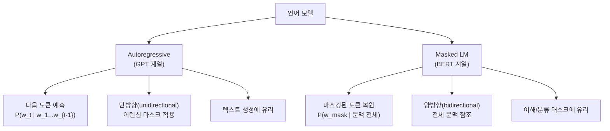

# 통계적 언어 모델 기초 (Language Model Foundations)

## 언어 모델이란

언어 모델(language model, LM)은 토큰 시퀀스에 확률을 부여하는 함수다. 연쇄 법칙(chain rule)에 의해 다음과 같이 분해된다.

$$P(w_1, w_2, \ldots, w_T) = \prod_{t=1}^{T} P(w_t \mid w_1, \ldots, w_{t-1})$$

## 마르코프 가정과 N-gram 모델

모든 이전 토큰을 조건으로 두면 파라미터 수가 폭발하므로 **마르코프 가정(Markov assumption)**을 도입한다. 현재 토큰이 직전 $n-1$개 토큰에만 의존한다고 가정하면 N-gram 모델이 된다.

$$P(w_t \mid w_1, \ldots, w_{t-1}) \approx P(w_t \mid w_{t-n+1}, \ldots, w_{t-1})$$

**데이터 희소성(data sparsity)**: $n$이 커질수록 표현력은 높아지지만 특정 N-gram이 학습 말뭉치(corpus)에 등장하지 않는 문제가 심각해진다.

## 스무딩 기법

| 기법 | 핵심 아이디어 | 특징 |
|------|---------------|------|
| **Add-k (Laplace)** | 모든 카운트에 $k$를 더해 0 카운트 제거 | 단순하지만 희귀 N-gram 과대평가 |
| **Kneser-Ney** | 각 단어가 등장하는 맥락 다양성 기반 | 실용적으로 가장 강력한 N-gram 스무딩 |
| **Backoff** | 고차 N-gram 없으면 저차 N-gram으로 후퇴 | Katz Backoff가 대표적 |
| **Interpolation** | 다양한 차수의 N-gram을 가중 결합 | Jelinek-Mercer Smoothing |

## Bengio 2003 신경 언어 모델

Bengio et al. (2003) "A Neural Probabilistic Language Model"은 단어를 연속 벡터로 표현하고, 피드포워드 신경망(feedforward neural network)으로 다음 단어 확률을 예측하는 첫 번째 신경 LM이다. 이 논문이 제안한 분산 표현(distributed representation)이 오늘날 임베딩의 기원이다.

## Autoregressive vs Masked 분화

- **GPT(Generative Pretrained Transformer)**: 왼쪽 문맥만 활용해 다음 토큰을 예측. 생성 태스크에 적합하며 현재 LLM의 주류
- **BERT(Bidirectional Encoder Representations from Transformers)**: 양방향 문맥으로 마스킹 토큰을 복원. 문장 분류·NER 등 이해 태스크에 강함

## 퍼플렉시티 (Perplexity)

퍼플렉시티는 언어 모델의 품질을 측정하는 지표다. "모델이 평균적으로 다음 토큰을 예측할 때 얼마나 많은 선택지를 고려하는가"를 의미한다.

$$\text{PPL} = \exp\left(-\frac{1}{T}\sum_{t=1}^{T} \log P(w_t \mid w_1, \ldots, w_{t-1})\right)$$

낮을수록 좋다. 완벽한 모델의 PPL = 1, 균등 분포 모델의 PPL = $|V|$.

## 관련 문서
- [[tokenization-concepts]] -- 토크나이제이션 개념 (Tokenization Concepts)

- [[cross-entropy-loss]]
- [[RNN과 LSTM]]
- [[embedding-layers]]
- [[Transformer 아키텍처]]
- [[Seq2Seq와 인코더-디코더 모델]]
