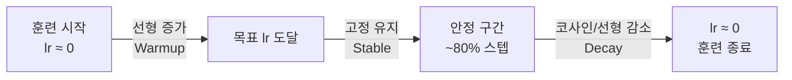

# 학습률 스케줄링 (Learning Rate Scheduling)

학습률(learning rate)을 훈련 과정에서 동적으로 조절하는 기법. 고정 학습률은 초기 발산이나 후기 진동 문제를 야기하므로, 단계별로 학습률을 변화시켜 안정적인 수렴을 유도한다.

## 왜 Warmup이 필요한가

훈련 초기에 파라미터가 랜덤으로 초기화된 상태에서 높은 학습률을 사용하면 손실이 폭발(loss spike)하기 쉽다. Adam 옵티마이저 기준으로 초기 `t`가 작을 때 2차 모멘트(second moment) 추정값이 불안정하여 step 크기가 왜곡된다. Warmup은 학습률을 0에서 목표값까지 서서히 올려 이 불안정 구간을 안전하게 통과시킨다.

- **Adam bias correction**: $\hat{v}_t = v_t / (1 - \beta_2^t)$ 항이 초기에 크게 보정됨 → 실질 step이 의도보다 커짐
- Warmup 기간 동안 낮은 lr로 시작하면 모멘트 추정이 수렴한 뒤 큰 학습률이 적용되어 안전

## 주요 스케줄 유형

| 스케줄 | 설명 | 장점 | 단점 |
|--------|------|------|------|
| Step Decay | 일정 에폭마다 lr을 0.1배 감소 | 단순 구현 | 불연속 전환 |
| Cosine Annealing | 코사인 함수를 따라 최솟값까지 하강 | 부드러운 감소, 재시작 가능 | 스케줄 길이 설정 필요 |
| Linear Warmup + Decay | 선형 증가 후 선형/코사인 감소 | 직관적 | 하이퍼파라미터 수 |
| OneCycleLR | Warmup 후 단일 코사인 사이클 | 빠른 수렴, 슈퍼 컨버전스 | 총 스텝 수 사전 지정 필요 |
| WSD (Warmup-Stable-Decay) | Warmup -> 안정 유지 -> 급격히 감소 | 긴 훈련에서 효율적 | Stable 구간 비율 설계 |

## WSD 스케줄 (Warmup-Stable-Decay)

Llama 3, DeepSeek 등 대규모 언어모델(LLM) 훈련에 채택된 최신 스케줄. 학습률을 오랫동안 안정적으로 유지하다가 훈련 말미에 급격히 낮추어 최종 수렴 품질을 극대화한다.

위 흐름에서 안정 구간(Stable)이 전체 스텝의 70-80%를 차지하고, Warmup 5%, Decay 15-20% 비율이 일반적이다.

## Cosine Annealing with Warm Restarts (SGDR)

코사인 함수를 주기적으로 재시작하여 여러 local minimum을 탐색한다:

$$\eta_t = \eta_{min} + \frac{1}{2}(\eta_{max} - \eta_{min})\left(1 + \cos\frac{T_{cur}}{T_i}\pi\right)$$

- $T_i$: 현재 주기 길이 (재시작마다 2배로 늘릴 수 있음)
- 재시작 시점에 lr이 최대로 복귀 → 다른 골짜기 탐색 가능

## OneCycleLR

Leslie Smith의 슈퍼 컨버전스(super-convergence) 연구에서 제안. 1사이클 안에 lr을 올렸다가 낮추며, 짧은 에폭 내에 높은 성능을 달성한다.

- 최대 lr: `lr_finder`로 적정값 탐색 후 설정
- Momentum은 lr과 반대 방향으로 조절 (lr↑ → momentum↓)
- PyTorch: `torch.optim.lr_scheduler.OneCycleLR`

## 실무 선택 가이드

- **LLM 사전학습 (대규모)**: WSD 스케줄 — 긴 stable 구간 후 decay
- **파인튜닝**: Linear warmup + cosine decay, warmup 비율 3-10%
- **빠른 프로토타이핑**: OneCycleLR — 10-30 에폭으로 빠른 탐색
- **소규모 CV 실험**: Cosine Annealing with restarts

## 관련 문서
- [[mup-maximal-update]] -- muP (최대 업데이트 파라미터화)

- [[gradient-descent-backpropagation]]
- [[AdamW 옵티마이저]]
- [[automatic-differentiation]]
