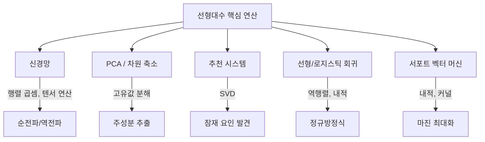

# ML을 위한 선형대수 (Linear Algebra for ML)

머신러닝의 거의 모든 연산은 선형대수 위에 구축된다. 데이터를 벡터와 행렬로 표현하고, 모델의 학습과 추론 과정에서 행렬 연산이 핵심 역할을 한다.

## 왜 ML에 선형대수가 필요한가

ML 모델은 데이터를 수치적으로 처리한다. 이미지 한 장은 픽셀 값의 행렬이고, 자연어 문장은 임베딩 벡터의 시퀀스이며, 신경망의 가중치는 거대한 행렬이다. 이 모든 것을 다루려면 벡터, 행렬, 텐서 연산에 대한 이해가 필수적이다.

## 핵심 개념

### 벡터 (Vectors)

벡터는 크기와 방향을 가진 양이다. ML에서 하나의 데이터 포인트는 특성(feature) 벡터로 표현된다.

- **내적 (Dot Product)**: 두 벡터의 유사도를 측정한다. 코사인 유사도의 기반이 된다
- **노름 (Norm)**: 벡터의 크기를 측정한다. L1 노름(맨해튼 거리)과 L2 노름(유클리드 거리)이 [[overfitting-regularization|정규화]]에서 핵심적으로 사용된다
- **직교성**: 두 벡터가 직교하면 서로 독립적인 정보를 담고 있다

### 행렬 (Matrices)

행렬은 벡터의 집합이자 선형 변환을 표현하는 도구다.

- **행렬 곱셈**: 신경망의 순전파(forward pass)는 본질적으로 행렬 곱셈의 연쇄다
- **전치 (Transpose)**: 행과 열을 교환한다. 공분산 행렬 계산에 필수
- **역행렬 (Inverse)**: 선형 회귀의 정규방정식(Normal Equation)에서 사용된다
- **행렬식 (Determinant)**: 선형 변환이 공간을 얼마나 확대/축소하는지 나타낸다

### 고유값 분해 (Eigendecomposition)

정방행렬 A에 대해 `Av = lambda * v`를 만족하는 v가 고유벡터, lambda가 고유값이다.

- **고유벡터 (Eigenvector)**: 변환 후에도 방향이 바뀌지 않는 벡터
- **고유값 (Eigenvalue)**: 해당 방향으로 얼마나 늘어나거나 줄어드는지를 나타내는 스칼라

PCA에서 공분산 행렬의 고유벡터가 주성분(principal component)이 되고, 고유값이 각 주성분이 설명하는 분산의 크기를 나타낸다. 이는 [[feature-engineering|특성 공학]]에서 차원 축소의 기반이다.

### 특이값 분해 (SVD)

SVD는 임의의 행렬 M을 세 행렬의 곱으로 분해한다: `M = U * Sigma * V^T`

- U: 좌특이벡터 (left singular vectors)
- Sigma: 특이값의 대각 행렬
- V^T: 우특이벡터 (right singular vectors)

고유값 분해가 정방행렬에만 적용되는 반면, SVD는 어떤 형태의 행렬에도 적용할 수 있어 ML에서 더 범용적으로 사용된다.

**ML 적용 사례:**
- 추천 시스템의 행렬 인수분해 (사용자-아이템 상호작용 행렬 분해)
- 차원 축소 (truncated SVD)
- 잠재 의미 분석 (LSA) -- 텍스트의 의미적 구조 파악
- 이미지 압축

## 선형대수가 ML 알고리즘에 적용되는 방식

## 텐서: 행렬의 확장

딥러닝에서는 2차원 행렬을 넘어 다차원 텐서를 다룬다.

- 스칼라: 0차원 텐서
- 벡터: 1차원 텐서
- 행렬: 2차원 텐서
- 3차원 이상: 배치 데이터, 컬러 이미지(높이 x 너비 x 채널), 시퀀스 데이터 등

PyTorch, TensorFlow 같은 프레임워크에서 `torch.matmul`, `tf.linalg.svd` 등의 함수로 이러한 연산을 GPU에서 대규모로 병렬 처리한다.

## 실무 핵심 정리

| 연산 | ML 적용 | 관련 알고리즘 |
|------|---------|---------------|
| 내적 | 유사도 계산 | 코사인 유사도, Attention |
| 행렬 곱 | 레이어 연산 | 신경망 전체 |
| 고유값 분해 | 분산 기반 차원 축소 | PCA |
| SVD | 행렬 인수분해 | 추천 시스템, LSA |
| 노름 | 정규화 | L1/L2 정규화 |

## 관련 문서

- [[probability-statistics-for-ml]] -- 선형대수와 함께 ML의 수학적 토대
- [[optimization-theory]] -- 행렬 미분과 최적화 이론의 연결
- [[feature-engineering]] -- PCA, SVD를 활용한 차원 축소
- [[gradient-descent-backpropagation]] -- 행렬 연산 기반의 기울기 계산

## 참고 자료

- [Linear Algebra for Machine Learning - IBM](https://www.ibm.com/think/topics/linear-algebra-for-machine-learning)
- [Linear Algebra in AI: Vectors, Matrices, Eigenvalues, and SVD - mathNai](https://learn.mathnai.com/module/core/math/linear-algebra-ai/)
- [ML Linear Algebra Operations - GeeksforGeeks](https://www.geeksforgeeks.org/machine-learning/ml-linear-algebra-operations/)
