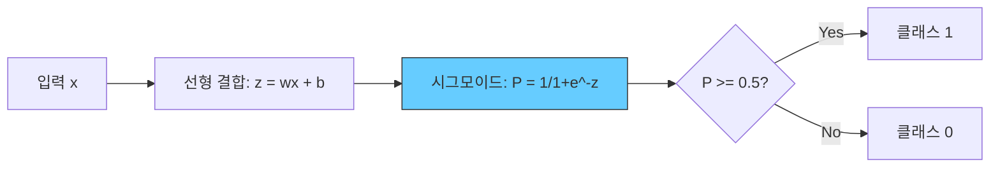
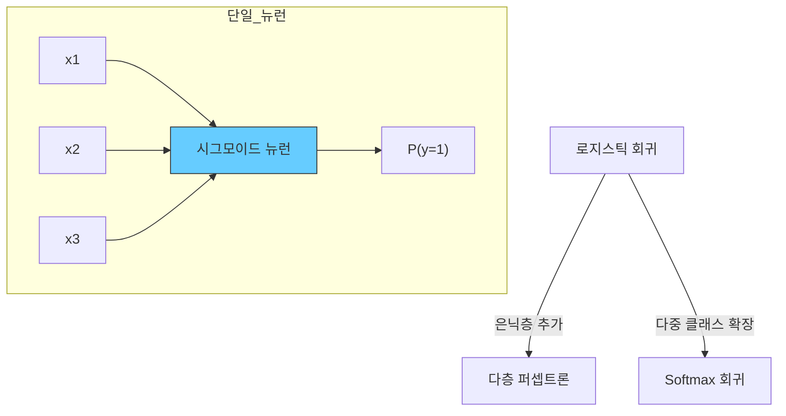

## 개요

로지스틱 회귀(Logistic Regression)는 이름에 "회귀"가 포함되어 있지만 실제로는 **분류(classification)** 알고리즘이다. 입력 변수의 선형 결합을 시그모이드(sigmoid) 함수로 변환하여 0과 1 사이의 확률을 출력하며, 이를 기반으로 클래스를 결정한다. 통계학에서 오랜 역사를 가진 모델이면서, [[perceptron-mlp]]의 단일 뉴런과 수학적으로 동일한 구조여서 신경망의 가장 기본적인 빌딩 블록이기도 하다. 해석 가능성과 효율성이 뛰어나 기준선(baseline) 모델로 널리 사용된다.

## 핵심 개념

### 시그모이드 함수

로지스틱 회귀의 핵심은 시그모이드(로지스틱) 함수다. 임의의 실수를 (0, 1) 범위의 확률로 변환한다.

```
sigmoid(z) = 1 / (1 + e^(-z))
```

여기서 z = w^T * x + b (가중치와 입력의 선형 결합 + 편향)



시그모이드는 [[activation-functions]]의 하나이며, 역사적으로 신경망 은닉층에도 사용되었으나 기울기 소실 문제로 현재는 출력층(이진 분류)에만 주로 쓰인다.

### 로그 오즈 (Log-Odds, Logit)

로지스틱 회귀의 선형 부분은 사건 발생 확률의 **로그 오즈(logit)**를 모델링한다:

```
logit(P) = log(P / (1-P)) = w^T * x + b
```

- P / (1-P): 오즈(odds) -- 사건 발생 대 비발생의 비율
- 계수 w의 해석: w_i가 1 증가하면 오즈가 e^(w_i)배 변화

이 해석 가능성이 로지스틱 회귀의 가장 큰 장점 중 하나다. 의료, 금융, 사회과학에서 변수의 영향력을 정량적으로 분석할 때 핵심적으로 활용된다.

### 최대 우도 추정 (Maximum Likelihood Estimation)

로지스틱 회귀는 최소 제곱법(OLS) 대신 **최대 우도 추정(MLE)**으로 파라미터를 학습한다. 관측 데이터가 나타날 확률(우도)을 최대화하는 w와 b를 찾는다.

실무에서는 음의 로그 우도(negative log-likelihood), 즉 **이진 교차 엔트로피(binary cross-entropy)**를 최소화하는 것과 동일하다:

```
L = -(1/n) * SUM[y*log(P) + (1-y)*log(1-P)]
```

이는 [[loss-functions]]의 대표적 분류 손실 함수이며, 닫힌 형태의 해(closed-form solution)가 없으므로 [[optimization-theory]]의 경사 하강법이나 Newton-Raphson 등 수치 최적화로 풀어야 한다.

## 결정 경계

로지스틱 회귀의 결정 경계는 z = w^T * x + b = 0인 초평면이다. 입력 공간에서 선형이므로, 비선형 결정 경계가 필요한 문제에는 적합하지 않다. 비선형성이 필요하면 다항 특성을 추가하거나, [[support-vector-machines]]의 커널 트릭, 또는 [[perceptron-mlp]]로 확장한다.

## 정규화

과적합을 방지하기 위해 [[overfitting-regularization]]의 L1/L2 정규화를 적용한다:

| 정규화 | 효과 | 활용 |
|--------|------|------|
| **L1 (Lasso)** | 일부 계수를 정확히 0으로 만듦 | 특성 선택 (sparse solution) |
| **L2 (Ridge)** | 계수를 작게 유지 | 다중공선성 완화 |
| **Elastic Net** | L1 + L2 결합 | 상관된 특성 그룹 처리 |

C 파라미터(또는 lambda)로 정규화 강도를 조절하며, [[cross-validation-model-evaluation]]로 최적값을 선택한다.

## 다중 클래스 확장

### Softmax 회귀 (다항 로지스틱 회귀)

이진 분류를 K개 클래스로 확장한다. 시그모이드 대신 **Softmax** 함수를 사용하여 각 클래스의 확률을 출력한다:

```
P(y=k|x) = e^(w_k^T * x) / SUM_j(e^(w_j^T * x))
```

이것이 [[perceptron-mlp]]의 출력층에서 사용하는 Softmax 분류기이며, [[activation-functions]]의 Softmax와 동일하다.

### One-vs-Rest (OvR)

K개의 이진 분류기를 학습하여 각각 "해당 클래스 vs 나머지"를 구분한다. 단순하지만 클래스 수가 많으면 비효율적이다.

## 신경망과의 관계



로지스틱 회귀는 활성화 함수로 시그모이드를 사용하는 **단일 뉴런 신경망**과 정확히 동일하다. [[perceptron-mlp]]에 은닉층을 추가하면 비선형 결정 경계를 학습할 수 있게 되며, 이것이 딥러닝으로의 확장이다. 따라서 로지스틱 회귀를 이해하는 것은 신경망의 기초를 이해하는 것과 같다.

## 장점과 한계

| 장점 | 한계 |
|------|------|
| 확률적 출력 (신뢰도 해석 가능) | 선형 결정 경계만 가능 |
| 계수의 직관적 해석 (오즈비) | 비선형 관계 포착 불가 |
| 계산 효율성이 높음 | 특성 간 상호작용을 수동으로 설계해야 함 |
| 정규화로 과적합 제어 용이 | 고차원 복잡 패턴에서 성능 한계 |
| 잘 연구된 통계적 기반 | [[decision-trees-random-forests]]나 SVM에 비해 유연성 부족 |

## 관련 문서

- [[perceptron-mlp]] - 로지스틱 회귀의 다층 확장
- [[activation-functions]] - 시그모이드와 Softmax 함수
- [[support-vector-machines]] - 마진 기반 선형 분류 대안
- [[loss-functions]] - 이진 교차 엔트로피 손실 함수
- [[overfitting-regularization]] - L1/L2 정규화
- [[cross-validation-model-evaluation]] - 분류 모델 평가 (Precision, Recall, F1)
- [[decision-trees-random-forests]] - 비선형 분류의 대안 모델
