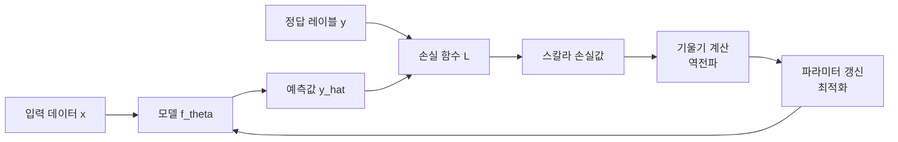
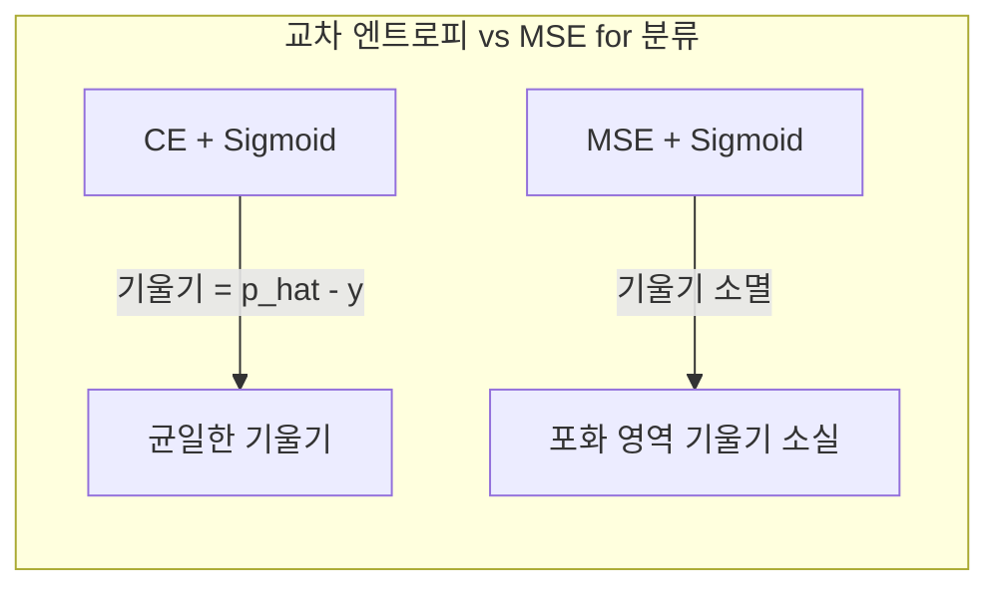
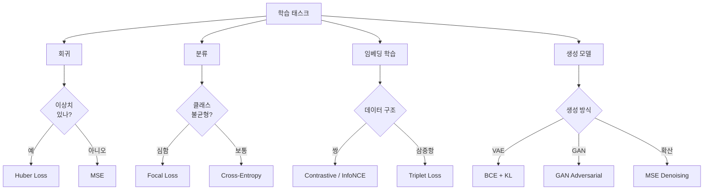

# 손실 함수 (Loss Functions)

## 개요

손실 함수(loss function)는 모델의 예측값과 실제 정답 사이의 **불일치를 수치로 정량화하는 함수**다. 머신러닝 학습의 핵심은 이 손실 함수를 최소화하는 파라미터를 찾는 것이므로, 어떤 손실 함수를 선택하느냐는 모델이 "무엇을 잘해야 하는가"를 정의하는 일과 같다.

목적 함수(objective function), 비용 함수(cost function), 에너지 함수(energy function)라고도 불리며, 문맥에 따라 미묘한 차이가 있지만 실용적으로는 혼용된다.

## 손실 함수의 역할



손실 함수는 반드시 미분 가능해야 역전파로 기울기를 계산할 수 있다. 미분 불가능한 지점(예: MAE의 $x=0$)에서는 서브그래디언트(subgradient)를 사용한다.

## 회귀 손실 함수

### MSE (Mean Squared Error)

$$\text{MSE} = \frac{1}{n}\sum_{i=1}^n (y_i - \hat{y}_i)^2$$

```python
import torch
import torch.nn.functional as F

# PyTorch 기본 제공
loss_fn = torch.nn.MSELoss()
loss = loss_fn(predictions, targets)

# 또는
loss = F.mse_loss(predictions, targets, reduction="mean")
```

**특성:**
- 오차의 제곱 → 큰 오차에 **불균형적으로 높은 페널티**
- 이상치(outlier)에 매우 민감
- 미분이 연속적이고 단순 → 최적화 용이
- 가우시안 노이즈를 가정할 때 최대 우도 추정(MLE)과 동일

**사용처:** 회귀, 이미지 재구성, 확산 모델 학습 목표 (일부)

### MAE (Mean Absolute Error)

$$\text{MAE} = \frac{1}{n}\sum_{i=1}^n |y_i - \hat{y}_i|$$

```python
loss_fn = torch.nn.L1Loss()
loss = loss_fn(predictions, targets)
```

**특성:**
- 모든 오차에 **동일한 가중치** (이상치에 강건)
- $x=0$에서 미분 불가능 → 서브그래디언트 사용
- 예측값이 **중앙값(median)**에 수렴하는 경향 (MSE는 평균)

### Huber Loss (Smooth MAE)

$$L_\delta(y, \hat{y}) = \begin{cases} \frac{1}{2}(y-\hat{y})^2 & |y-\hat{y}| \leq \delta \\ \delta|y-\hat{y}| - \frac{1}{2}\delta^2 & |y-\hat{y}| > \delta \end{cases}$$

```python
# delta (beta in PyTorch)
loss_fn = torch.nn.HuberLoss(delta=1.0)
loss = loss_fn(predictions, targets)

# SmoothL1Loss는 HuberLoss의 beta=1.0 버전
smooth_l1 = torch.nn.SmoothL1Loss(beta=1.0)
```

**특성:**
- 오차 $< \delta$: MSE처럼 동작 (부드러운 기울기)
- 오차 $\geq \delta$: MAE처럼 동작 (이상치 강건성)
- $\delta$ 선택이 중요: 데이터 스케일에 맞춰 조정

| 손실 | 이상치 강건성 | 미분 연속성 | 예측 수렴 |
|------|------------|-----------|---------|
| MSE | 낮음 | 완전 | 평균 |
| MAE | 높음 | $x=0$ 불연속 | 중앙값 |
| Huber | 중간 | 완전 | 평균 근사 |

## 분류 손실 함수

### Cross-Entropy (교차 엔트로피)

정보이론에서 유래한 분류 문제의 표준 손실이다. 예측 확률 분포 $q$와 실제 분포 $p$의 차이를 측정한다.

$$H(p, q) = -\sum_c p(c) \log q(c)$$

**이진 교차 엔트로피 (BCE):**

$$\text{BCE} = -\frac{1}{n}\sum_{i=1}^n [y_i \log \hat{p}_i + (1-y_i)\log(1-\hat{p}_i)]$$

```python
# 이진 분류
bce_loss = torch.nn.BCELoss()  # 입력: 확률값 (sigmoid 통과 후)
bce_logits_loss = torch.nn.BCEWithLogitsLoss()  # 입력: 로짓 (수치 안정)

# 수치 안정성 때문에 BCEWithLogitsLoss 권장
loss = bce_logits_loss(logits, targets.float())
```

**다중 클래스 교차 엔트로피 (CE):**

$$\text{CE} = -\frac{1}{n}\sum_{i=1}^n \log \hat{p}_{i, y_i}$$

```python
# 다중 분류 (소프트맥스 통합)
ce_loss = torch.nn.CrossEntropyLoss()  # 입력: 로짓 (소프트맥스 미적용)
loss = ce_loss(logits, targets)  # targets: 클래스 인덱스

# 레이블 스무딩 (label smoothing) - 과적합 방지
ce_smooth = torch.nn.CrossEntropyLoss(label_smoothing=0.1)
```

**왜 교차 엔트로피가 분류에 적합한가?**

Sigmoid/Softmax 출력과 결합하면 기울기 $= \hat{p} - y$로 단순해져 포화 영역에서도 기울기가 사라지지 않는다. MSE를 분류에 쓰면 포화 영역에서 기울기 소실이 발생한다.



### Focal Loss

Lin et al. (2017, Facebook AI)가 RetinaNet 논문에서 제안한 클래스 불균형 해결 손실이다.

$$\text{FL}(p_t) = -\alpha_t (1-p_t)^\gamma \log(p_t)$$

- $\gamma > 0$: 쉽게 분류된 샘플의 손실을 낮춤
- $\alpha$: 클래스별 가중치 (불균형 보정)

```python
class FocalLoss(torch.nn.Module):
    """Focal Loss - 클래스 불균형 문제 해결"""

    def __init__(self, alpha: float = 0.25, gamma: float = 2.0) -> None:
        super().__init__()
        self.alpha = alpha
        self.gamma = gamma

    def forward(self, logits: torch.Tensor, targets: torch.Tensor) -> torch.Tensor:
        bce_loss = F.binary_cross_entropy_with_logits(
            logits, targets.float(), reduction="none"
        )
        probs = torch.sigmoid(logits)
        p_t = probs * targets + (1 - probs) * (1 - targets)
        alpha_t = self.alpha * targets + (1 - self.alpha) * (1 - targets)
        focal_weight = alpha_t * (1 - p_t) ** self.gamma
        return (focal_weight * bce_loss).mean()
```

| $\gamma$ 값 | 효과 |
|------------|------|
| 0 | 표준 교차 엔트로피 |
| 1 | 약한 집중 |
| 2 | 권장 기본값 |
| 5 | 강한 집중 (어려운 샘플에만 집중) |

**사용처:** 객체 탐지(class imbalance), 의료 영상(병변 드문 경우), 감정 분석 (불균형 데이터)

### Hinge Loss (SVM 손실)

$$L = \sum_i \max(0, 1 - y_i \cdot f(x_i))$$

```python
# PyTorch HingeEmbeddingLoss
hinge_loss = torch.nn.HingeEmbeddingLoss(margin=1.0)
```

- 마진(margin) 기반: 결정 경계에서 마진 내부 샘플에만 페널티
- SVM(서포트 벡터 머신)의 핵심 손실
- 딥러닝에서는 교차 엔트로피보다 잘 쓰이지 않음

## 특수 목적 손실 함수

### Triplet Loss

Schroff et al. (2015, FaceNet)이 제안한 임베딩 공간 학습 손실이다.

$$L = \sum_i [\|f(x_i^a) - f(x_i^p)\|_2^2 - \|f(x_i^a) - f(x_i^n)\|_2^2 + \alpha]_+$$

- Anchor ($a$), Positive ($p$, 같은 클래스), Negative ($n$, 다른 클래스)
- 앵커-포지티브 거리 < 앵커-네거티브 거리 + 마진 $\alpha$

```python
triplet_loss = torch.nn.TripletMarginLoss(margin=1.0, p=2)
loss = triplet_loss(anchor, positive, negative)
```

**사용처:** 얼굴 인식(FaceNet), 유사 이미지 검색, 추천 시스템

### Contrastive Loss (대조 손실)

$$L = \frac{1}{2N}\sum_{i=1}^N [y \cdot d^2 + (1-y) \cdot \max(\text{margin} - d, 0)^2]$$

- 같은 쌍($y=1$): 거리 최소화
- 다른 쌍($y=0$): 거리를 margin 이상으로 최대화

CLIP, SimCLR 등 자기지도 대조 학습의 핵심이다.

### InfoNCE Loss

$$L = -\log \frac{\exp(\text{sim}(q, k^+) / \tau)}{\sum_{i=0}^K \exp(\text{sim}(q, k_i) / \tau)}$$

- $\tau$: 온도(temperature), 작을수록 분포 날카로움
- 현대 대조 학습(CLIP, MoCo)의 사실상 표준

```python
def info_nce_loss(
    query: torch.Tensor,
    keys: torch.Tensor,
    temperature: float = 0.07,
) -> torch.Tensor:
    """InfoNCE 손실 계산"""
    # query: (B, D), keys: (B, D) - 첫 번째가 positive
    similarity = torch.einsum("bd,nd->bn", query, keys) / temperature
    labels = torch.zeros(query.size(0), dtype=torch.long, device=query.device)
    return F.cross_entropy(similarity, labels)
```

### KL Divergence (쿨백-라이블러 발산)

$$D_{KL}(P \| Q) = \sum_x P(x) \log \frac{P(x)}{Q(x)}$$

```python
kl_div = torch.nn.KLDivLoss(reduction="batchmean")
# 입력은 log-probability, 타겟은 probability
loss = kl_div(F.log_softmax(pred, dim=-1), target_probs)
```

**특성:**
- 비대칭: $D_{KL}(P\|Q) \neq D_{KL}(Q\|P)$
- $P$가 0인 곳에서 $Q$도 0이어야 유한값 유지 (forward KL)
- **사용처:**
  - VAE(변분 자동인코더) 잠재 공간 정규화 (ELBO)
  - RLHF에서 기준 정책 이탈 페널티: $\beta D_{KL}(\pi_\theta \| \pi_{\text{ref}})$
  - 지식 증류(knowledge distillation): 소프트 레이블 매칭

### JS Divergence (젠슨-섀넌 발산)

$$D_{JS}(P\|Q) = \frac{1}{2}D_{KL}\left(P\left\|\frac{P+Q}{2}\right) + \frac{1}{2}D_{KL}\left(Q\left\|\frac{P+Q}{2}\right)\right.$$

- KL 발산과 달리 **대칭** ($D_{JS}(P\|Q) = D_{JS}(Q\|P)$)
- 항상 유한 (0~1)
- GAN(생성적 적대 신경망)의 원래 논문에서 사용

## 언어 모델의 손실 함수

### Next-Token Prediction (다음 토큰 예측)

$$L = -\frac{1}{T}\sum_{t=1}^T \log p(x_t | x_{<t})$$

GPT 계열 자동 회귀 언어 모델의 사전 학습 목표다. 각 위치에서 다음 토큰의 교차 엔트로피 손실을 평균낸다.

```python
# Hugging Face 스타일
from transformers import AutoModelForCausalLM

model = AutoModelForCausalLM.from_pretrained("gpt2")
outputs = model(input_ids=input_ids, labels=input_ids)
loss = outputs.loss  # 자동으로 cross-entropy 계산
```

### MLM Loss (마스킹 언어 모델)

$$L = -\frac{1}{|M|}\sum_{i \in M} \log p(x_i | x_{\backslash M})$$

BERT 계열 인코더의 사전 학습 목표. 마스킹된 토큰만 손실 계산.

## RLHF와 손실 함수

RLHF(Reinforcement Learning from Human Feedback) 파이프라인에서 여러 손실이 조합된다.

```mermaid
flowchart TD
    SFT[SFT 단계\n교차 엔트로피] --> REWARD[보상 모델 학습\n쌍별 선호 손실]
    REWARD --> PPO[PPO RL 단계\n클리핑된 정책 목표]
    PPO --> KL_PEN[KL 패널티\nKL Divergence]
    KL_PEN --> FINAL[최종 목표\nE[r] - beta*KL]

    DPO_PATH[DPO 직접 선호 최적화] --> |쌍별 CE| FINAL2[단일 손실로 통합]
```

- **SFT**: 지도 학습 교차 엔트로피
- **보상 모델**: Bradley-Terry 쌍별 순위 손실
- **PPO**: $L^{CLIP} = \mathbb{E}\left[\min(r_t A_t, \text{clip}(r_t, 1-\epsilon, 1+\epsilon)A_t)\right]$
- **DPO**: $L_{DPO} = -\log\sigma\left(\beta\log\frac{\pi_\theta(y_w|x)}{\pi_\text{ref}(y_w|x)} - \beta\log\frac{\pi_\theta(y_l|x)}{\pi_\text{ref}(y_l|x)}\right)$

## 다중 목표 손실 (Multi-Task Loss)

여러 태스크를 동시에 학습할 때 손실을 결합한다.

$$L_{\text{total}} = \sum_k w_k L_k$$

```python
class MultiTaskLoss(torch.nn.Module):
    """학습 가능한 가중치를 가진 다중 태스크 손실"""

    def __init__(self, n_tasks: int) -> None:
        super().__init__()
        # 불확실성 기반 가중치 학습 (Kendall et al., 2018)
        self.log_vars = torch.nn.Parameter(torch.zeros(n_tasks))

    def forward(self, losses: list[torch.Tensor]) -> torch.Tensor:
        total = torch.tensor(0.0, device=losses[0].device)
        for i, loss in enumerate(losses):
            precision = torch.exp(-self.log_vars[i])
            total = total + precision * loss + self.log_vars[i]
        return total
```

## 손실 함수 선택 가이드



| 태스크 | 권장 손실 | 이유 |
|--------|----------|------|
| 회귀 (이상치 없음) | MSE | 미분 간단, 수렴 안정 |
| 회귀 (이상치 있음) | Huber | MSE+MAE 균형 |
| 이진 분류 | BCEWithLogitsLoss | 수치 안정, Sigmoid 통합 |
| 다중 분류 | CrossEntropyLoss | Softmax 통합, 표준 |
| 불균형 분류 | Focal Loss | 소수 클래스 집중 |
| 언어 모델 (AR) | CrossEntropyLoss | 토큰 확률 최적화 |
| 언어 모델 (BERT) | MLM CrossEntropy | 마스킹 토큰만 |
| 임베딩/검색 | InfoNCE, Triplet | 거리 공간 학습 |
| VAE | ELBO (BCE + KL) | 재구성 + 정규화 |
| RLHF PPO | Clipped Surrogate | 안정적 정책 최적화 |
| DPO | 쌍별 로그 비율 | 단순, 안정 |

## 손실 풍경 시각화

```python
import torch
import numpy as np

def visualize_loss_landscape(
    model: torch.nn.Module,
    loss_fn: torch.nn.Module,
    data: tuple,
    steps: int = 20,
) -> np.ndarray:
    """2D 방향으로 손실 지형 시각화"""
    x_data, y_data = data
    params = [p.detach().clone() for p in model.parameters()]

    # 랜덤 방향 벡터 2개 생성
    dir1 = [torch.randn_like(p) for p in params]
    dir2 = [torch.randn_like(p) for p in params]

    # 방향 정규화 (filter normalization)
    for d, p in zip(dir1, params):
        d.mul_(p.norm() / (d.norm() + 1e-10))
    for d, p in zip(dir2, params):
        d.mul_(p.norm() / (d.norm() + 1e-10))

    alphas = np.linspace(-1, 1, steps)
    betas = np.linspace(-1, 1, steps)
    loss_grid = np.zeros((steps, steps))

    for i, alpha in enumerate(alphas):
        for j, beta in enumerate(betas):
            # 파라미터 이동
            for param, p0, d1, d2 in zip(model.parameters(), params, dir1, dir2):
                param.data.copy_(p0 + alpha * d1 + beta * d2)
            with torch.no_grad():
                pred = model(x_data)
                loss_grid[i, j] = loss_fn(pred, y_data).item()

    # 원래 파라미터 복원
    for param, p0 in zip(model.parameters(), params):
        param.data.copy_(p0)

    return loss_grid
```

## 관련 문서

- [[cross-entropy-loss]] - 교차 엔트로피 상세 분석
- [[kl-divergence-penalty]] - KL 발산과 RLHF 페널티
- [[contrastive-learning]] - 대조 학습 손실 심화
- [[softmax]] - 소프트맥스와 교차 엔트로피의 결합
- [[optimization-theory]] - 손실 최소화 최적화 이론
- [[gradient-descent-backpropagation]] - 손실에서 기울기 계산
- [[regularization]] - 손실 함수에 정규화 항 추가
- [[activation-functions]] - 출력 활성화 함수와 손실 조합
