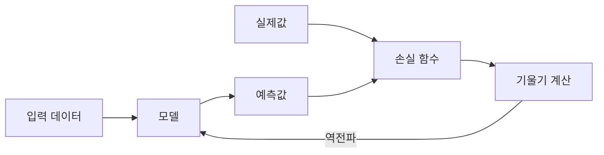
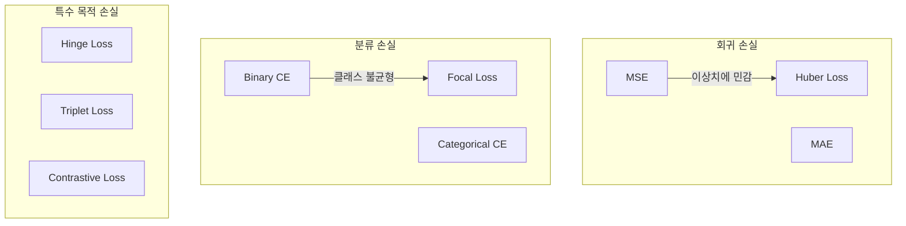

# 손실 함수 (Loss Functions)

손실 함수는 모델의 예측이 실제 값과 얼마나 다른지를 수치로 표현하는 함수다. ML 학습의 목표는 이 함수의 값을 [[optimization-theory|최적화]]를 통해 최소화하는 것이다.

## 손실 함수의 역할



손실 함수의 선택은 모델이 "무엇을 잘해야 하는지"를 정의한다. 같은 모델이라도 손실 함수에 따라 완전히 다른 행동을 학습한다.

## 회귀 손실 함수

### MSE (Mean Squared Error)

가장 기본적인 회귀 손실:

```
MSE = (1/n) * sum((y_i - y_hat_i)^2)
```

- 오차의 제곱을 평균한다
- 큰 오차에 더 큰 페널티를 준다 (제곱 때문에)
- 이상치(outlier)에 민감하다
- 미분이 간단하여 최적화가 용이

### MAE (Mean Absolute Error)

```
MAE = (1/n) * sum(|y_i - y_hat_i|)
```

- 이상치에 MSE보다 강건하다
- 0에서 미분 불가능 (서브그래디언트 사용)
- 모든 오차에 동일한 가중치

### Huber Loss

MSE와 MAE의 장점을 결합한다:

- 오차가 작으면 MSE처럼 동작 (부드러운 기울기)
- 오차가 크면 MAE처럼 동작 (이상치에 강건)
- 임계값 delta가 전환 기준

## 분류 손실 함수

### 교차 엔트로피 (Cross-Entropy)

분류 문제의 표준 손실 함수다. [[probability-statistics-for-ml|확률론]]의 정보 이론에서 유래한다.

**이진 교차 엔트로피 (Binary Cross-Entropy):**

```
BCE = -(1/n) * sum(y * log(p) + (1-y) * log(1-p))
```

**범주형 교차 엔트로피 (Categorical Cross-Entropy):**

```
CCE = -(1/n) * sum_i(sum_c(y_ic * log(p_ic)))
```

- 예측 확률 분포와 실제 분포의 차이를 측정
- 소프트맥스 출력과 자연스럽게 결합
- 기울기가 오차에 비례하여 학습 초기에 빠른 수렴

### Focal Loss

Lin et al. (2017)이 제안한 클래스 불균형 문제 해결책:

```
FL = -alpha * (1 - p)^gamma * log(p)
```

- `gamma = 0`이면 표준 교차 엔트로피와 동일
- `gamma > 0`이면 쉬운 샘플의 손실을 줄이고, 어려운 샘플에 집중
- 객체 탐지(예: RetinaNet)에서 배경 클래스 우세 문제를 해결



### Hinge Loss

SVM에서 사용하는 손실 함수:

```
Hinge = max(0, 1 - y * f(x))
```

- 올바르게 분류되고 마진 밖에 있으면 손실 0
- 마진 내부에 있거나 오분류되면 선형 페널티

## 특수 목적 손실 함수

### Triplet Loss

임베딩 학습(metric learning)에 사용:

- 앵커, 양성, 음성 세 샘플의 관계를 학습
- 앵커-양성 거리가 앵커-음성 거리보다 가까워지도록

### Contrastive Loss

유사한 쌍은 가깝게, 다른 쌍은 멀게:

- CLIP, SimCLR 등 자기지도 학습의 핵심
- 양성/음성 쌍의 거리를 동시에 최적화

### KL 발산 (KL Divergence)

두 확률 분포 사이의 차이를 측정:

- VAE의 잠재 공간 정규화에 사용
- RLHF에서 정책 이탈 페널티로 사용
- 비대칭적: `KL(P||Q) != KL(Q||P)`

## 손실 함수 선택 가이드

| 태스크 | 권장 손실 | 이유 |
|--------|----------|------|
| 회귀 | MSE / Huber | 연속값 예측의 표준 |
| 이진 분류 | BCE | 확률 출력에 자연스러움 |
| 다중 분류 | Categorical CE | 소프트맥스와 결합 |
| 불균형 분류 | Focal Loss | 소수 클래스 학습 강화 |
| 임베딩 학습 | Triplet / Contrastive | 유사도 공간 학습 |
| 언어 모델 | CE (next-token prediction) | 토큰 확률 분포 학습 |

## 관련 문서

- [[optimization-theory]] -- 손실 함수를 최소화하는 이론과 알고리즘
- [[gradient-descent-backpropagation]] -- 손실에서 기울기를 계산하여 역전파
- [[probability-statistics-for-ml]] -- 교차 엔트로피, KL 발산의 확률론적 기반
- [[bias-variance-tradeoff]] -- 손실의 분해: 편향^2 + 분산 + 노이즈
- [[overfitting-regularization]] -- 손실에 정규화 항 추가

## 참고 자료

- [Loss Functions: MSE, Cross-Entropy, Focal Loss & Custom](https://mbrenndoerfer.com/writing/neural-network-loss-functions-guide)
- [Focal Loss: A Better Alternative for Cross-Entropy - Towards Data Science](https://towardsdatascience.com/focal-loss-a-better-alternative-for-cross-entropy-1d073d92d075/)
- [Comprehensive Overview of Loss Functions in ML - CloudFactory](https://wiki.cloudfactory.com/docs/mp-wiki/loss/comprehensive-overview-of-loss-functions-in-machine-learning)
