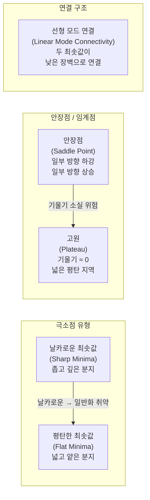
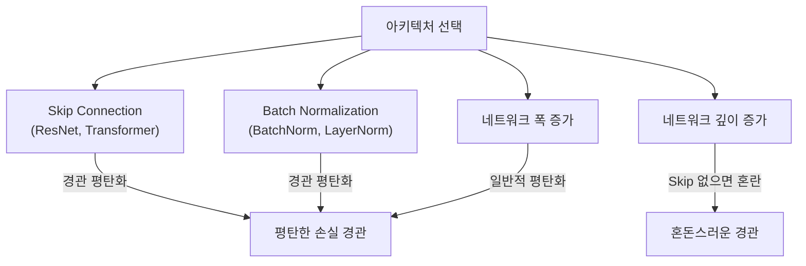

# 손실 경관 (Loss Landscape)

## 개요

손실 경관(Loss Landscape)은 신경망 파라미터 공간에서 손실 함수 값의 분포를 기하학적으로 표현한 개념이다. 수백만~수십억 개의 파라미터로 정의되는 고차원(high-dimensional) 공간에서의 손실 표면(loss surface)은 훈련 동역학, 수렴 특성, 일반화 능력에 직접적인 영향을 미친다. Li et al.(2018)의 필터 정규화 시각화 방법을 통해 처음으로 직관적인 시각화가 가능해졌다.

## 주요 지형 유형

## 고차원 공간의 특성

저차원 직관과 달리, 고차원 손실 경관은 다음과 같은 반직관적 특성을 가진다:

### 안장점의 지배

2D에서 지역 최솟값(local minima)은 드물게 존재한다. 고차원에서는 임계점(기울기가 0인 점)의 대부분이 **안장점(saddle point)** 이다. 안장점은 일부 방향에서는 최솟값이지만 다른 방향에서는 최댓값인 점으로, 기울기가 0이지만 헤시안(Hessian)이 양의 정부호(positive definite)가 아니다.

고차원 신경망에서:
- 임계점의 대부분은 안장점
- 깊은 지역 최솟값은 거의 존재하지 않음
- 존재하는 지역 최솟값들은 전역 최솟값과 유사한 품질을 가지는 경향

이것이 SGD가 지역 최솟값에 갇히지 않고 좋은 해를 찾을 수 있는 이유 중 하나다.

### 지역 최솟값의 연결성

Garipov et al.(2018)은 두 개의 독립적으로 훈련된 모델을 **낮은 손실을 유지하는 곡선으로 연결**할 수 있음을 보였다(모드 연결, Mode Connectivity). 이는 손실 경관이 "격리된 섬들의 집합"이 아니라 "연결된 산맥"처럼 생겼음을 시사한다.

## 평탄 vs 날카로운 최솟값

| 특성 | 평탄한 최솟값 (Flat Minima) | 날카로운 최솟값 (Sharp Minima) |
|------|--------------------------|-------------------------------|
| 헤시안 스펙트럼 | 작은 고유값, 좁은 분포 | 큰 고유값, 넓은 분포 |
| 파라미터 섭동 내성 | 강함 | 약함 |
| 일반화 경향 | 우수 | 불량 (흔히) |
| 훈련 손실 | 같거나 약간 높을 수 있음 | 더 낮을 수 있음 |
| 도달 방법 | [[sharpness-aware-minimization]], 작은 배치 SGD | 큰 배치 SGD, Adam |

Hochreiter & Schmidhuber(1997)가 평탄 최솟값과 일반화의 관계를 처음 지적했으며, [[sharpness-aware-minimization]]은 이를 명시적으로 최적화한다.

## 시각화 방법

Li et al.(2018)의 필터 정규화 시각화(Filter Normalization Visualization):

1. 두 개의 랜덤 방향 벡터 $\delta, \eta$를 파라미터 공간에서 샘플링
2. 각 방향을 레이어별 필터 노름으로 정규화 (스케일 불변성 확보)
3. $\theta^* + \alpha \delta + \beta \eta$에서의 손실을 $\alpha, \beta$ 격자에 대해 계산
4. 등고선(contour) 또는 3D 표면으로 시각화

이 방법은 Skip Connection(잔차 연결)이 있는 ResNet이 없는 VGG보다 훨씬 평탄하고 볼록한 손실 경관을 가짐을 시각적으로 보여줬다.

## 아키텍처와 손실 경관

Skip Connection이 손실 경관을 극적으로 평탄화하는 이유는 경사 흐름을 개선하여 손실 곡면의 곡률을 감소시키기 때문이다.

## [[gradient-descent-backpropagation]]의 행동과 경관

손실 경관의 기하학은 옵티마이저 선택에 따라 다르게 탐색된다:

- **SGD (미니배치)**: 노이즈 때문에 평탄한 최솟값으로 자연스럽게 수렴하는 경향
- **Adam**: 각 차원별 적응 학습률로 더 빠른 수렴, 하지만 날카로운 최솟값에 수렴하는 경향도 있음
- **큰 배치 SGD**: 노이즈 감소로 날카로운 최솟값에 수렴하기 쉬움 (일반화 갭 문제)
- **학습률**: 높은 학습률은 더 평탄한 지역으로 "튀어나갈" 수 있는 에너지를 제공

## [[optimization-theory]] 관점

손실 경관 분석은 최적화 이론에서 다음 질문들과 연결된다:

- 경사 소실/폭발: 깊은 경관에서 기울기 전파의 기하학
- 수렴 속도: 헤시안 스펙트럼의 조건수(condition number)와 수렴 속도의 관계
- 탈출 능력: 안장점과 지역 최솟값에서 탈출하는 옵티마이저의 특성
- 대역 조건(Armijo condition): 직선 탐색에서 충분한 하강을 보장하는 조건

## 실무 적용 관점

- **체크포인트 앙상블**: 손실 경관의 모드 연결성을 이용해 여러 체크포인트를 평균화(SWA, Stochastic Weight Averaging)하면 더 평탄한 최솟값 근방에 도달 가능
- **학습률 웜업**: 훈련 초기에 날카로운 경관에서 불안정한 업데이트를 방지
- **경사 클리핑**: 경관의 급격한 곡률 변화(기울기 폭발)를 제어
- **잔차 연결 설계**: 평탄한 손실 경관을 위해 Skip Connection 적극 활용

## 관련 문서

- [[optimization-theory]] - 손실 경관 탐색을 위한 최적화 알고리즘 전반
- [[gradient-descent-backpropagation]] - 경관에서 기울기 기반 하강의 작동 원리
- [[sharpness-aware-minimization]] - 평탄 최솟값을 명시적으로 탐색하는 옵티마이저
- [[neural-tangent-kernel]] - 무한 폭 한계에서의 손실 경관의 이론적 분석
- [[loss-functions]] - 손실 경관을 정의하는 목적 함수의 종류
