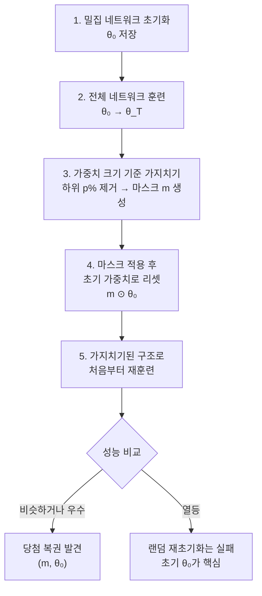

# 복권 티켓 가설 (Lottery Ticket Hypothesis)

## 개요

복권 티켓 가설(Lottery Ticket Hypothesis, LTH)은 Frankle & Carlin(2019, ICLR Best Paper)이 제안한 신경망 희소화 이론이다. 핵심 주장은: **임의로 초기화된 밀집 신경망(dense neural network) 안에는 독자적으로 훈련했을 때 원본 네트워크와 유사하거나 더 좋은 성능에 도달하는 희소 서브네트워크(sparse subnetwork)가 항상 존재한다.** 이 서브네트워크를 "당첨 복권(winning ticket)"이라 부른다.

## 핵심 주장과 실험

Frankle & Carlin은 다음 과정으로 당첨 복권을 찾는다:

중요한 발견은 **마스크(구조)만이 아니라 원래 초기 가중치 값 $\theta_0$도 함께 보존해야** 한다는 점이다. 동일한 마스크에 새로운 랜덤 가중치를 초기화하면 훨씬 성능이 떨어진다. 이는 특정 초기화 값이 학습에 유리한 출발점을 제공한다는 것을 시사한다.

## 반복 크기 가지치기 (Iterative Magnitude Pruning)

단번에 큰 비율을 가지치기하면 성능 저하가 발생한다. 대신 소량씩 반복 가지치기하는 IMP(Iterative Magnitude Pruning) 방법이 더 효과적이다:

| 단계 | 작업 |
|------|------|
| 초기화 | 전체 파라미터 $\theta_0$ 저장 |
| 훈련 | 전체 또는 일부 에포크 실행 |
| 가지치기 | 크기 하위 $p$% 제거 (예: 20%) |
| 리와인드 | 남은 파라미터를 $\theta_0$으로 복원 |
| 반복 | 목표 희소성 달성까지 반복 |

전형적으로 90% 이상의 파라미터를 제거하면서도 전체 네트워크와 유사한 정확도를 유지할 수 있다.

## 이론적 의의

LTH는 신경망 훈련에 관한 근본적인 질문을 제기한다:

1. **초기화의 중요성**: 단순히 좋은 구조가 아니라, 특정 초기화 값이 훈련 경로를 결정한다
2. **과잉 파라미터화의 역할**: 큰 네트워크는 당첨 복권을 찾을 확률을 높이기 위한 복권 구매(parameter purchase) 행위로 해석 가능
3. **[[overfitting-regularization]]과의 연결**: 희소 서브네트워크가 더 강한 귀납적 편향을 가져 과적합을 방지할 수 있음
4. **전이 학습 관점**: 당첨 복권이 도메인 간에도 이전될 수 있다는 후속 연구 존재

## 스케일 문제와 Late Rewinding

원래 LTH는 소규모 네트워크(LeNet, VGG 등)에서 잘 작동했으나, ResNet-50 이상 대형 네트워크에서는 초기 가중치 $\theta_0$로의 리와인드(rewinding)가 잘 동작하지 않았다. Frankle et al.(2020)은 이에 대한 해결책으로 **레이트 리와인드(late rewinding)** 를 제안한다: 초기 체크포인트 $\theta_0$ 대신 초기 몇 번의 반복 후 체크포인트 $\theta_k$를 사용한다.

이는 LTH의 강한 형태(strong version)와 약한 형태(weak version)로 구분된다:

- **강한 LTH**: $\theta_0$으로 리와인드, 소규모 모델에서만 검증
- **약한 LTH (late rewinding)**: $\theta_k$로 리와인드, 대형 모델에서도 적용 가능

## 구조적 가지치기와의 관계

LTH의 크기 기반 가지치기(magnitude pruning)는 **비구조적 가지치기(unstructured pruning)** 다. 결과로 나오는 희소 행렬은 하드웨어에서 실제 가속을 얻기 어렵다. 반면 [[structured-pruning-theory]]은 행/열/필터 단위로 제거해 밀집 행렬로 표현되므로 GPU/NPU 가속이 가능하다. LTH는 이론적 설명력이 강하지만, 실무 추론 가속에서는 구조적 가지치기가 더 직접적으로 활용된다.

## 후속 연구 방향

- **선형 모드 연결(Linear Mode Connectivity)**: 서로 다른 훈련 경로의 종착점이 선형으로 연결 가능하다는 개념과 LTH의 연결
- **Supermask**: 고정 랜덤 초기화 + 가중치 마스크만 학습으로 좋은 성능 달성 (Zhou et al., 2019)
- **LLM으로의 확장**: 대형 언어 모델에서 당첨 복권이 존재하는지는 활발한 연구 주제
- **신경망 구조 탐색(NAS)**: LTH는 구조 탐색과 초기화 탐색을 통합하는 관점 제공

## 관련 문서

- [[structured-pruning-theory]] - 하드웨어 가속에 적합한 구조적 가지치기 방법
- [[overfitting-regularization]] - 희소 네트워크와 일반화 능력의 관계
- [[weight-initialization]] - 당첨 복권에서 초기화 값의 결정적 역할
- [[scaling-laws]] - 모델 크기와 희소 서브네트워크 존재의 관계
