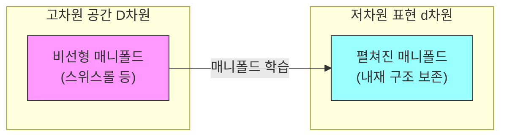
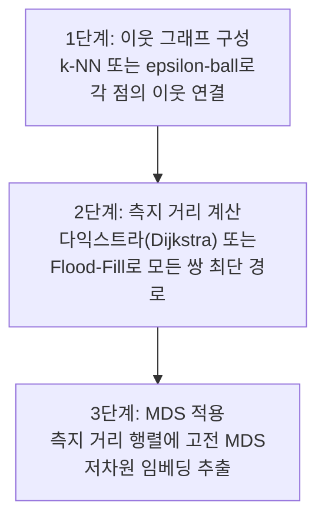
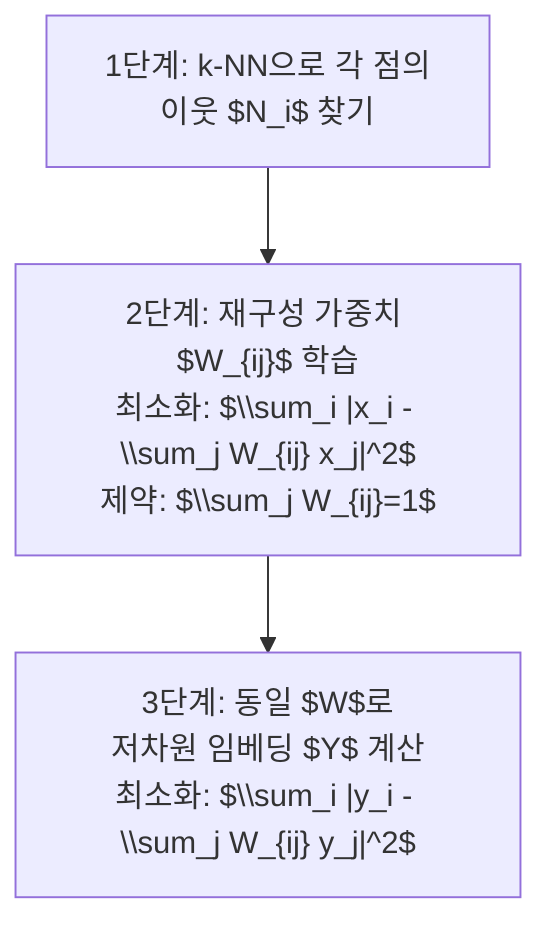
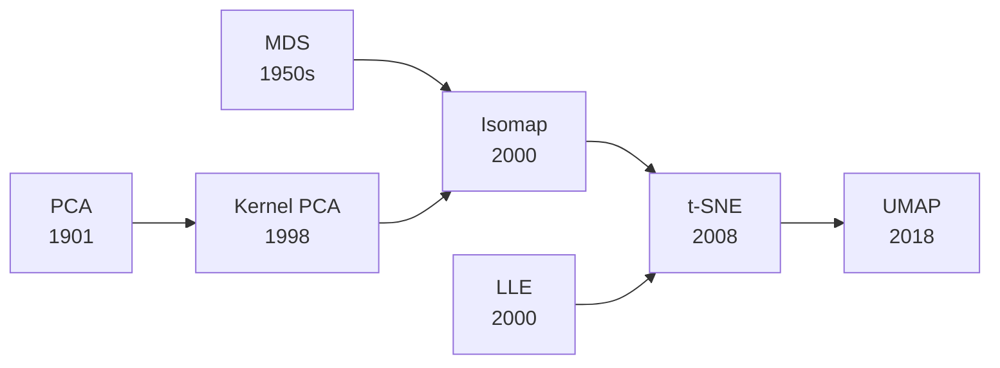

# 매니폴드 학습 - Isomap과 LLE

## 한 줄 요약

고차원 데이터가 실제로는 저차원 매니폴드(manifold) 위에 놓여 있다는 가정 하에, 매니폴드 구조를 보존하는 비선형 차원 축소 방법. Isomap은 측지 거리(geodesic distance)를, LLE는 국소 선형 구조를 보존한다.

## 매니폴드 가설

**매니폴드 가설(manifold hypothesis)**: 실제 데이터(이미지, 텍스트, 음성 등)는 고차원 공간의 매우 작은 비선형 부분 공간 - 저차원 매니폴드 - 에 집중되어 있다.

예시:
- 100x100 픽셀 이미지 = $10^4$차원이지만, 의미 있는 얼굴 이미지는 훨씬 낮은 차원의 다양체 위에 있다
- 언어 데이터도 실제 의미 공간은 훨씬 낮은 차원

[[pca]] (PCA)는 선형 부분 공간만 찾을 수 있다. 매니폴드 학습은 **비선형** 매니폴드를 복원한다.



매니폴드 학습은 고차원에서 꼬여 있는 구조를 저차원으로 '펼친다'.

## Isomap (Isometric Feature Mapping)

Tenenbaum, de Silva, Langford (Science, 2000) 발표.

### 핵심 아이디어

PCA나 MDS (Multi-Dimensional Scaling)는 **유클리드 거리**를 보존한다. 그러나 매니폴드 위에서 실제 의미 있는 거리는 **측지 거리(geodesic distance)** - 매니폴드 표면을 따라가는 최단 경로 - 이다.

예: 스위스롤(Swiss Roll)에서 두 점 A, B의 유클리드 거리는 가깝지만, 매니폴드를 따른 실제 거리는 훨씬 멀 수 있다.

### 알고리즘 3단계



**1단계 - 이웃 그래프**:
- $k$-NN ($k$ 최근접 이웃) 또는 $\epsilon$-ball 방식으로 각 점의 이웃을 연결
- 연결된 이웃 간 거리 = 유클리드 거리

**2단계 - 측지 거리 계산**:
- 다익스트라 알고리즘으로 그래프의 모든 쌍 최단 경로 $D_G(i,j)$ 계산
- 인접하지 않은 점들 사이의 측지 거리를 그래프 경로로 근사

**3단계 - MDS**:
- $D_G$ 행렬에 고전 MDS (Classical MDS) 적용
- 저차원 임베딩 $Y \in \mathbb{R}^{n \times d}$ 추출

### 수학적 핵심

고전 MDS는 거리 행렬을 이중 중심화(double centering)하여 내적 행렬 $B$를 구성:

$$B = -\frac{1}{2} H D_G^{(2)} H, \quad H = I - \frac{1}{n} \mathbf{1}\mathbf{1}^\top$$

$B$의 상위 $d$개 고유값-고유벡터로 임베딩 좌표를 구한다.

### 계산 복잡도

- 이웃 그래프 구성: $O(n^2)$ 또는 $O(n \log n)$ (kd-tree)
- 최단 경로: $O(n^3)$ (다익스트라 전체) 또는 $O(kn^2 \log n)$
- MDS: $O(n^3)$ (고유값 분해)
- 전체: 대규모 데이터에 부담, 보통 수천 ~ 수만 샘플에 사용

## LLE (Locally Linear Embedding)

Roweis & Saul (Science, 2000) 발표. Isomap과 같은 해에 발표된 또 다른 매니폴드 학습 방법.

### 핵심 아이디어

매니폴드 위의 각 점은 **국소적으로 선형**이다 - 즉 각 점은 자신의 이웃들의 선형 결합으로 근사될 수 있다. 이 **선형 관계**를 저차원에서도 보존한다.

### 알고리즘 3단계



**1단계 - 이웃 찾기**: 각 $x_i$에 대해 $k$-NN으로 이웃 집합 $\mathcal{N}(i)$ 결정.

**2단계 - 재구성 가중치 $W$ 학습**:

$$\min_{W} \sum_i \left\|x_i - \sum_{j \in \mathcal{N}(i)} W_{ij} x_j\right\|^2, \quad \sum_{j} W_{ij} = 1$$

이를 닫힌 형태(closed-form)로 풀면 $C_{jk} = (x_i - x_j)^\top(x_i - x_k)$의 국소 공분산 행렬 역행렬로 계산된다.

**3단계 - 저차원 임베딩 $Y$ 계산**:

$$\min_{Y} \sum_i \left\|y_i - \sum_{j \in \mathcal{N}(i)} W_{ij} y_j\right\|^2$$

$W$는 고정하고 $Y$를 최적화. 이는 희소 행렬 $(I-W)^\top(I-W)$의 하위 고유벡터를 구하는 문제로 귀결된다.

### LLE의 직관

가중치 $W_{ij}$는 **매니폴드의 국소 기하를 인코딩**한다. 고차원에서 성립하는 선형 관계가 저차원에서도 동일하게 성립하면, 저차원 임베딩이 매니폴드 구조를 올바르게 보존한다.

## Isomap vs LLE 비교

| 특성 | Isomap | LLE |
|------|--------|-----|
| 보존 대상 | 전역 측지 거리 | 국소 선형 재구성 가중치 |
| 전역/국소 | 전역 구조 보존 | 국소 구조 보존 |
| 이웃 파라미터 | $k$ 또는 $\epsilon$ | $k$ |
| 계산 복잡도 | $O(n^3)$ | $O(n^2 k^3)$ + 희소 고유값 |
| 노이즈 민감도 | 높음 (측지 경로 단절 위험) | 중간 |
| 비볼록 매니폴드 | 어려움 | 부분적으로 가능 |
| 구멍(hole) 처리 | 불가 | 가능 |

## t-SNE/UMAP과의 역사적 관계

Isomap과 LLE는 [[tsne-umap]] (t-SNE)보다 앞선 2000년 발표로, 비선형 차원 축소의 시초다.



## 실용적 사용

```python
from sklearn.manifold import Isomap, LocallyLinearEmbedding
from sklearn.datasets import make_swiss_roll
import matplotlib.pyplot as plt

# 스위스롤 데이터
X, color = make_swiss_roll(n_samples=1500, noise=0.0)

# Isomap
isomap = Isomap(n_neighbors=10, n_components=2)
X_isomap = isomap.fit_transform(X)

# LLE
lle = LocallyLinearEmbedding(n_neighbors=10, n_components=2, method='standard')
X_lle = lle.fit_transform(X)

# Modified LLE (더 안정적)
mlle = LocallyLinearEmbedding(n_neighbors=10, n_components=2, method='modified')
X_mlle = mlle.fit_transform(X)
```

### 파라미터 선택 지침

**$k$ (이웃 수) 선택**:
- 너무 작으면: 그래프 단절 위험 (Isomap), 충분한 국소 정보 부족 (LLE)
- 너무 크면: 매니폴드를 넘어 멀리 있는 점 포함 (단락 오류, short-circuit error)
- 보통 $k \in [5, 30]$ 범위에서 교차 검증

## 응용 분야

| 분야 | 적용 |
|------|------|
| 얼굴 인식 | 조명·포즈 변화의 매니폴드 구조 복원 |
| 뇌 신경 데이터 | 고차원 신경 활동의 저차원 표현 |
| 분자 역학 시뮬레이션 | 구조 변화 경로 시각화 |
| 로봇 공학 | 포즈 공간 매니폴드 |
| 자연어 처리 | 단어/문서 임베딩 분석 |

## 한계와 현대적 대안

**Isomap/LLE의 한계**:
- 데이터 밀도가 낮거나 노이즈가 있으면 단락(short-circuit) 발생
- $O(n^3)$ 계산 비용으로 대규모 데이터에 부적합
- 새 데이터 포인트 임베딩 (out-of-sample extension) 지원 미흡

**현대 대안**:
- [[tsne-umap]] (t-SNE, UMAP): 더 빠르고 시각화에 특화
- PCA + 비선형 오토인코더: 대규모 데이터 처리 가능
- PHATE: 생물학 데이터 전문

## 왜 중요한가

- 매니폴드 가설은 딥러닝의 성공 이유를 설명하는 핵심 개념
- 신경망이 학습하는 것이 결국 데이터 매니폴드의 표현이라는 이론 기반 제공
- 차원 축소·시각화·반지도 학습의 이론적 토대

## 관련 문서

- [[pca]] - 선형 차원 축소 기준선
- [[tsne-umap]] - 현대적 비선형 차원 축소
- [[rkhs-kernel-methods]] - 커널 기반 비선형 방법
- [[spectral-methods-ml]] - 스펙트럼 방법 (LLE는 고유값 분해 기반)
- [[graph-signal-processing]] - 그래프 이웃 구조 이론
- [[autoencoders-vae]] - 딥러닝 기반 비선형 차원 축소
