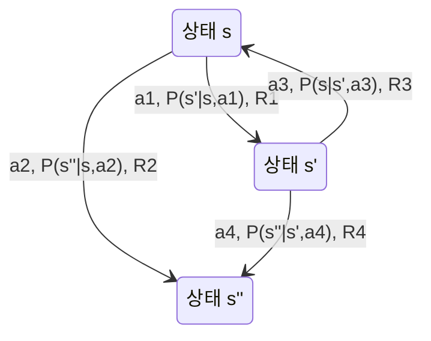

# 마르코프 결정 과정 (Markov Decision Process)

## MDP 정의: 5-tuple

강화 학습(reinforcement learning)의 수학적 토대인 MDP는 다섯 요소로 정의된다.

$$\mathcal{M} = (S, A, P, R, \gamma)$$

| 기호 | 명칭 | 설명 |
|------|------|------|
| $S$ | 상태 공간(state space) | 환경의 가능한 모든 상태 집합 |
| $A$ | 행동 공간(action space) | 에이전트가 선택 가능한 행동 집합 |
| $P$ | 전이 함수(transition function) | $P(s' \mid s, a)$: 상태 $s$에서 행동 $a$ 후 $s'$로 전이할 확률 |
| $R$ | 보상 함수(reward function) | $R(s, a, s')$: 전이 시 받는 즉각 보상 |
| $\gamma$ | 할인율(discount factor) | $\gamma \in [0, 1)$: 미래 보상의 현재 가치 |

**마르코프 성질(Markov property)**: 미래 상태는 현재 상태에만 의존하며 과거 이력과 무관하다.
$$P(s_{t+1} \mid s_t, a_t, s_{t-1}, a_{t-1}, \ldots) = P(s_{t+1} \mid s_t, a_t)$$

## 상태 전이 다이어그램

에이전트는 현재 상태를 관찰하고 행동을 선택하며, 환경은 새 상태와 보상을 반환한다.

## 정책과 가치 함수

**정책(policy)** $\pi$: 상태에서 행동으로의 매핑. 확률적 정책(stochastic policy) $\pi(a \mid s)$ 또는 결정론적 정책(deterministic policy) $\pi(s) = a$.

**상태 가치 함수(state-value function)**:
$$V^\pi(s) = \mathbb{E}_\pi\left[\sum_{t=0}^{\infty} \gamma^t R_{t+1} \mid S_0 = s\right]$$

**행동 가치 함수(action-value function)**:
$$Q^\pi(s, a) = \mathbb{E}_\pi\left[\sum_{t=0}^{\infty} \gamma^t R_{t+1} \mid S_0 = s, A_0 = a\right]$$

두 함수의 관계: $V^\pi(s) = \sum_a \pi(a \mid s) Q^\pi(s, a)$

## Bellman 방정식

**Bellman 기대 방정식(Bellman expectation equation)**:

$$V^\pi(s) = \sum_a \pi(a \mid s) \sum_{s'} P(s' \mid s, a) \left[R(s, a, s') + \gamma V^\pi(s')\right]$$

현재 상태의 가치 = 즉각 보상의 기대값 + 다음 상태 가치의 할인합.

**Bellman 최적 방정식(Bellman optimality equation)**:

$$V^*(s) = \max_a \sum_{s'} P(s' \mid s, a) \left[R(s, a, s') + \gamma V^*(s')\right]$$

$$Q^*(s, a) = \sum_{s'} P(s' \mid s, a) \left[R(s, a, s') + \gamma \max_{a'} Q^*(s', a')\right]$$

최적 정책: $\pi^*(s) = \arg\max_a Q^*(s, a)$

## Discount Factor의 역할

$\gamma$는 단순히 수렴을 보장하는 수학적 장치가 아니라 에이전트의 미래 지향성(farsightedness)을 조절한다.

- $\gamma \to 0$: 근시안적(myopic) 에이전트, 즉각 보상만 추구
- $\gamma \to 1$: 장기적 에이전트, 미래 보상을 현재와 동등하게 평가
- 에피소딕(episodic) 환경: $\gamma = 1$도 허용 (유한 스텝 보장)
- 연속(continuous) 환경: $\gamma < 1$ 필수 (무한 합 수렴)

## Value Iteration vs Policy Iteration

| | **Value Iteration** | **Policy Iteration** |
|---|---|---|
| 핵심 연산 | Bellman 최적 방정식으로 $V$ 직접 업데이트 | 정책 평가(evaluation) + 정책 개선(improvement) 교차 반복 |
| 수렴 속도 | 느림 (많은 반복 필요) | 빠름 (적은 반복) |
| 반복당 비용 | 낮음 | 높음 (정책 평가가 선형 시스템 풀기) |
| 적합 상황 | 대규모 상태 공간 | 소규모~중규모 상태 공간 |

두 방법 모두 테이블 형태(tabular) MDP에 적합하며, 큰 연속 상태 공간에는 함수 근사(function approximation)를 사용하는 Q-러닝, PPO 등이 필요하다.

## 관련 문서

- [[q-learning-dqn]]
- [[policy-gradient-ppo]]
- [[RLHF 파이프라인]]
- [[bayesian-inference]]
