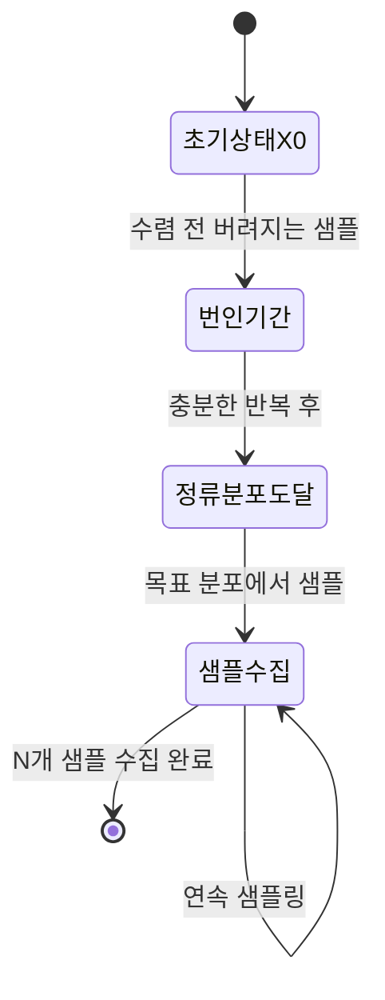
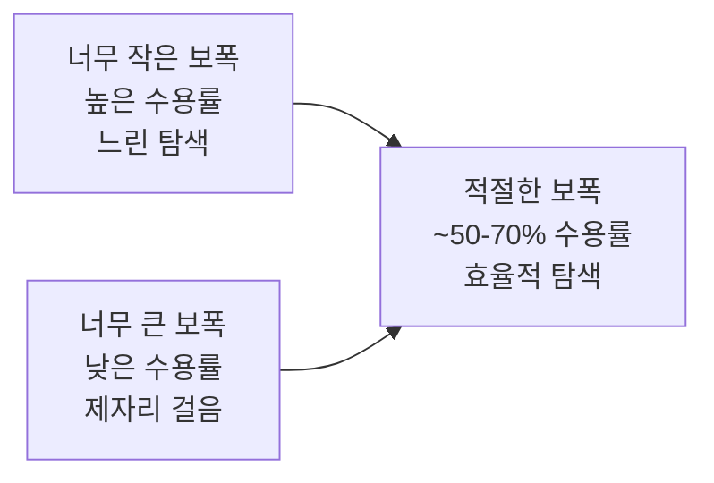
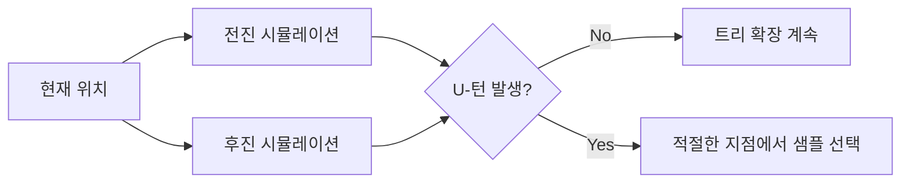
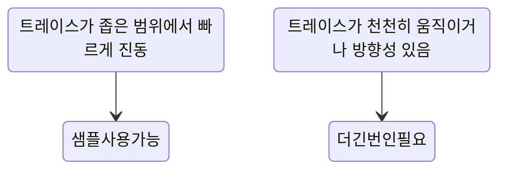

# MCMC (Markov Chain Monte Carlo)

MCMC(Markov Chain Monte Carlo, 마르코프 체인 몬테 카를로)는 직접 샘플링이 어려운 복잡한 확률 분포에서 샘플을 얻기 위한 알고리즘 계열이다. 베이지안 추론(Bayesian inference), 통계 물리, 금융 공학 등 광범위한 분야에서 사용되며, 딥러닝에서는 베이지안 신경망, 확산 모델의 이론적 기반, MCMC 기반 샘플링 등에 활용된다.

핵심 아이디어: **마르코프 체인을 구성해 그 체인의 정류 분포(stationary distribution)가 목표 분포 $\pi(x)$가 되도록 설계하고, 충분히 오래 실행하면 목표 분포에서의 샘플을 얻을 수 있다.**

## MCMC의 기본 원리

### 왜 직접 샘플링이 어려운가

베이지안 추론에서 사후 분포(posterior)는 다음과 같이 정의된다:

$$p(\theta | \mathcal{D}) = \frac{p(\mathcal{D} | \theta) \cdot p(\theta)}{p(\mathcal{D})}$$

문제: 정규화 상수 $p(\mathcal{D}) = \int p(\mathcal{D}|\theta) p(\theta) d\theta$ 계산이 고차원에서 불가능하다. 적분 차원이 수백~수백만이 되면 어떤 수치 방법도 직접 계산할 수 없다.

### 마르코프 체인의 활용

마르코프 체인은 현재 상태만으로 다음 상태가 결정되는 확률 과정이다:

$$P(X_{t+1} | X_0, X_1, ..., X_t) = P(X_{t+1} | X_t)$$

MCMC의 핵심 조건:
1. **에르고딕성(Ergodicity)**: 어떤 초기 상태에서 출발해도 체인이 모든 상태를 방문
2. **세밀 균형(Detailed Balance)**: $\pi(x) T(x' | x) = \pi(x') T(x | x')$ — 정류 분포 보장



번인 기간(burn-in period) 동안의 샘플은 초기화에 의존하므로 버리고, 이후 샘플만 사용한다.

## Metropolis-Hastings 알고리즘

MH 알고리즘은 MCMC의 기본 형태로, 어떤 제안 분포(proposal distribution)도 사용할 수 있다.

### 알고리즘

```
초기값 x₀ 설정
for t = 1, ..., T:
    제안 분포에서 후보 생성: x* ~ q(x* | xₜ₋₁)
    수용 비율 계산:
        α = min(1, [π(x*) · q(xₜ₋₁|x*)] / [π(xₜ₋₁) · q(x*|xₜ₋₁)])
    u ~ Uniform(0, 1) 샘플
    if u < α:
        xₜ = x*     (수용)
    else:
        xₜ = xₜ₋₁  (기각, 이전 상태 유지)
```

수용 비율 $\alpha$의 핵심:
- $\pi(x*)$가 $\pi(x_{t-1})$보다 크면 항상 수용
- 작더라도 확률적으로 수용 → 지역 최솟값(local minimum) 탈출 가능

### 정규화 상수 불필요

$$\alpha = \min\left(1, \frac{\tilde{\pi}(x^*) / Z}{\tilde{\pi}(x_{t-1}) / Z}\right) = \min\left(1, \frac{\tilde{\pi}(x^*)}{\tilde{\pi}(x_{t-1})}\right)$$

정규화 상수 $Z = p(\mathcal{D})$가 분자·분모에서 약분되어 계산 불필요하다. 이것이 MH 알고리즘의 핵심 장점이다.

### 제안 분포 선택의 중요성



경험 법칙: 1차원에서 44%, 고차원에서 23% 수용률이 이론적 최적에 가깝다.

## Gibbs 샘플링

Gibbs 샘플링은 다변수 분포에서 각 변수를 조건부 분포로 번갈아 샘플링하는 특수한 MH 알고리즘이다.

### 알고리즘

$\theta = (\theta_1, \theta_2, ..., \theta_d)$에서 샘플링할 때:

```
초기값 θ⁽⁰⁾ = (θ₁⁽⁰⁾, ..., θ_d⁽⁰⁾) 설정
for t = 1, ..., T:
    θ₁⁽ᵗ⁾ ~ p(θ₁ | θ₂⁽ᵗ⁻¹⁾, ..., θ_d⁽ᵗ⁻¹⁾)
    θ₂⁽ᵗ⁾ ~ p(θ₂ | θ₁⁽ᵗ⁾, θ₃⁽ᵗ⁻¹⁾, ..., θ_d⁽ᵗ⁻¹⁾)
    ...
    θ_d⁽ᵗ⁾ ~ p(θ_d | θ₁⁽ᵗ⁾, ..., θ_{d-1}⁽ᵗ⁾)
```

각 조건부 분포 $p(\theta_i | \theta_{-i})$가 분석적으로 다루기 쉬운 형태일 때 매우 효율적이다.

**수용 기각 없음**: 제안이 항상 수용된다. 각 단계가 조건부 분포의 정확한 샘플이기 때문.

**적용 예시**: 베이지안 혼합 모델, LDA(Latent Dirichlet Allocation), 계층적 베이지안 모델

**한계**: 변수 간 강한 상관관계가 있을 때 느린 혼합(poor mixing). 각 변수를 독립적으로 갱신하는 구조상 대각선 방향 탐색이 어렵다.

## HMC (Hamiltonian Monte Carlo)

HMC는 물리학의 해밀턴 역학(Hamiltonian dynamics)을 활용해 기울기(gradient) 정보로 훨씬 효율적인 탐색을 수행하는 MCMC 방법이다.

### 해밀턴 역학 기반 직관

위치 $q$를 샘플링할 파라미터, 운동량 $p$를 보조 변수로 도입:

$$H(q, p) = U(q) + K(p)$$
$$U(q) = -\log \pi(q) \quad \text{(퍼텐셜 에너지)}$$
$$K(p) = \frac{1}{2} p^T M^{-1} p \quad \text{(운동 에너지)}$$

해밀턴 방정식을 수치적으로 시뮬레이션(리프로그 적분기)해 목표 분포의 등고선을 따라 효율적으로 이동한다.

```mermaid
flowchart TD
    Start[현재 위치 q] --> Mom[운동량 p 샘플링: p ~ N(0,M)]
    Mom --> Leap[리프로그 L스텝 시뮬레이션]
    Leap --> Prop[후보 위치 q* 생성]
    Prop --> MH[MH 수용/기각\n이산화 오차 보정]
    MH --> Next[다음 상태]
```

### HMC의 장점

| 항목 | 랜덤 워크 MH | HMC |
|------|------------|-----|
| 이동 방향 | 무작위 | 기울기 기반 방향성 |
| 상관관계 있는 파라미터 | 비효율 | 효율적 |
| 차원 확장성 | $O(d^2)$ 스텝 | $O(d^{5/4})$ 스텝 |
| 기울기 계산 필요 | 불필요 | 필수 |
| 구현 복잡도 | 단순 | 복잡 |

딥러닝 모델처럼 미분 가능한 구조에서 HMC는 역전파로 기울기를 계산할 수 있어 매우 강력하다.

## NUTS (No-U-Turn Sampler)

HMC의 실용적 한계는 리프로그 스텝 수 $L$과 스텝 크기 $\epsilon$을 수동으로 조정해야 한다는 것이다. NUTS(Hoffman & Gelman, 2011)는 이 두 하이퍼파라미터를 자동으로 결정한다.

### 핵심 아이디어: U-턴 감지



U-턴 조건: 위치 벡터와 운동량 내적이 음수가 되면 시뮬레이션이 되돌아가기 시작한다는 신호.

$$\text{U-턴} \equiv (q_{+} - q_{-}) \cdot p_{-} < 0 \quad \text{또는} \quad (q_{+} - q_{-}) \cdot p_{+} < 0$$

**Stan(통계 모델링 언어)과 PyMC의 기본 샘플러**가 NUTS다.

## SGLD (Stochastic Gradient Langevin Dynamics)

[[sgld]] 참조.

대규모 데이터셋에 적용하기 위해 MCMC와 확률적 경사 하강법(SGD)을 결합한 방법. Welling & Teh (2011) 제안.

$$\theta_{t+1} = \theta_t + \frac{\epsilon_t}{2} \nabla \log \tilde{p}(\theta_t | \mathcal{D}_t) + \eta_t$$

여기서 $\eta_t \sim \mathcal{N}(0, \epsilon_t I)$는 랑주뱅 노이즈, $\mathcal{D}_t$는 미니배치다.

특징:
- 미니배치로 기울기를 근사해 확장성 확보
- 학습률 $\epsilon_t$가 0에 수렴하면 정확한 베이지안 추론으로 수렴
- 딥러닝 가중치의 불확실성 정량화에 활용

## 변분 추론과의 비교

MCMC와 변분 추론([[variational-inference-deep]])은 베이지안 추론의 두 가지 주요 접근이다.

| 항목 | MCMC | 변분 추론 (VI) |
|------|------|--------------|
| 접근 방식 | 정확한 샘플링 | 근사 최적화 |
| 점근적 정확성 | 보장 (충분히 오래 실행 시) | 근사 오차 존재 |
| 계산 비용 | 높음 | 낮음 |
| 확장성 | 대규모 데이터에 제한 | 대규모 가능 |
| 수렴 진단 | 어려움 | 손실 기반 모니터링 |
| 다중 모드 처리 | 가능 (느리지만) | 단일 모드 경향 |
| 불확실성 추정 | 정확 | 과소 추정 경향 |

실무에서는:
- **소규모 데이터 + 정확한 불확실성 필요**: MCMC (Stan, PyMC)
- **대규모 데이터 + 빠른 근사**: VI (변분 오토인코더, Mean Field VI)
- **딥러닝 베이지안**: SGLD, Monte Carlo Dropout (경량 MCMC 근사)

## 수렴 진단

MCMC가 충분히 수렴했는지 판단하는 도구들:

### R-hat (Gelman-Rubin 통계량)

여러 독립 체인을 병렬 실행해 체인 간 분산과 체인 내 분산을 비교:

$$\hat{R} = \sqrt{\frac{\hat{V}}{W}}$$

- $\hat{R} \approx 1.0$: 수렴
- $\hat{R} > 1.1$: 수렴 미완료, 더 긴 실행 필요

### ESS (Effective Sample Size)

자기상관(autocorrelation)을 고려한 실질 샘플 크기:

$$\text{ESS} = \frac{N}{1 + 2 \sum_{k=1}^{\infty} \rho_k}$$

$N$개 샘플이 있어도 높은 자기상관이면 실질적으로 훨씬 적은 정보를 담는다.

### 트레이스 플롯



## 딥러닝에서의 MCMC 응용

### 베이지안 신경망 (Bayesian Neural Networks)

[[bayesian-neural-networks]] 참조.

가중치를 확률 변수로 처리해 예측 불확실성을 정량화:

$$p(y^* | x^*, \mathcal{D}) = \int p(y^* | x^*, \theta) p(\theta | \mathcal{D}) d\theta$$

MCMC로 $p(\theta|\mathcal{D})$를 샘플링해 앙상블 예측. 계산 비용이 커서 실무에서는 SGLD, MC Dropout 등 근사 방법을 주로 사용한다.

### 확산 모델과 MCMC

확산 모델([[denoising-diffusion-probabilistic-models]])의 역과정은 랑주뱅 MCMC와 밀접한 관계를 가진다. Score-based generative model에서 Langevin dynamics로 샘플을 생성하는 것이 이론적 기반이다.

## 실무 라이브러리

| 라이브러리 | 언어 | 주요 샘플러 | 특징 |
|-----------|------|-----------|------|
| Stan | C++ / R / Python | NUTS, HMC | 통계 모델링 표준 |
| PyMC | Python | NUTS (Aesara/PyTensor) | Python 생태계 통합 |
| NumPyro | Python | NUTS (JAX 기반) | JAX 가속, 벡터화 |
| BlackJAX | Python | HMC, NUTS, SGLD | JAX, 커스터마이징 |
| TFP (TensorFlow Probability) | Python | HMC, NUTS | TensorFlow 통합 |

```python
import pymc as pm
import numpy as np

# 간단한 베이지안 선형 회귀 예시
with pm.Model() as linear_model:
    # 사전 분포 정의
    alpha = pm.Normal("alpha", mu=0, sigma=10)
    beta = pm.Normal("beta", mu=0, sigma=10, shape=X.shape[1])
    sigma = pm.HalfNormal("sigma", sigma=1)
    
    # 우도 (likelihood)
    mu = alpha + pm.math.dot(X, beta)
    obs = pm.Normal("obs", mu=mu, sigma=sigma, observed=y)
    
    # NUTS 샘플링 (PyMC 기본)
    trace = pm.sample(
        draws=2000,
        tune=1000,       # 번인 기간
        chains=4,        # 병렬 체인 수
        target_accept=0.9,
        return_inferencedata=True,
    )

# 수렴 진단
import arviz as az
az.plot_trace(trace)
print(az.summary(trace, round_to=2))  # R-hat, ESS 포함
```

## 관련 문서

- [[bayesian-deep-learning]] - 딥러닝에서의 베이지안 방법론 개요
- [[sgld]] - 확률적 경사 랑주뱅 다이나믹스
- [[variational-inference-deep]] - 변분 추론: MCMC의 근사 대안
- [[bayesian-neural-networks]] - 베이지안 신경망 구현
- [[bayesian-inference]] - 베이지안 추론 기초 개념
