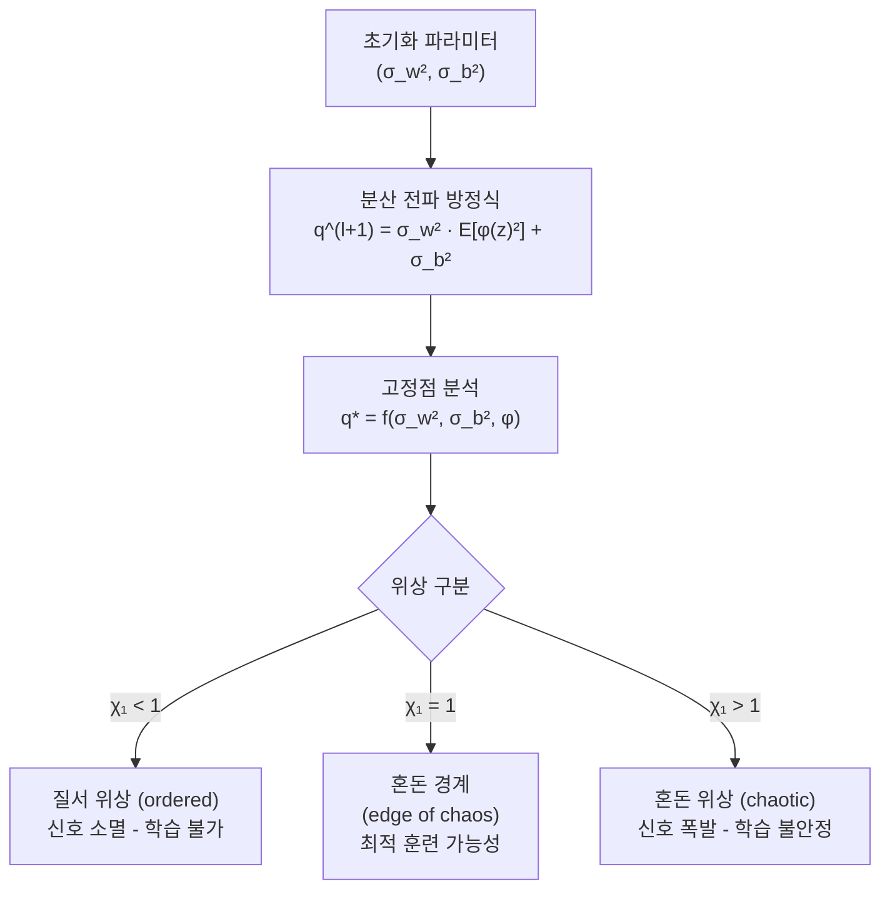
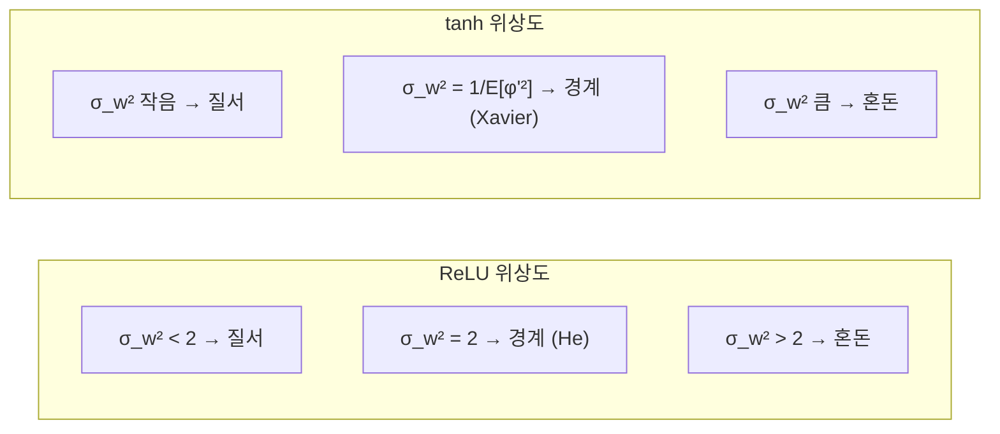

# 신경망 평균장 이론 (Mean Field Theory for Neural Networks)

신경망 평균장 이론(mean field theory, MFT)은 **무한히 넓은 신경망에서 신호가 레이어를 통과할 때 어떻게 전파되는가**를 통계역학적으로 분석하는 이론 체계다. 이 이론은 훈련 가능성(trainability)을 좌우하는 초기화 전략의 이론적 근거를 제공하며, He 초기화와 같은 실용적인 기법의 수학적 토대다.

## 핵심 질문: 신호는 어떻게 소멸하거나 폭발하는가

깊은 신경망을 학습할 때 다음 두 가지 병리 현상이 발생한다:
- **신호 소멸(vanishing)**: 그래디언트와 활성값이 레이어를 거칠수록 0에 수렴
- **신호 폭발(exploding)**: 레이어를 거칠수록 값이 무한대로 발산

MFT는 이 두 가지 사이에 존재하는 **임계점(edge of chaos)**을 수학적으로 특정한다.

## 무한 폭 신호 전파 분석

$l$번째 레이어의 사전 활성값(pre-activation)을 $h_i^l$이라 할 때, 폭 $N$이 무한대로 가면 중심극한정리에 의해:

$$h_i^l \sim \mathcal{N}(0, q^l)$$

여기서 분산 $q^l$은 다음 재귀 관계로 전파된다:

$$q^{l+1} = \sigma_w^2 \cdot \mathbb{E}_{z \sim \mathcal{N}(0, q^l)}[\phi(z)^2] + \sigma_b^2$$

- $\sigma_w^2$: 가중치 초기화 분산 스케일
- $\sigma_b^2$: 편향 초기화 분산
- $\phi$: 활성 함수

## 야코비안 스펙트럼과 혼돈 경계

두 입력 $x, x'$의 표현이 레이어를 거쳐 어떻게 변하는지는 상관 계수 $c^l = q_{12}^l / q^l$의 동역학으로 분석된다.

$$c^{l+1} = \frac{\sigma_w^2 \cdot \mathbb{E}[\phi(z)\phi(z')]}{\sqrt{q^l \cdot q'^l}} + \sigma_b^2 / q^{l+1}$$

**훈련 가능성의 핵심 지표**는 야코비안(Jacobian)의 단일 순방향 통과 증폭률 $\chi_1$이다:

$$\chi_1 = \sigma_w^2 \cdot \mathbb{E}_{z \sim \mathcal{N}(0, q^*)}[{\phi'(z)}^2]$$

- $\chi_1 < 1$: 질서 위상 - 입력 차이가 소멸, 그래디언트 소멸
- $\chi_1 = 1$: 혼돈 경계 - 이론적으로 최적
- $\chi_1 > 1$: 혼돈 위상 - 입력 차이가 폭발, 학습 불안정

## He 초기화의 이론적 근거

ReLU 활성 함수에 대해 MFT를 적용하면:

$$\mathbb{E}_{z \sim \mathcal{N}(0, q^*)}[\text{ReLU}(z)^2] = q^* / 2$$

고정점 $q^* = \sigma_w^2 \cdot q^*/2$에서 $\sigma_w^2 = 2$일 때 성립한다. 이를 폭 $N$의 레이어에 적용하면:

$$\text{Var}(W_{ij}) = \frac{2}{N_{\text{in}}}$$

이것이 바로 **He 초기화(Kaiming initialization)**의 도출 근거다. 즉, He 초기화는 ReLU 네트워크를 혼돈 경계에 배치하기 위한 최적 초기화다.

| 초기화 | 가중치 분산 | 대상 활성 함수 | MFT 근거 |
|--------|-----------|--------------|---------|
| Xavier/Glorot | $2/(N_{in}+N_{out})$ | tanh, sigmoid | $\chi_1 = 1$ @ tanh |
| He (Kaiming) | $2/N_{in}$ | ReLU | $\chi_1 = 1$ @ ReLU |
| Lecun | $1/N_{in}$ | SELU | SELU 자기 정규화 조건 |

## 활성 함수별 위상도

- ReLU는 비선형성이 단조적이어서 위상 경계가 단순 ($\sigma_w^2 = 2$)
- tanh는 포화 영역 때문에 $q^*$값에 따라 경계가 이동

## 배치 정규화와 MFT

배치 정규화(BatchNorm)는 각 레이어의 출력을 $q^l = 1$로 강제 고정하는 것과 동치다. 이는 MFT 관점에서 **항상 고정점에 있음을 보장**하므로 초기화에 덜 민감해진다. 그러나 동시에 야코비안 특성이 달라져, BatchNorm 없는 경우의 이론이 그대로 적용되지 않는다.

## 실용적 의미

1. **초기화 선택**: 활성 함수에 맞는 분산 스케일을 항상 확인
2. **깊이 한계**: 혼돈 경계에서도 유효 깊이(depth scale)가 유한함 - 실용적 최대 깊이 존재
3. **잔차 연결**: ResNet은 MFT 관점에서 신호 전파 경로를 극적으로 안정화
4. **아키텍처 검색**: 새 활성 함수 설계 시 MFT로 사전 훈련 가능성 평가 가능

## 관련 문서

- [[neural-tangent-kernel]] - 무한 폭 극한에서 학습 동역학을 기술하는 NTK 이론
- [[weight-initialization]] - He, Xavier 등 다양한 초기화 전략의 실용 가이드
- [[batch-norm-layer-norm]] - 정규화 레이어가 신호 전파에 미치는 영향
- [[gradient-descent-backpropagation]] - 그래디언트 소멸/폭발 문제와 해결책
