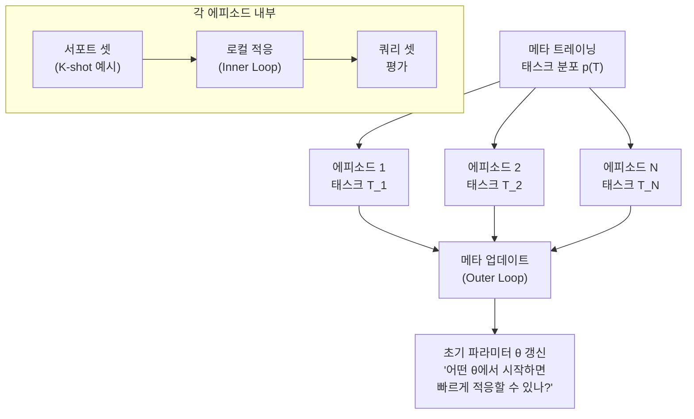
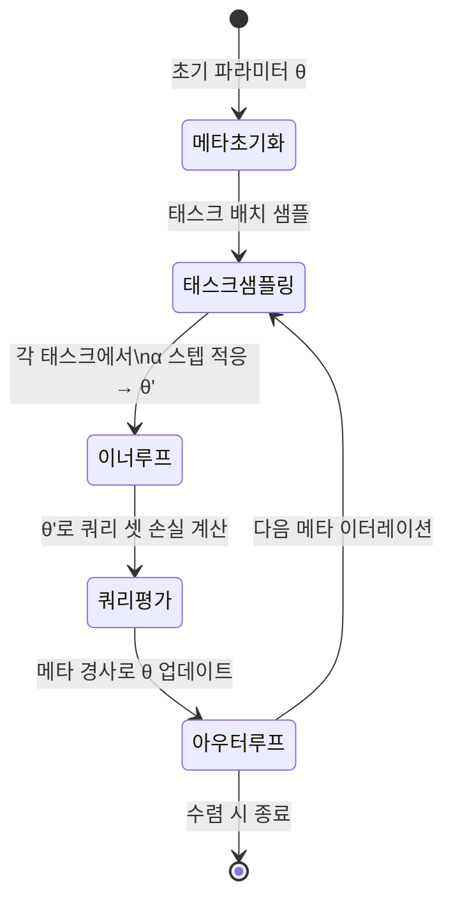

# 메타 학습 (Meta-Learning / MAML / Reptile)

## 개요

메타 학습(Meta-Learning)은 "**학습하는 방법을 학습**"하는 머신러닝 패러다임이다. 개별 태스크에서 처음부터(from scratch) 학습하는 대신, 여러 태스크의 경험을 통해 **빠른 적응(fast adaptation)** 능력 자체를 습득하는 것이 목표다.

핵심 직관: 인간은 새로운 언어를 배울 때 완전히 처음부터 시작하지 않는다. 이미 언어 학습 방법을 알고 있기 때문에 몇 가지 예시만으로도 빠르게 적응한다. 메타 학습은 이 능력을 모델에 부여하려 한다.

## 문제 설정: 에피소드 학습

메타 학습은 **에피소드(episode)** 단위로 학습한다:

- **메타 트레이닝 셋**: 다양한 태스크들의 집합 $\{\mathcal{T}_1, \mathcal{T}_2, ..., \mathcal{T}_N\}$
- 각 태스크 $\mathcal{T}_i$는 서포트 셋(support set, 학습용 소수 예시)과 쿼리 셋(query set, 평가용)으로 구성
- **N-way K-shot**: N개 클래스, 클래스당 K개 예시로 적응

## MAML (Model-Agnostic Meta-Learning)

Finn et al.(2017)이 제안한 MAML은 **"어떤 초기 파라미터에서 출발해야 적은 경사 스텝으로 새 태스크에 적응할 수 있는가?"** 를 최적화한다.

### 알고리즘

**Inner Loop (태스크 적응)**:
태스크 $\mathcal{T}_i$의 서포트 셋으로 몇 스텝 경사 업데이트:

$$\theta'_i = \theta - \alpha \nabla_\theta \mathcal{L}_{\mathcal{T}_i}(\theta)$$

**Outer Loop (메타 업데이트)**:
쿼리 셋에서의 손실로 원래 파라미터 $\theta$ 업데이트:

$$\theta \leftarrow \theta - \beta \nabla_\theta \sum_{\mathcal{T}_i} \mathcal{L}_{\mathcal{T}_i}(\theta'_i)$$

핵심: outer loop의 경사는 $\theta'_i$를 통해 $\theta$까지 **역전파(meta-gradient)** 해야 한다. 즉, "경사의 경사(gradient through gradient)"가 필요 -> 2차 미분 계산.

## Reptile

Nichol et al.(OpenAI, 2018)이 제안한 Reptile은 MAML의 2차 미분 계산을 피한 **1차 근사** 방법이다.

알고리즘:
1. 태스크 $\mathcal{T}_i$ 샘플링
2. 해당 태스크에서 SGD를 $k$번 실행하여 $\theta'_i$ 획득
3. 원래 파라미터를 $\theta'_i$ 방향으로 이동:

$$\theta \leftarrow \theta + \varepsilon (\theta'_i - \theta)$$

### MAML vs Reptile 비교

| 항목 | MAML | Reptile |
|------|------|---------|
| 계산 방식 | 2차 미분 (meta-gradient) | 1차 (SGD 방향 평균) |
| 메모리 비용 | 높음 | 낮음 |
| 구현 복잡도 | 높음 | 단순 |
| 성능 | 이론적 우세 | 실험적으로 유사 |
| 확장성 | 제한적 | 더 용이 |

## 메타 학습의 세 가지 관점

메타 학습 방법들은 "무엇을 메타 학습하는가?"에 따라 분류된다:

| 관점 | 대표 방법 | 학습하는 것 |
|------|----------|-----------|
| 초기화 기반 | MAML, Reptile | 빠른 적응을 위한 초기 파라미터 |
| 최적화 기반 | LSTM 메타 학습자 | 업데이트 규칙 자체 |
| 메트릭 기반 | Prototypical Networks, Matching Networks | 유사도 측정 함수 |

## [[few-shot-learning]] 과의 관계

메타 학습은 퓨샷 학습의 가장 강력한 접근법 중 하나다. 5-way 1-shot 분류에서:

- MAML은 서포트 셋의 1개 예시로 5개 클래스를 구분
- 이는 [[transfer-learning]]의 파인튜닝과 달리 "적응 능력"을 사전 학습

## LLM에서의 메타 학습 해석

프롬프트 내 In-Context Learning(ICL)은 메타 학습의 일종으로 해석할 수 있다. LLM은 사전학습에서 다양한 태스크를 경험하며 "컨텍스트에서 빠르게 학습하는 능력"을 습득했다는 주장이 있다. 이 경우 외부 경사 업데이트 없이 어텐션 메커니즘이 암묵적 in-context 적응을 수행한다.

## 한계와 최신 연구 방향

- **계산 비용**: MAML의 2차 미분은 대규모 모델에서 여전히 부담
- **태스크 분포 가정**: 메타 트레이닝과 테스트 태스크의 분포가 크게 다르면 성능 저하
- **최신 동향**: 프롬프트 기반 메타 학습(prompt-tuning + ICL), LoRA를 inner loop로 활용하는 방법

## 관련 문서

- [[few-shot-learning]] - 메타 학습의 핵심 응용 태스크
- [[transfer-learning]] - 사전학습 + 파인튜닝 패러다임과의 비교
- [[gradient-descent-backpropagation]] - MAML inner/outer loop의 역전파 기초
- [[optimization-theory]] - 메타 최적화 수렴 분석
