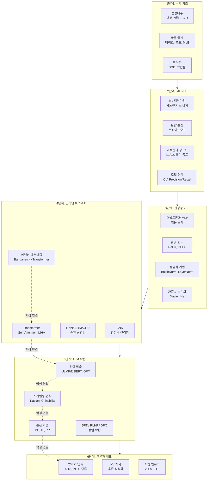

# ML Learning Path (머신러닝 학습 경로 가이드)

## 개요

이 페이지는 머신러닝 기초부터 현대 LLM까지의 학습 경로를 안내한다. 각 단계는 다음 단계의 선수 지식이며, 뛰어넘으면 이해에 구멍이 생긴다. 단, 모든 페이지를 순서대로 읽을 필요는 없다. 자신의 수준에 맞는 단계부터 시작하면 된다.

## 전체 학습 경로

## 1단계: 수학 기초

LLM을 "쓰는 것"에는 수학이 필요 없지만, "이해하는 것"에는 필수다. 모든 ML 알고리즘의 뼈대는 선형대수, 확률, 최적화다.

**선형대수**: 벡터, 행렬곱, 고유값 분해, SVD. 신경망은 결국 행렬 연산의 연쇄이다. 임베딩, 어텐션, 가중치 업데이트 모두 행렬곱이다.

**확률과 통계**: 베이즈 정리, 확률 분포, 최대우도 추정(MLE). 언어 모델은 확률 분포 위의 모델이다. "다음 토큰의 확률"이 LLM의 출력이다.

**최적화**: 경사하강법(SGD), 학습률 스케줄링, 수렴 조건. 모든 학습은 손실 함수를 최소화하는 최적화 문제다.

**권장 자원**: 3Blue1Brown의 "Essence of Linear Algebra" 시리즈, Stanford CS229 강의 노트.

## 2단계: ML 기초 개념

수학 위에 세우는 ML의 핵심 프레임워크다. 이 단계를 건너뛰면 모델의 행동을 설명할 수 없다.

**ML 3대 패러다임**: 지도학습(분류, 회귀), 비지도학습(군집화, 차원 축소), 강화학습(보상 기반). 현대 LLM은 세 가지를 모두 사용한다: 사전학습(비지도) -> SFT(지도) -> RLHF(강화).

**편향-분산 트레이드오프**: 모델이 너무 단순하면 편향(underfitting), 너무 복잡하면 분산(overfitting). 이 균형이 일반화의 핵심이다.

**과적합과 정규화**: L1/L2 정규화, 드롭아웃, 조기 종료, 데이터 증강. 딥러닝에서 과적합 방지는 여전히 핵심 과제다.

**모델 평가**: K-fold 교차검증, Precision/Recall/F1, AUC-ROC. 모델이 "좋다"는 것을 어떻게 측정하는가.

## 3단계: 신경망 기초

딥러닝의 빌딩 블록이다. 하나의 뉴런에서 시작하여 심층 네트워크로 확장한다.

**퍼셉트론과 MLP**: 단일 뉴런(선형 분류) -> 다층 퍼셉트론(비선형 함수 근사). 범용 근사 정리(Universal Approximation Theorem)는 MLP가 이론적으로 어떤 함수든 근사할 수 있음을 보장한다.

**활성 함수**: Sigmoid -> ReLU -> GELU -> SiLU/Swish. 비선형성을 도입하는 핵심 요소. 현대 LLM은 주로 GELU 또는 SiLU를 사용한다.

**정규화 기법**: BatchNorm -> LayerNorm -> RMSNorm. 학습 안정성의 핵심이다. Transformer는 LayerNorm을 사용하며, 최근 모델(LLaMA 등)은 RMSNorm을 선호한다.

**역전파와 기울기**: 연쇄 법칙(chain rule)에 기반한 자동 미분. 기울기 소실(vanishing gradient)과 폭발(exploding gradient) 문제, 그리고 해결책(잔차 연결, 기울기 클리핑).

## 4단계: 딥러닝 아키텍처

시퀀스와 공간 데이터를 처리하는 핵심 아키텍처들이다.

**CNN(합성곱 신경망)**: 이미지 처리의 표준. 커널, 풀링, 잔차 연결. Vision Transformer(ViT)가 등장했지만 CNN의 원리는 여전히 중요하다.

**RNN/LSTM/GRU**: 시퀀스 처리의 초기 해법. 장기 의존성 문제와 게이트 메커니즘. Transformer에 의해 대체되었지만, 왜 대체되었는지를 이해하려면 알아야 한다.

**[[attention-mechanism-overview|어텐션 메커니즘]]**: Bahdanau(2014)에서 Transformer(2017)까지. RNN의 고정 벡터 병목을 해결하고, 병렬 처리를 가능하게 한 혁신. 현대 AI의 가장 중요한 단일 개념이다.

**Transformer**: Self-Attention, Multi-Head Attention, 위치 인코딩, 인코더-디코더 구조. BERT(인코더), GPT(디코더), T5(인코더-디코더)로 분화했다.

## 5단계: LLM 학습

Transformer를 대규모로 학습시키는 과정이다.

**[[transfer-learning|전이 학습]]**: ULMFiT가 열어젖힌 사전학습-미세조정 패러다임. BERT와 GPT로 폭발적으로 확산되었고, 100개의 레이블 데이터로 100배 데이터의 성능을 달성할 수 있음을 보였다.

**[[scaling-laws|스케일링 법칙]]**: Kaplan(2020)은 "모델을 키워라"를, Chinchilla(2022)는 "데이터도 같이 키워라"를 주장했다. 이 법칙이 GPT-3부터 현대 LLM까지의 투자 논리를 지탱한다.

**[[distributed-training-overview|분산 학습]]**: 데이터 병렬, 텐서 병렬, 파이프라인 병렬. 수천 개의 GPU를 조율하여 수십억 파라미터를 학습시키는 인프라 기술이다.

**정렬 학습**: SFT(지도 미세조정)로 대화 능력을 부여하고, RLHF/DPO로 인간 선호도에 정렬한다. "도움이 되고, 무해하고, 정직한" 모델을 만드는 과정이다.

## 6단계: 추론과 배포

학습된 모델을 실제로 서비스하는 단계다.

**[[quantization-model-compression|양자화와 모델 압축]]**: INT8/INT4 양자화, 가지치기, 지식 증류. 70B 모델을 소비자 GPU에서 실행할 수 있게 만드는 기술이다.

**KV 캐시 최적화**: 자기회귀 생성에서 이전 토큰의 Key/Value를 캐싱하여 중복 계산을 제거한다. GQA, MQA, Paged Attention 등이 메모리 효율을 높인다.

**서빙 인프라**: vLLM, TGI(Text Generation Inference) 등 추론 서버. 연속 배칭(continuous batching), 추측적 디코딩(speculative decoding) 등 처리량 최적화 기법이다.

## 학습 전략 권장사항

### 이론 vs 실습 균형

| 단계 | 이론 비중 | 실습 비중 | 권장 활동 |
|------|---------|---------|----------|
| 1단계 수학 | 80% | 20% | NumPy로 행렬 연산 직접 구현 |
| 2단계 ML | 60% | 40% | scikit-learn으로 분류/회귀 실습 |
| 3단계 신경망 | 50% | 50% | PyTorch로 MLP 직접 구현 |
| 4단계 아키텍처 | 40% | 60% | Transformer 논문 구현 (Annotated Transformer) |
| 5단계 LLM | 30% | 70% | HuggingFace로 미세조정 실습 |
| 6단계 배포 | 20% | 80% | llama.cpp, vLLM 실제 배포 |

### 자주 하는 실수

- **1단계 건너뛰기**: 수학 없이 시작하면 4단계에서 벽에 부딪힌다
- **논문만 읽기**: 구현 없는 이론은 금방 잊힌다
- **최신 모델만 추적**: GPT-4를 이해하려면 GPT-1 -> BERT -> GPT-2 -> GPT-3 순서로 밟아야 한다
- **한 프레임워크에 종속**: PyTorch를 주력으로 하되, JAX/TensorFlow 코드도 읽을 수 있어야 한다

## 이 위키의 관련 페이지 맵

### 기초 (foundations)

| 페이지 | 단계 | 핵심 내용 |
|--------|------|----------|
| [[transfer-learning]] | 5 | ULMFiT, 사전학습-미세조정 패러다임 |
| [[scaling-laws]] | 5 | Kaplan, Chinchilla, 연산 최적 학습 |
| [[distributed-training-overview]] | 5 | 데이터/모델/파이프라인 병렬 |
| [[quantization-model-compression]] | 6 | INT8/INT4, 가지치기, 증류 |
| [[attention-mechanism-overview]] | 4 | Bahdanau에서 Transformer까지 |

### 관련 심화 페이지

| 위키 페이지 | 연결 단계 | 역할 |
|------------|---------|------|
| [[context-engineering]] | 응용 | 컨텍스트 창 구성 전략 |
| [[how-coding-agents-work]] | 응용 | 코딩 에이전트의 내부 구조 |
| [[circuit-tracing]] | 심화 | 모델 내부 메커니즘 해석 |

## 출처

- Lilian Weng, "How to Train Really Large Models on Many GPUs" (2021) - https://lilianweng.github.io/posts/2021-09-25-train-large/
- Kaplan et al., "Scaling Laws for Neural Language Models" (2020) - https://arxiv.org/abs/2001.08361
- Howard & Ruder, "Universal Language Model Fine-tuning for Text Classification" (2018) - https://arxiv.org/abs/1801.06146
