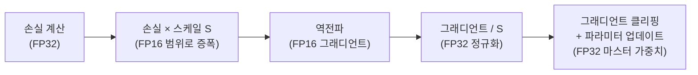
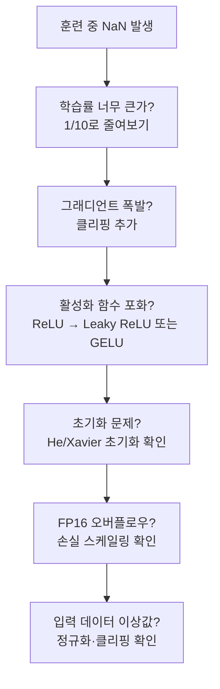

# ML 수치 안정성 기초

## 한 줄 요약

딥러닝 학습에서 발생하는 수치 불안정성(오버플로우, 언더플로우, NaN)의 원인과, log-sum-exp 트릭·소프트맥스 수치 안정화·FP16 관리·그래디언트 클리핑 등 실용적 해결책.

## 부동소수점 표현의 한계

ML에서 사용하는 부동소수점 형식별 특성:

| 형식 | 지수 비트 | 가수 비트 | 최대값 | 최솟값(정규) | 표현 가능 유효숫자 |
|------|---------|---------|-------|------------|----------------|
| FP64 (double) | 11 | 52 | ~1.8e308 | ~2.2e-308 | ~15자리 |
| FP32 (float) | 8 | 23 | ~3.4e38 | ~1.2e-38 | ~7자리 |
| FP16 (half) | 5 | 10 | 65504 | ~6.1e-5 | ~3자리 |
| BF16 | 8 | 7 | ~3.4e38 | ~1.2e-38 | ~2자리 |
| FP8 (e4m3) | 4 | 3 | 448 | ~1.6e-7 | ~1자리 |

**핵심 차이**:
- FP16: 최대값 65504로 매우 작음 - 오버플로우 위험
- BF16: FP32와 같은 지수 범위 - 동적 범위 우수, 정밀도 낮음
- FP8: 최신 GPU(H100 등)에서 사용, 매우 낮은 정밀도

## 오버플로우와 언더플로우

**오버플로우(Overflow)**: 표현 범위를 초과하면 $\pm\infty$ 또는 NaN 발생.

```python
import numpy as np

# FP16 오버플로우 예시
x = np.float16(60000)
y = np.float16(60000)
print(x + y)  # inf (65504 초과)

# 소프트맥스 오버플로우
logits = np.array([1000.0, 1001.0])
exp_logits = np.exp(logits)  # [inf, inf] - overflow!
```

**언더플로우(Underflow)**: 너무 작은 값이 0으로 플러시. 확률의 반복 곱셈에서 자주 발생.

```python
# 언더플로우 예시
p = 0.1
for _ in range(1000):
    p *= 0.9  # 점차 0으로 소멸
print(p)  # 0.0 (underflow)
```

## log-sum-exp 트릭

**문제**: $\log\sum_i \exp(x_i)$를 계산할 때 $\exp(x_i)$가 오버플로우 또는 언더플로우 발생.

**트릭**: 최대값 $c = \max_i x_i$를 빼서 수치 안정화:

$$\log\sum_i \exp(x_i) = c + \log\sum_i \exp(x_i - c)$$

$x_i - c \leq 0$이므로 $\exp(x_i - c) \in (0, 1]$ - 오버플로우 없음.
$\exp(0) = 1$이 항상 존재하므로 언더플로우로 합이 0이 되지 않음.

```python
import numpy as np

def log_sum_exp(x: np.ndarray) -> float:
    """수치 안정적 log-sum-exp."""
    c = x.max()
    return c + np.log(np.sum(np.exp(x - c)))

# 검증
x = np.array([1000.0, 1001.0, 1002.0])
print(log_sum_exp(x))       # 1002.4076...
print(np.log(np.sum(np.exp(x))))  # inf (불안정)
```

응용:
- 소프트맥스 분모 계산
- 크로스 엔트로피 손실
- CTC (Connectionist Temporal Classification) 로스
- 정규화되지 않은 로그 확률의 합산

## 수치 안정 소프트맥스

소프트맥스 함수:

$$\text{softmax}(x)_i = \frac{\exp(x_i)}{\sum_j \exp(x_j)}$$

**안정화 버전** (log-sum-exp 트릭 적용):

```python
def stable_softmax(x: np.ndarray) -> np.ndarray:
    """수치 안정적 소프트맥스."""
    x_shifted = x - x.max(axis=-1, keepdims=True)  # broadcast
    exp_x = np.exp(x_shifted)
    return exp_x / exp_x.sum(axis=-1, keepdims=True)
```

PyTorch의 `torch.nn.functional.softmax`는 이미 수치 안정화 내장.

**크로스 엔트로피와의 결합**: 소프트맥스 후 로그 취하는 `log_softmax`는 단독으로 더 안정적:

$$\log\text{softmax}(x)_i = x_i - \log\sum_j \exp(x_j) = x_i - c - \log\sum_j \exp(x_j - c)$$

```python
import torch
import torch.nn.functional as F

logits = torch.tensor([1000.0, 1001.0, 1002.0])

# 불안정: softmax 후 log
probs = F.softmax(logits, dim=0)
log_probs_bad = torch.log(probs)  # 정밀도 손실

# 안정: log_softmax 직접
log_probs_good = F.log_softmax(logits, dim=0)  # 권장
```

## 혼합 정밀도 학습 (Mixed Precision Training)

FP16으로 학습하면 속도와 메모리를 절약하지만, 동적 범위가 좁아 그래디언트 언더플로우 위험이 높다.

### 손실 스케일링 (Loss Scaling)

FP16 그래디언트의 언더플로우를 방지하기 위해 손실 값을 일시적으로 크게 스케일링:



```python
from torch.cuda.amp import autocast, GradScaler

scaler = GradScaler()  # 동적 손실 스케일 관리

for batch in dataloader:
    optimizer.zero_grad()

    with autocast():  # FP16 자동 캐스팅
        output = model(batch)
        loss = criterion(output, target)

    scaler.scale(loss).backward()     # 스케일된 역전파
    scaler.unscale_(optimizer)        # 그래디언트 역스케일
    torch.nn.utils.clip_grad_norm_(model.parameters(), max_norm=1.0)
    scaler.step(optimizer)            # FP32로 파라미터 업데이트
    scaler.update()                   # 스케일 동적 조정
```

### 동적 손실 스케일링

`GradScaler`는 자동으로:
- $\infty$/NaN 그래디언트 감지 시 스케일 감소 (2배로 나눔)
- 연속 성공 시 스케일 증가 (2배로 곱함)
- 초기 스케일: 보통 $2^{16} = 65536$

## 그래디언트 클리핑 (Gradient Clipping)

### 폭발하는 그래디언트 문제

RNN, 깊은 네트워크에서 역전파 중 그래디언트가 기하급수적으로 증가할 수 있다.

**원인**: 반복 행렬 곱셈에서 최대 고유값 > 1인 행렬을 반복 곱하면 폭발.

### 글로벌 노름 클리핑 (Global Norm Clipping)

Pascanu et al. (2013)의 방법:

$$g \leftarrow g \cdot \min\left(1, \frac{\text{max\_norm}}{\|g\|}\right)$$

```python
torch.nn.utils.clip_grad_norm_(
    model.parameters(),
    max_norm=1.0,  # 또는 0.5, 5.0 등 태스크에 따라
    norm_type=2,   # L2 노름
)
```

**클리핑의 이론적 근거**: 손실 함수가 리프시츠 연속(Lipschitz continuous)이면 그래디언트의 노름이 유계여야 한다. 클리핑은 이를 강제 적용한다.

### 값 기반 클리핑 (Value Clipping)

각 그래디언트 값을 $[-c, c]$로 제한:

```python
torch.nn.utils.clip_grad_value_(model.parameters(), clip_value=1.0)
```

노름 클리핑보다 덜 사용됨. 노름 클리핑은 방향을 보존하므로 더 안정적.

## 배치 정규화와 수치 안정성

배치 정규화(Batch Normalization)의 표준화 공식:

$$\hat{x} = \frac{x - \mu_B}{\sqrt{\sigma_B^2 + \epsilon}}$$

$\epsilon$의 역할: 분모가 0이 되는 것을 방지. 보통 $\epsilon = 10^{-5}$ (PyTorch 기본값).

```python
# epsilon 값이 중요한 상황: 분산이 매우 작을 때
import torch

x = torch.ones(32, 10) * 5.0  # 분산 = 0인 배치
bn = torch.nn.BatchNorm1d(10, eps=1e-5)
out = bn(x)  # eps 없으면 0/0 = NaN
```

## Attention 수치 안정성

Transformer의 스케일드 닷 어텐션:

$$\text{Attention}(Q, K, V) = \text{softmax}\left(\frac{QK^\top}{\sqrt{d_k}}\right)V$$

$\frac{1}{\sqrt{d_k}}$ 스케일링의 역할: $d_k$가 크면 $QK^\top$ 값이 커져 소프트맥스가 포화(saturation) 상태가 된다 - 기울기 소실.

```python
# d_k = 512일 때 스케일 없으면
logits_unscaled = Q @ K.T  # 표준편차가 sqrt(d_k) ≈ 22.6이 됨
# softmax 포화로 대부분의 그래디언트가 0에 가까워짐

logits_scaled = Q @ K.T / (d_k ** 0.5)  # 표준편차 ≈ 1, 안전한 범위
```

**FlashAttention**은 타일링(tiling)으로 어텐션 행렬을 청크 단위로 계산하여 수치 안정성과 메모리 효율을 동시에 확보한다.

## 일반 수치 안정화 패턴

```python
import torch

# 1. 로그 도메인 연산
log_prob = torch.log_softmax(logits, dim=-1)  # log(softmax) 직접 계산

# 2. 안정적 지수
def safe_exp(x: torch.Tensor, max_val: float = 88.0) -> torch.Tensor:
    """FP32 오버플로우 방지 (exp(88) ≈ 6.5e38 ≈ FP32 최대)."""
    return torch.exp(torch.clamp(x, max=max_val))

# 3. 안정적 log
def safe_log(x: torch.Tensor, eps: float = 1e-8) -> torch.Tensor:
    """log(0) = -inf 방지."""
    return torch.log(torch.clamp(x, min=eps))

# 4. NaN/Inf 감지
def check_nan_inf(tensor: torch.Tensor, name: str = "tensor") -> None:
    if torch.isnan(tensor).any() or torch.isinf(tensor).any():
        raise ValueError(f"{name}에 NaN 또는 Inf 발생")
```

## 훈련 중 수치 문제 디버깅



## 왜 중요한가

- 수치 불안정성은 학습 실패의 가장 흔한 원인 중 하나
- FP16/BF16 혼합 정밀도 학습은 현대 LLM 훈련의 기본이 되었음
- log-sum-exp 트릭 같은 간단한 변환이 수치 안정성을 극적으로 개선
- 올바른 그래디언트 클리핑 없이는 Transformer 대형 모델의 안정적 학습이 불가능

## 관련 문서

- [[gradient-descent-backpropagation]] - 역전파와 그래디언트 계산
- [[batch-norm-layer-norm]] - 정규화와 수치 안정성
- [[optimization-theory]] - 최적화 이론과 수렴
- [[sgd-convergence-theory]] - SGD 수렴 이론
- [[attention-mechanism-overview]] - 어텐션 스케일링 이유
