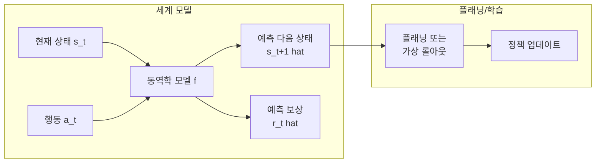
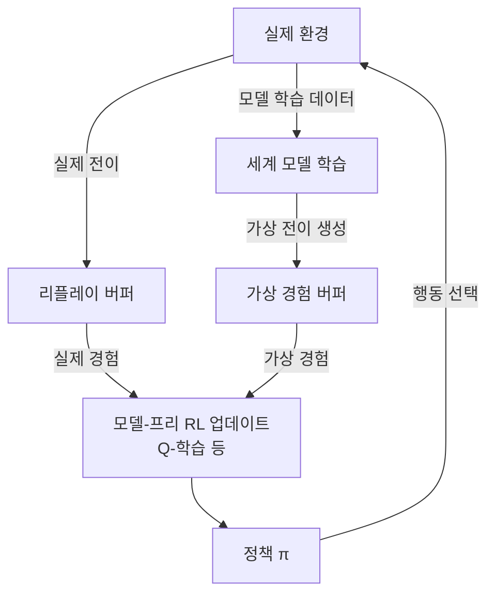
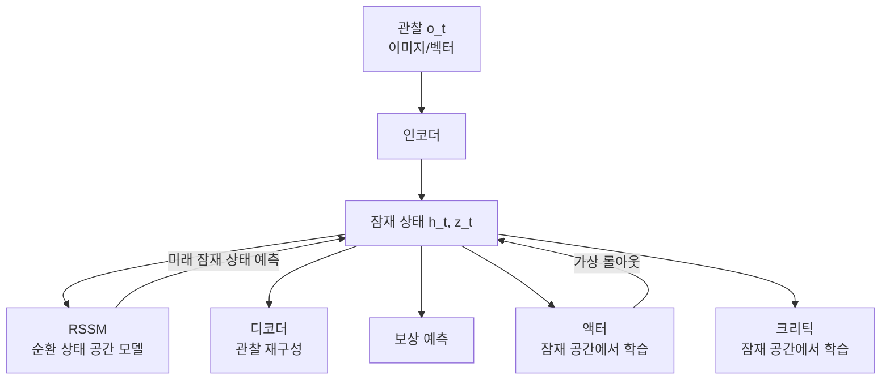
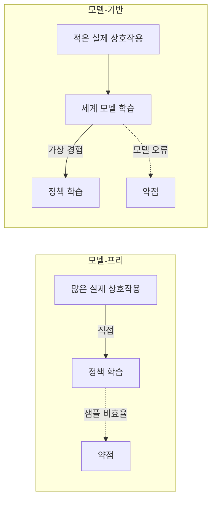
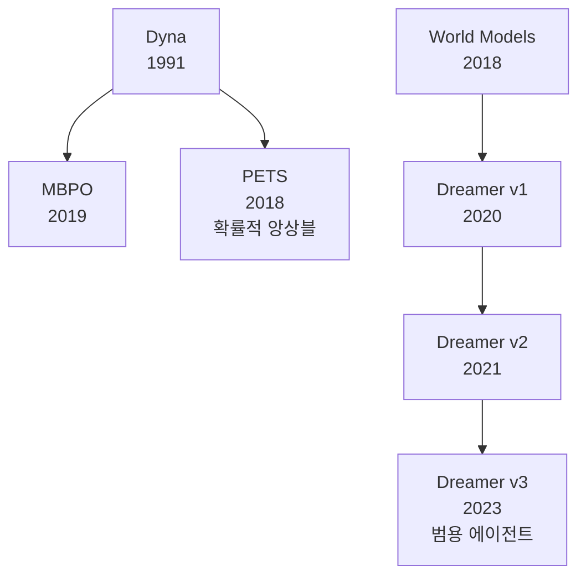

# 모델 기반 강화학습 (Model-Based Reinforcement Learning, MBRL)

## 핵심 개념

**MBRL(Model-Based RL)**은 환경의 동역학(dynamics)을 학습한 **세계 모델(world model)**을 이용해 플래닝이나 정책 학습을 수행하는 강화학습 패러다임이다. 에이전트가 "세계가 어떻게 작동하는가"를 이해하고, 이를 바탕으로 가상의 경험을 생성하거나 앞을 내다보며 행동한다.

**모델-프리(Model-Free) RL**이 경험으로부터 직접 정책이나 가치 함수를 학습하는 반면, MBRL은 환경 모델을 명시적으로 학습하고 활용한다.

## 핵심 요소: 동역학 모델

환경의 동역학 모델 $f$는 현재 상태와 행동으로부터 다음 상태를 예측한다:

$$\hat{s}_{t+1} = f(s_t, a_t)$$

보상 모델도 함께 학습하는 경우가 많다:

$$\hat{r}_t = r(s_t, a_t)$$

## Dyna 프레임워크 (Sutton, 1991)

**Dyna**는 MBRL의 원형적 프레임워크다. 실제 경험과 모델에서 생성된 가상 경험을 혼합하여 정책을 학습한다.

Dyna의 장점은 단순성이다. 기존 모델-프리 알고리즘(Q-학습, SAC 등)을 그대로 사용하면서 가상 경험으로 데이터 효율을 높인다.

## MBPO - 모델 기반 정책 최적화

**MBPO(Model-Based Policy Optimization)**(Janner et al. 2019)는 신경망 세계 모델의 **예측 신뢰 구간(prediction horizon)**을 제한하여 모델 오류 누적 문제를 해결한다.

- 세계 모델로 짧은 $k$-스텝 롤아웃(보통 1-5 스텝)만 생성
- 긴 시야의 가상 롤아웃은 모델 오류가 누적되어 학습을 저해함
- 짧은 롤아웃 + 실제 데이터 혼합으로 SAC 업데이트

$$\text{총 데이터} = \underbrace{\text{실제 환경 데이터}}_{\text{신뢰도 높음}} + \underbrace{k\text{-스텝 모델 롤아웃}}_{\text{풍부한 양}}$$

## Dreamer 시리즈 - 잠재 공간 세계 모델

**Dreamer**(Hafner et al. 2020-2023)는 잠재 공간(latent space)에서 세계 모델을 학습하고, 잠재 공간 내에서 직접 actor-critic을 학습한다.

### RSSM (Recurrent State Space Model)

RSSM은 Dreamer의 핵심 모듈로, 두 가지 잠재 상태를 관리한다:

- **결정적 상태 $h_t$**: GRU로 유지되는 과거 맥락 (확정적)
- **확률적 상태 $z_t$**: 현재 관찰에서 샘플링 (불확실성 표현)

$$h_t = f(h_{t-1}, z_{t-1}, a_{t-1})$$
$$z_t \sim q(z_t | h_t, o_t)$$
$$\hat{z}_t \sim p(z_t | h_t) \quad \text{(관찰 없이 예측 시)}$$

**DreamerV3**는 학습 안정성을 대폭 개선하여, Atari/DMControl/Minecraft 등 다양한 도메인에서 하이퍼파라미터 변경 없이 동작한다.

## 모델-프리 vs 모델-기반 비교

| 항목 | 모델-프리 (SAC, PPO) | 모델-기반 (MBPO, Dreamer) |
|------|---------------------|--------------------------|
| 샘플 효율 | 낮음 | 높음 (10-100배) |
| 최종 성능 | 충분한 데이터 시 높음 | 복잡한 환경에서 제한적 |
| 모델 오류 | 없음 | 있음 (bias 발생 가능) |
| 계획 능력 | 없음 | 있음 |
| 구현 복잡도 | 낮음-중간 | 높음 |
| 적합 환경 | 시뮬레이션 비용 낮을 때 | 실세계 상호작용 비쌀 때 |

## 샘플 효율의 장점과 모델 오류 문제

**샘플 효율 장점**:
- 실로봇 실험: 환경 상호작용 1,000회 미만으로도 유의미한 정책 학습 가능
- 의료, 자율주행 등 현실에서 시행착오가 위험한 도메인에 적합

**모델 오류 문제**:
- 학습 데이터 분포 밖 상태에서 세계 모델이 부정확
- 긴 롤아웃에서 오류가 기하급수적으로 누적
- 해결책: 단기 롤아웃(MBPO), 앙상블 불확실성(PETS), 잠재 공간 학습(Dreamer)

## 주요 알고리즘 계보

## LLM과 세계 모델의 연결

최근 LLM을 세계 모델로 활용하는 연구가 활발하다:

- **언어 기반 플래닝**: LLM이 텍스트로 세계 모델 역할 수행
- **비디오 세계 모델**: Genie, Sora 등 비디오 생성 모델을 세계 모델로
- **로보틱스**: RT-2, OpenVLA에서 VLM이 세계 모델 + 정책의 역할 통합

## 관련 문서

- [[sac-soft-actor-critic|soft-actor-critic-sac]] - 모델-프리 오프-정책 알고리즘 (MBRL과 자주 비교)
- [[offline-rl]] - 고정 데이터로만 학습하는 관련 패러다임
- [[multi-agent-rl|multi-agent-rl-marl]] - 멀티에이전트 환경에서의 MBRL 확장
- [[act-action-chunking-transformer]] - 로보틱스에서 세계 모델 없이 모방 학습
